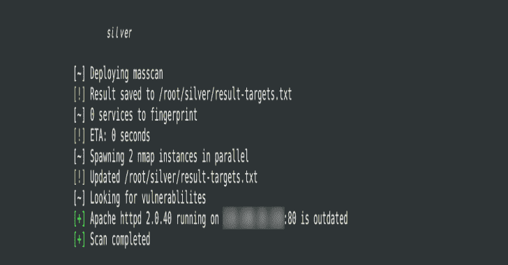

# 银牌:针对易受攻击服务的大规模扫描 IPs

> 原文：<https://kalilinuxtutorials.com/silver-mass-scan-ips-vulnerable-services/>

masscan 速度快，nmap 可以指纹软件，vulners 是一个巨大的漏洞数据库。Silver 是一个前端，它允许通过解析数据、生成并行进程、缓存漏洞数据以随着时间的推移更快地扫描等等来完全利用这些程序。

**特性**

*   可继续扫描
*   时差通知
*   多核利用
*   漏洞数据缓存
*   智能 Shodan 集成*

> **Shodan 集成是可选的，但在链接时，如果主机有许多开放的端口以节省资源，它可以自动使用 Shodan 来检索服务和漏洞数据。它每次扫描使用的 Shodan 信用可以被节流。也可以配置触发 Shodan 的最小端口数量。*

也可阅读-[Exist:用于聚合的网络应用&分析网络威胁情报](https://kalilinuxtutorials.com/exist-web-app-aggregating-analyzing-cyber-threat-intelligence/)

**设置**

**下载**

**git 克隆 https://github.com/s0md3v/Silver**

**要求**

**外部程序**

*   [nmap](https://nmap.org/)
*   [质量扫描](https://github.com/robertdavidgraham/masscan)

**Python 库**

*   psutil
*   要求

需要的 Python 库可以通过执行`Silver`目录下的`**pip3 install -r requirements.txt**`来安装。

**配置**

可以通过编辑`**/core/memory.py**`中的各个变量来配置 Slack WebHook、Shodan API key 和 limits

**设置时差通知**

*   在时差上创建一个工作区，[在这里](https://slack.com/)
*   创建一个应用，[这里](https://api.slack.com/apps/new)
*   从应用程序中启用 WebHooks，并将 URL 从那里复制到 Silver 的`/core/memory.py`文件中。

**作为根用户运行**

它需要 root 权限，因为它使用 masscan，需要以 root 身份运行 mass can 来进行端口扫描。使用`sudo`。

**用途**

**开始前**

*   ⚠️以 root 用户身份使用`**python3**`运行它，即使用`**sudo python3 silver.py <your input>**`
*   ⚠️默认扫描所有 TCP 端口，即端口`**0-65535**`。使用`--quick`开关仅扫描前 1000 个端口。

**从命令行扫描主机**

**python 3 silver . py 127 . 0 . 0 . 1
python 3 silver . py 127 . 0 . 0 . 1/22
python 3 silver . py 127 . 0 . 0 . 1，127.0.0.2，127.0.0.3**

**扫描前 1000 个端口**

**python 3 silver . py 127 . 0 . 0 . 1–快速**

**从文件中扫描主机**

**python 3 silver . py-I/path/to/targets . txt**

**设置并行 nmap 实例的最大数量**

**python 3 silver . py-I/path/to/targets . txt-t 4**

[**Download**](https://github.com/s0md3v/Silver)