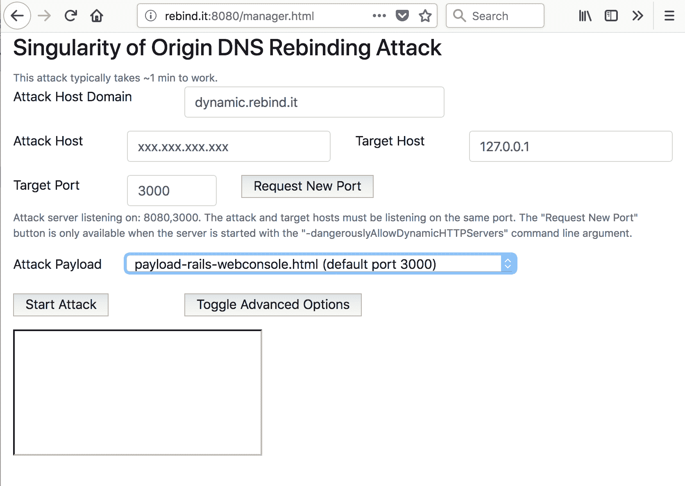
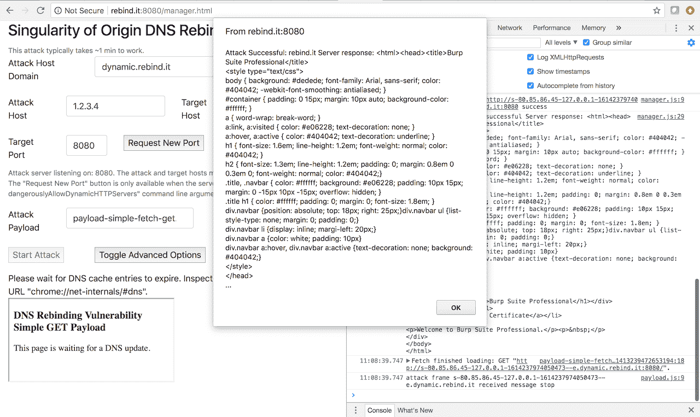

# 奇点——DNS 重新绑定攻击框架

> 原文：<https://kalilinuxtutorials.com/singularity-dns-rebinding-attack/>

原点奇点是执行 DNS 重新绑定攻击的工具。它包括将攻击服务器 DNS 名称的 IP 地址重新绑定到目标机器的 IP 地址，以及提供攻击负载以利用目标机器上易受攻击的软件的必要组件。

它还附带了示例负载，可以利用几个易受攻击的软件版本，从简单地捕获主页到执行远程代码执行。它旨在提供一个框架，以促进易受 DNS 重新绑定攻击的软件的利用，并提高对它们如何工作以及如何防范它们的认识。

## **DNS 重新绑定攻击是如何工作的？**

DNS 重新绑定将攻击者控制的机器名称的 IP 地址更改为目标应用程序的 IP 地址，绕过[同源策略](https://developer.mozilla.org/en-US/docs/Web/Security/Same-origin_policy)，从而允许浏览器向目标应用程序发出任意请求并读取其响应。Singularity DNS 服务器使用生存时间短(TTL)记录进行响应，最大限度地减少了缓存响应的时间。当受害者浏览到 Singularity manager 界面时，Singularity 的 DNS 服务器首先用承载客户端代码(有效载荷)的 Singularity 本身的 IP 地址进行响应。当 DNS 记录超时时，Singularity DNS 服务器以目标主机的 IP 地址(例如 127.0.0.1)响应，受害者的浏览器可以访问目标应用程序，从而绕过浏览器的同源策略。

还可以在缓存的 DNS 记录过期之前触发 DNS 重新绑定，这取决于目标平台并使用后面章节中描述的技术组合。

**也可理解为[hideNsneak——用于短暂渗透测试的 CLI](https://kalilinuxtutorials.com/hidensneak-penetration-testing/)**

## **奇点** **特征**

*   Singularity 提供了完整的 DNS 重新绑定攻击交付堆栈:
    *   自定义 DNS 服务器，将 DNS 名称和 IP 地址映射从攻击者的 web 服务器地址重新绑定到目标机器地址
    *   HTTP 服务器向目标提供 HTML 页面和 JavaScript 代码，并管理攻击
    *   几个示例攻击负载，从抓取目标应用程序的主页到执行远程代码执行。这些有效载荷可以很容易地适应执行新的和定制的攻击。
*   支持并发用户
*   提供了几种 DNS 重新绑定策略，包括从攻击者到目标 IP 地址的顺序映射和随机映射，以最大限度地降低 IDS/IPS 干扰攻击的影响
*   许多技术控制措施可以最大限度地提高攻击的可靠性和速度:
    *   禁用 HTTP 保持活动、缓存、DNS 预取
    *   积极的 DNS 响应 TTLs
    *   选择使用 DNS CNAME，而不是一个记录，以逃避几个 DNS 过滤解决方案
    *   使用多个 DNS 答案和动态 HTTP 端口阻塞，几乎可以即时重新绑定多个浏览器和操作系统组合。
*   能够在启动时或之后动态分配 HTTP 服务器
    *   这是一个方便的特性，可以避免重启 Singularity 来监听不同的 HTTP 端口。
    *   为攻击扫描后发现的易受攻击的端口打下基础。

## **要求**

*   来自域名注册机构的 DNS 域名，如甘地或 namecheap。您需要能够为您的域添加和编辑自己的 DNS 记录。
*   来自托管提供商的 Linux 服务器实例，如 [Linode](https://www.linode.com/) 、[亚马逊 AWS](https://aws.amazon.com/ec2/) 、[谷歌云](https://cloud.google.com/)、[微软 Azure](https://azure.microsoft.com/en-us/) 等。

## **设置**

假设我们要从域“ *dynamic.your.domain.* “您个人拥有/管理的域” *your.domain.* “您将从 IP 地址为“ *ip.ad.dr.ss* ”的服务器发起攻击”中检索一台受害台式机上监听`localhost`端口 8080 的工具的主页。这个服务器将运行 Singularity DNS 和 HTTP 服务器。

### **在 DNS 注册商网络管理界面上**

配置适当的 DNS 记录，将您所拥有的域名(“ *your.domain.* ”)的测试子域(“ *dynamic.your.domain.* ”)的管理委托给我们即将部署的奇点 DNS 服务器:

*   **一个名字** : "rebinder "，**IP v4**:"*IP . ad . dr . ss*"
*   **NS 名**:"动态"，**主机名**:"*rebinder . your . domain .*"

此示例设置通知 DNS 客户端(包括浏览器)，“ *ip.ad.dr.ss* ”回答对“ *.dynamic.your.domain.* ”下任何子域的查询，例如“foo.dynamic.your.domain”。这也允许用户通过网络浏览器使用“*rebinder . your . domain*”DNS 名称访问奇点管理控制台。

### **在攻击者主机上**

#### **安装 Golang**

按照官方 [Go 编程语言网站](https://golang.org/doc/install)的指示进行操作。

#### **获得奇点**

打开终端并键入以下命令:

**`go get -v github.com/nccgroup/singularity/`**

#### **编译**

```
$ cd ~/go/src/github.com/nccgroup/singularity/cmd/singularity-server
$ go build
```

#### **展开**

*   在我们说的“**~/奇点 【T3”)中部署“html”目录。**
*   将`**singularity-server**`二进制部署在**~/奇点** 。

```
$ cd ~/
$ mkdir -p singularity/html
$ cp ~/go/src/github.com/nccgroup/singularity/cmd/singularity-server ~/singularity/
$ cp ~/go/src/github.com/nccgroup/singularity/html/* /singularity/html/*
```

#### 跑

从`**sudo ./singularity-server --HTTPServerPor**t **8080**`开始`singularity-server`。默认情况下，这将使用基于 DNS 查询内容的 DNS 重新绑定策略，例如将首先返回“ *ip.ad.dr.ss* ”攻击者主机 ip 地址，然后返回“127.0.0.1”用于有限时间内的后续查询。

注意:您需要验证其他服务没有监听 Singularity 所需的端口。

##### **最少需要的端口:**

*   UDP 53 (DNS)
*   TCP 8080(manager web 界面的可配置默认端口)
*   运行易受攻击的应用程序的端口(例如，Ruby on Rails Web 控制台的端口 3000 或 VS Code Chrome DevTools 的端口 9333)

在 Ubuntu 18.04 LTS 上，默认情况下， **`systemd-resolved`** 是监听本地主机上的 UDP 端口 53。这将防止奇点开始。用此命令禁用`**systemd-resolved**`:**`sudo systemctl disable --now systemd-resolved.service`**。接下来，更新文件`**/etc/resolv.conf**`以确保它不包含`**nameserver 127.0.0.53**`，而是类似于 **`nameserver 8.8.8.8`** 。用您选择的 DNS 服务器的 IP 地址替换`**8.8.8.8**`(例如 [GCP](https://cloud.google.com/compute/docs/internal-dns) 上的名称服务器 169.254.169.254)。

#### **防火墙**

Singularity 需要多个端口暴露在互联网上(或者至少暴露在通过浏览器访问该工具的网络上)。所需的最小端口是 DNS 的 UDP 53 和运行 Singularity manager web 界面的端口。管理器 web 界面的默认端口是 TCP 端口 8080。此外，Singularity 要求从运行易受攻击/被利用的应用程序的同一个端口提供有效负载，以不违反[同源策略](https://developer.mozilla.org/en-US/docs/Web/Security/Same-origin_policy)。

所需的最少端口列于上方的[。](https://github.com/nccgroup/singularity#Minimum-required-ports)

请咨询您的主机提供商以配置允许的入站端口:

*   [AWS:为您的 Linux 实例授权入站流量](https://docs.aws.amazon.com/AWSEC2/latest/UserGuide/authorizing-access-to-an-instance.html)
*   [GCP:使用防火墙规则](https://cloud.google.com/vpc/docs/using-firewalls)

## **测试**

### **在受害主机上**

*   在您的客户机上，从包含一些测试数据文件的目录中用`**python -c 'import
    BaseHTTPServer as bhs, SimpleHTTPServer as shs;
    bhs.HTTPServer(("127.0.0.1", 8080),
    shs.SimpleHTTPRequestHandler).serve_forever()'**`部署一个本地测试服务。
*   浏览至“[http://rebinder.your.domain:8080/manager.html](http://rebinder.your.domain:8080/manager.html)”。
*   确保以下字段包含正确的信息:
    *   “攻击主机域”如“ *dynamic.your.domain*
    *   “攻击主机”如“ *ip.ad.dr.ss*
    *   “目标端口”，例如 8080
    *   “攻击有效载荷”，“有效载荷-简单-获取-获取. html”。
*   点击“开始攻击”。
*   您的受害者主机目录的内容应该在几秒/几分钟内显示在一个警告框中。

## **浏览器支持**

Singularity 已经过测试，可在以下浏览器中运行:

| 浏览器 | 操作系统 | 开发时间到了 |
| --- | --- | --- |
| 火狐浏览器 | Windows 7 / 10 | 大约 1 分钟 |
| 铬 | Windows 7 / 10 | 大约 1 分钟 |
| 火狐浏览器 | 人的本质 | 大约 1 分钟 |
| 铬 | 人的本质 | 大约 1 分钟 |
| 边缘 | Windows 10 | 大约 21 到 49 分钟 |
| 火狐浏览器 | 马科斯 | 大约 1 分钟 |
| 铬 | 马科斯 | 大约 1 分钟 |
| 旅行队 | 马科斯 | 大约 1 分钟 |
| 铬 | 机器人 | 大约 1 分钟 |
| 火狐浏览器 | 机器人 | 大约 1 分钟 |
| 旅行队 | ios | 大约 1 分钟 |
| 火狐浏览器 | ios | 大约 1 分钟 |

以上测试使用了奇点的默认保守设置:

*   DNS 重新绑定策略:`DNSRebindFromQueryFirstThenSecond`
*   提取间隔(Web 界面):20 秒
*   目标:127.0.0.1。

在某些配置中可以实现更快的攻击速度，如下表所示:

| 浏览器 | 操作系统 | 开发时间到了 | 重新绑定策略 | 提取间隔 | 目标规格 |
| --- | --- | --- | --- | --- | --- |
| 铬 | Windows 10 | ~3s | `DNSRebindFromQueryMultiA` | 1s | 127.0.0.1 |
| 边缘 | Windows 10 | ~3s | `DNSRebindFromQueryMultiA` | 1s | 127.0.0.1 |
| 火狐浏览器 | Windows 10 | ~3s | `DNSRebindFromQueryMultiA` | 1s | 127.0.0.1 |
| 铬 | 人的本质 | ~3s | `DNSRebindFromQueryMultiA` | 1s | 0.0.0.0 |
| 火狐浏览器 | 人的本质 | ~3s | `DNSRebindFromQueryMultiA` | 1s | 0.0.0.0 |
| 铬 | 马科斯 | ~3s | `DNSRebindFromQueryMultiA` | 1s | 0.0.0.0 |
| 火狐浏览器 | 马科斯 | ~3s | `DNSRebindFromQueryMultiA` | 1s | 0.0.0.0 |
| 旅行队 | 马科斯 | ~3s | `DNSRebindFromQueryMultiA` | 1s | 0.0.0.0 |

我们将在测试时添加更多的平台。我们选择了 3s 的延迟来执行 DNS 重新绑定，以满足与互联网/网络连接不良的目标。

## **使用奇点**

当 Singularity 不带参数运行时，管理器 web 界面监听 TCP 端口 8080。浏览到该端口以配置和启动 DNS 重新绑定攻击。

### **个性化管理器配置文件**

Singularity 在`**html/manager-config.json**`中有一个默认的配置文件。您可以修改该文件来改变默认参数，如`**attackHostDomain**`、`**attackHostIPAddress**`和`**attackPayloads**`。如果您添加自己的有效负载，您需要编辑这个文件。如果您想要使用现有的有效负载，则不需要编辑配置文件，因为您可以在 web 界面中更改参数。

### **服务器参数**

启动奇点双星，( **`singularity-server`** )，用`-h`参数查看其参数。

*   **`-DNSRebindStrategy string`** :指定如何响应来自受害客户端的 DNS 查询。支持的策略有:
    *   `**DNSRebindFromQueryRoundRobin**`
    *   **`DNSRebindFromQueryFirstThenSecond`(默认)**
    *   T2`**DNSRebindFromQueryRandom**`
    *   `**DNSRebindFromQueryMultiA**` (需要 Linux `iptables`)
*   `**-HTTPServerPort value**`:指定将提供 HTML/JavaScript 文件的攻击者 HTTP 服务器端口。重复此标志以监听多个 HTTP 端口。
*   `**-ResponseIPAddr string**`:使用标志`**-DNSRebingStrategy**`指定的策略，指定将被反弹到受害主机地址的攻击者主机 IP 地址(默认值为 192.168.0.1)。
*   `**-ResponseReboundIPAddr string**`:指定从攻击者主机地址反弹的受害主机 IP 地址(默认值为 127.0.0.1)。
*   指定任何目标是否可以动态请求 Singularity 在新端口上分配 HTTP 服务器。这个功能可能是*危险的*，因为它允许通过未经认证的网络接口打开新的端口。
*   `**-responseReboundIPAddrtimeOut in**t`:指定一个延迟时间(秒)，在此时间内，我们将在最后一次查询后继续使用反弹 IP 地址进行响应。延迟后，我们将使用`**ResponseReboundIPAddr**`进行响应。默认值为 300 秒。

### **经理界面**

manager web 界面是您配置和启动 DNS 重新绑定攻击的地方。默认情况下，它监听端口 8080。下表描述了管理界面中的所有表单字段和按钮:

| 字段名 | 描述 |
| --- | --- |
| 攻击主机域 | 这是 Singularity web 服务器运行的(子)域。默认值:`dynamic.rebind.it` |
| 攻击主机 | 这是管理器和攻击负载所在的 IP 地址。默认值:xxx.xxx.xxx.xxx |
| 目标主机 | 这是受害者(目标)应用程序运行的目标系统的 IP 地址。默认值:127.0.0.1 |
| 目标港口 | 这是受害者(目标)应用程序侦听的端口。默认值:8080 |
| 请求新端口 | 这将请求 Singularity 监听一个新端口。该功能仅在使用`-dangerouslyAllowDynamicHTTPServers`命令行选项启动奇点时可用。 |
| 攻击有效载荷 | 这是您选择有效负载的地方，即您试图利用的应用程序。 |
| 开始攻击 | 开始 DNS 重新绑定攻击。耐心等待至少一分钟。打开浏览器 web 控制台查看调试日志。 |
| 切换高级选项 | 此按钮将启用下述高级字段。 |
| 间隔 | 在尝试连接到目标应用程序之间等待的时间，以秒为单位。默认值:20 |
| 索引令牌 | Singularity 使用索引标记来检测重新绑定是否已经发生。默认值:`thisismytesttoken` |

### **有效载荷描述**

奇点支持以下攻击载荷:

*   **基本获取请求** ( `**payload-simple-fetch-get.html**`):这个示例负载向根目录('/')发出 GET 请求，并使用`fetch` API 显示服务器响应。该有效负载的目标是作为示例请求，尽可能容易地做出额外的贡献。
*   **基本 XHR 请求** ( **`payload-simple-xhr-get.html`** ):向根目录('/')发出 GET 请求并使用`**XMLHttpRequest**` (XHR)显示服务器响应的另一个示例负载。
*   **Chrome DevTools** ( `**payload-exposed-chrome-devtools.html**`):该有效载荷展示了微软 VS 1 . 19 . 3 版本中修复的代码中的一个远程代码执行(RCE)漏洞。这个有效载荷可以用来开发任何在`localhost`上公开 Chrome 开发工具的软件。
*   **etcd** ( `**payload-etcd.html**`):这个有效负载从 [etcd](https://github.com/coreos/etcd) 键值存储中检索键和值。
*   **pyethapp** ( `**payload-pyethapp.html**`):利用以太坊客户端的 Python 实现 [Pyethapp](https://github.com/ethereum/pyethapp) 获取所拥有的 eth 地址列表，并检索第一个 eth 地址的余额。
*   **Rails Web 控制台** ( `**payload-rails-webconsole.html**`):对 [Rails Web 控制台](https://github.com/rails/web-console)进行远程代码执行(RCE)攻击。
*   **AWS 元数据** ( `**payload-aws-metadata.html**`):强制无头浏览器向给定主机泄漏包括私钥的 AWS 元数据。有关如何设置攻击的更多详细信息，请查看有效负载内容。

### **创建自己的有效载荷**

创建您自己的有效负载就像复制样本有效负载 HTML 文件(`payload-simple-fetch-get.html`)一样简单，并根据您的需要进行修改。示例负载发出一个 GET 请求并显示响应。首先将该文件的内容复制到一个新的`.html`文件中，并将其名称添加到`manager-config.json`文件的`attackPayloads`列表中。然后修改新的 HTML 文件，例如更改请求 URL。

## **防止 DNS 重新绑定攻击**

通过在服务器端验证“Host”HTTP 头，只允许一组白名单值，可以防止 DNS 重新绑定攻击。对于在环回接口上侦听的服务，这组白名单主机值应该只包含本地主机和环回接口的所有保留数字地址，包括 127.0.0.1。

例如，假设一个服务正在侦听地址 127.0.0.1，TCP 端口 3000。然后，服务应该检查所有 HTTP 请求“Host”头值是否严格包含“127.0.0.1:3000”和/或“localhost:3000”。如果主机报头包含任何其他内容，则应该拒绝该请求。

根据应用程序部署模型，您可能需要将其他或额外的地址列入白名单，例如 127.0.0.2，这是为环回接口保留的另一个数字地址。

对于网络上公开的服务(以及一般的任何服务)，应该要求身份验证以防止未经授权的访问。

对于 IPv4 和 IPv6，过滤包含私有地址、本地链路地址或环回地址的 DNS 响应不应作为抵御 DNS 重新绑定攻击的主要防御机制。在某些情况下，Singularity 可以绕过一些过滤器，例如，当通过谷歌 Chrome 浏览器定位一个应用程序时，用本地主机 CNAME 记录进行响应。

## **高级技法**

*   如果您怀疑在一个或多个环境中存在 IDS，该 IDS 除了向实际目标发送多个 DNS 请求之外，还向攻击服务器发送多个 DNS 请求，请使用`-DNSRebindStrategy DNSRebindFromQueryRandom` DNS 重新绑定策略，而不是默认的`- DNSRebindStrategy DNSRebindFromQueryFirstThenSecond`。这将确保目标最终获得所需的 IP 地址，尽管会慢一点。
*   如果指定“localhost”而不是“127.0.0.1”作为目标，Singularity 会用 DNS CNAME 而不是 A 记录来响应。在某些配置中，这可以解决包含“127.0.0.1”的响应的 DNS 过滤问题。一些浏览器似乎在接收到包含“localhost”的 CNAME 记录时执行自己的查找。Chrome 用“127.0.0.1”和“* 1”填充它的 DNS 缓存。相关:[https://tools . IETF . org/html/draft-west-let-localhost-be-localhost-06](https://tools.ietf.org/html/draft-west-let-localhost-be-localhost-06)。
*   类似地，在 Mac 和 Linux 上指定“0.0.0.0 ”(对应于这些平台上的“此主机，在任何接口上”)可能会绕过一些过滤器/控件。

## **有用的笔记和其他零碎东西**

*   跨平台编译:转到“~/singularity/cmd/singularity-server/”并键入`env GOOS=linux GOARCH=amd64 go build`获得 Linux 版本，或者从 mac OS 机器键入`go build`获得 mac 版本。
*   如果出现网络错误,“html”目录中基于`fetch` API 的攻击脚本将在 5 次尝试后停止。
*   在 Chrome 浏览器中进入`chrome://net-internals/#dns`对于调试来说是很棒的。
*   测试`dig`查询:`dig "s-ip.ad.dr.ss-127.0.0.1-<random_number>--e.dynamic.your.domain" @ip.ad.dr.ss`
*   `sudo ./singularity-server -HTTPServerPort 8080 -HTTPServerPort 8081 -dangerouslyAllowDynamicHTTPServers`在端口 8080 和 8081 上启动服务器，并允许通过管理器界面动态请求一个额外的 HTTP 端口。
*   测试服务的 DNS 重新绑定漏洞:在 HTTP 拦截代理(如 Portswigger 的 Burp Suite)中，重放对`localhost`的请求，将主机头值(如“localhost ”)替换为“attacker.com”。如果请求被接受，您很可能发现了 DNS 重新绑定漏洞。之后你能做什么，影响，取决于易受攻击的应用程序。
*   当目标浏览器/操作系统组合支持时，使用`DNSRebindFromQueryMultiA`策略进行即时重新绑定，并使用上表中总结的测试设置。
*   如果试图避开 IPS/IDS 和 DNS 过滤器，`DNSRebindFromQueryMultiA`重新绑定策略不支持“localhost”目标值。

## **截图**

### **奇点管理器界面**



### **获取本地主机上易受攻击的应用程序主页**



### **免责声明**

该工具旨在展示 DNS 重新绑定的概念。该软件不应用于非法活动。作者不对其使用负责。仅使用此工具攻击您有权攻击的系统。

[ ](https://github.com/nccgroup/singularity) **灵感来源:Taviso 的 rbndr 服务&暴雪 DNS 重新绑定测试案例**