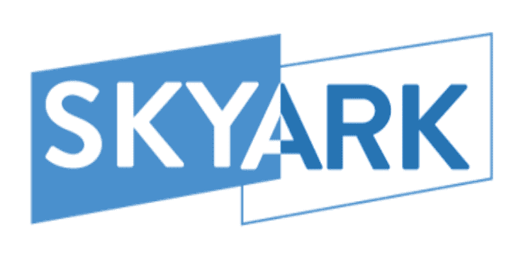
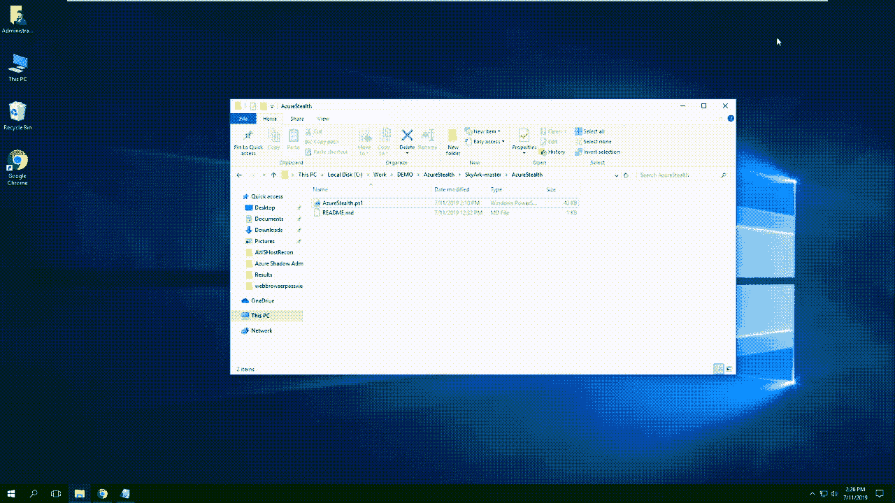

# SkyArk:一个云安全项目，有两个主要的扫描模块

> 原文：<https://kalilinuxtutorials.com/skyark/>

**SkyArk** 是一个云安全项目，有两个主要扫描模块:

*   **Azure health–**扫描 Azure 环境
*   **aw stealth—**扫描 AWS 环境

这两个扫描模块将发现目标 AWS 和 Azure 中最有特权的实体。

**主要目标——发现最有特权的云用户**

它目前专注于减轻云影子管理员的新威胁，并帮助组织发现、评估和保护云特权实体。

隐秘和秘密的云管理员可能驻留在每个公共云平台上，而 SkyArk 有助于减轻 AWS 和 Azure 中的风险。

在防御/测试/风险评估程序中，确保解决威胁并验证这些特权实体确实得到了很好的保护。

**背景**

SkyArk 应对云影子管理员的新威胁——攻击者如何找到并滥用重要的所谓“有限”权限，以便仍然通过并提升其权限，成为完全的云管理员。此外，攻击者可以很容易地使用那些棘手的特定权限来隐藏秘密的管理实体，这些实体将作为一种秘密的持久性技术等待他们。

SkyArk 最初是作为我们关于 AWS 影子管理员威胁的研究的一部分发布的，该研究在 RSA USA 2018 大会上发表。
AWS 影子管理员博客帖子:

[https://www . cyberark . com/threat-research-blog/cloud-shadow-admin-threat-10-permissions-protect/](https://www.cyberark.com/threat-research-blog/cloud-shadow-admin-threat-10-permissions-protect/)

RSA 演讲的录音:

[https://www . RSA conference . com/videos/sky-your-way-to-cloud-persistence shadow-admins-is-here-to-stay](https://www.rsaconference.com/videos/sneak-your-way-to-cloud-persistenceshadow-admins-are-here-to-stay)

大约一年后，我们为 SkyArk 添加了 Azure 健康扫描，以减轻 Azure 中影子管理员的威胁！

**工具描述**

它目前包含两个主要的扫描模块 **AWStealth** 和**azure health**。

通过扫描结果，组织可以发现拥有最敏感和最危险权限的实体(用户、组和角色)。
此外，我们还鼓励组织不时地扫描他们的环境，并在其特权实体列表中搜索可疑的偏差。

**潜在的攻击者正在搜寻这些用户，防御团队应该确保这些特权用户得到很好的保护——拥有强大的、循环的和安全存储的凭据，启用 MFA，受到仔细的监控，等等。**

请记住，我们无法保护我们不知道的东西，SkyArk 有助于发现最有特权的云实体的复杂任务，包括直接的管理员和秘密的影子管理员，这些管理员可以轻松提升他们的特权，也可以成为完全管理员。

*   **azure 健康扫描**

发现被扫描的 Azure 环境中最有特权的用户，包括 Azure 影子管理员。

**如何运行 AzureStealth？**

完整的细节在 azure health 的自述文件中:
[https://github . com/cyberark/sky ark/blob/master/azure health/Readme . MD](https://github.com/cyberark/SkyArk/blob/master/AzureStealth/README.md)
简而言之:

*   本地下载/同步 SkyArk 项目
*   打开 SkyArk 文件夹中有权限运行脚本的 PowerShell:
    “PowerShell-execution policy Bypass-no profile”
*   运行以下命令:

**(1)导入-模块。\ skyark . PS1-force
(2)Start-azure health**

AzureStealth 只需要对扫描的 Azure 目录(租户)和订阅的只读权限。
*您还可以使用内置的 CloudShell 在 Azure 门户中轻松运行扫描:

**(1) IEX (New-Object Net。WebClient)。download string(' https://raw . githubusercontent . com/cyberark/sky ark/master/azure health/azure health . PS1 ')
(2)Scan-AzureAdmins**

**azure health 演示**

*   **AWStealth Scan**

发现被扫描的 AWS 环境中最有特权的实体，包括 Azure 影子管理员。

**如何运行 AWStealth** ？

完整的细节在 AWStealth 的自述文件里:
[https://github.com/cyberark/SkyArk/tree/master/AWStealth](https://github.com/cyberark/SkyArk/tree/master/AWStealth)
简而言之:

*   本地下载/同步 SkyArk 项目
*   打开 SkyArk 文件夹中有权限运行脚本的 PowerShell:
    “PowerShell-execution policy Bypass-no profile”
*   运行以下命令:

**(1)导入-模块。\ skyark . PS1-force
(2)Start-aw stealth**

AWStealth 只需要对被扫描的 AWS 环境的 IAM 服务的只读权限。

**AWStealth DEMO:**

*   **SkyArk 包括更多小的子模块，用于在云安全领域进行游戏**

*   这种子模块的一个例子是 **AWStrace** 模块。
*   **AWS trace——分析 AWS CloudTrail 日志，并从 CloudTrail 日志中提供新的有价值的见解。**
*   它特别优先考虑有风险的敏感 IAM 操作，潜在的攻击者可能会将其作为 AWS 影子管理员的恶意操作的一部分。
*   该模块分析日志文件，并生成信息性 csv 结果文件，其中包含在测试环境中执行的每个操作的重要细节。
*   安全团队可以使用结果文件来调查敏感操作，发现采取这些操作的实体，并揭示每个已执行和记录的操作的其他有价值的详细信息。

**快速启动**

*   查看扫描模块的自述文件:
    *   **azure health-**[https://github . com/cyberark/sky ark/blob/master/azure health/readme . MD](https://github.com/cyberark/SkyArk/blob/master/AzureStealth/README.md)
    *   **AWStealth –** [https://github.com/cyberark/SkyArk/blob/master/AWStealth/README.md](https://github.com/cyberark/SkyArk/blob/master/AWStealth/README.md)

[**Download**](https://github.com/cyberark/SkyArk)