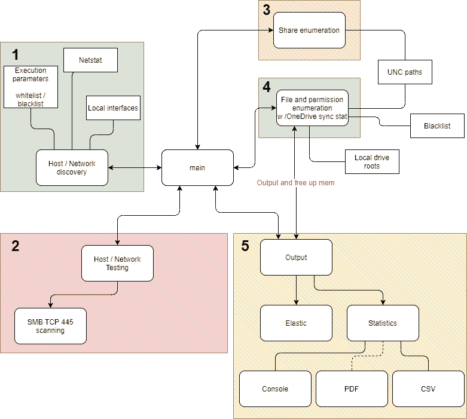

# SMBeagle:文件共享审计工具，它能搜索出它在网络中看到的所有文件，并报告文件是否可以被读取和/或写入

> 原文：<https://kalilinuxtutorials.com/smbeagle/>

SMBeagle 是一个(SMB)文件共享审计工具，它可以搜索出它在网络中可以看到的所有文件，并报告该文件是否可以被读取和/或写入。所有这些发现都被输出到一个 CSV 文件或一个弹性搜索主机，或者两者都有！？

SMBeagle 试图利用 win32 APIs 来获得最大速度，但是失败回到较慢的 ACL 检查。

它有两个很棒的用例:

**聚焦弱共享权限**。

各种规模的企业通常都有带有可怕文件权限的文件共享。

大型企业在文件服务器上有大量共享，发现权限配置不当的敏感数据并不罕见。

小型企业通常在办公室的角落里有一个小型 NAS，没有任何限制！

SMBeagle 抓取这些共享，并列出它可以读写的所有文件。如果它可以读取它们，勒索软件也可以。

**横向调动和特权升级**

SMBeagle 可以为渗透测试人员提供提升权限和横向移动的不太明显的途径。

通过直接输出到 elasticsearch，测试人员可以快速找到可读的脚本和可写的可执行文件。

发现水坑攻击和无保护的密码从来没有感觉这么容易！

**基巴纳仪表盘**

有关安装和使用 Kibana 仪表板的详细说明，请参阅 Kibana 自述文件，这些仪表板提供了可视化管理，并使数据透视变得更加容易。

**用法**

唯一的强制参数是设置一个输出，它应该是一个 elasticsearch 主机 IP 地址或一个 csv 文件。

一个好的起点是启用快速模式并输出到 csv，但这个 CSV 可能会变得很大，这取决于它找到多少文件。

**。/SMBeagle.exe -c out.csv -f**

**完全使用**

**用法:
输出到一个 CSV 文件:
SMBeagle -c out.csv
输出到 elasticsearch(Preffered):
SMBeagle-e 127 . 0 . 0 . 1
输出到 elastic search 和 CSV:
SMBeagle-c out . CSV-e 127 . 0 . 0 . 1
禁用网络发现并提供手动网络:
SMBeagle-D-e 127 . 0 . 0 . 1-n 127/23 192.168.15.0/24
也扫描本地文件系统(慢):
SMBeagle -e 127.0.0.1 -l
不枚举 ACL(更快):
SMBeagle-A-e 127 . 0 . 0 . 1
-c，–CSV-file(Group:Output)通过提供 filepath
-e，–elastic search-host 将结果输出到 CSV
文件 –Scan-local-drives 扫描本机的本地驱动器
-L，–Exclude-local-shares 不扫描本机的本地驱动器
-D，–Disable-network-discovery 禁用网络发现
-n，–network 手动添加要扫描的网络
-N，–Exclude-network 从扫描中排除网络
-h，–host 手动添加要扫描的主机
-H，–Exclude-host 从扫描中排除主机
-q，–quiet 禁用不必要的输出

–版本 Di** 显示版本信息。

**架构**

SMBeagle 做了大量的工作，这些工作被分解成松散耦合的模块，这些模块相互传递。这使设计保持简单，并允许我们轻松地扩展每个模块。

我们目前只在 Windows 上运行，尽管我们使用的是跨平台的 dotnetcore。Linux 对 SMB 的支持相对较弱，我们在 SMB 端利用了大量 Win32 APIs。我们确实有一个开放的问题，所以如果你想看的话，请给予支持。

[**Downlo**ad](https://github.com/punk-security/SMBeagle)