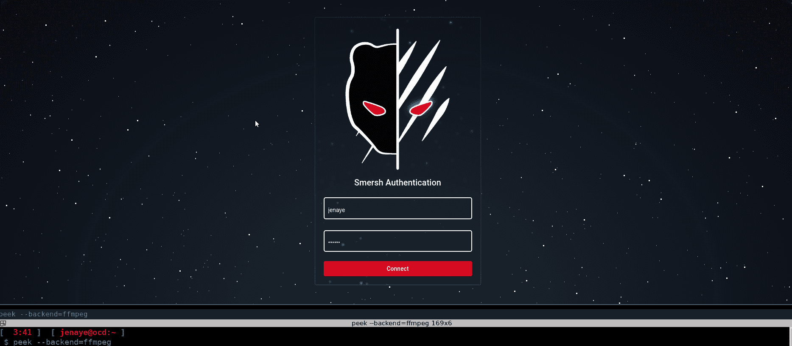

# Smersh:面向 Pentest 的协作工具

> 原文：<https://kalilinuxtutorials.com/smersh/>

Smersh 是一个面向 pentest 的协作工具，用于跟踪贵公司任务的进展并建立融洽关系。

**预览前端**

**文档**

所有信息可从以下地址获得: [https://docs.smersh.app](https://docs.smersh.app)

**如何投稿？**

只需*分叉*存储库，然后创建分支，工作并推送您的内容+创建 PR

**git check out-b my branch
git add-p
git commit-m " xx "
git push origin my branch**

[Download](https://github.com/CMEPW/Smersh)