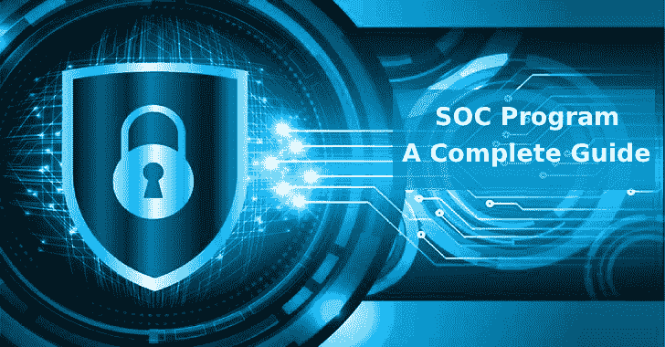

# 在合适的 SOC 计划中寻找什么——完整指南

> 原文：<https://kalilinuxtutorials.com/soc-program/>

SOC 代表“安全运营中心”，它对每个企业都很重要，无论其规模如何。无论您的企业是大是小，每个人都需要某种 SOC 计划来确保一切安全，这意味着找到适合您需求的合适计划。

一个非常小的企业可能使用几个应用程序来保护系统和信息的安全，而一个大公司可能使用多种技术、流程和整个 SOC 团队来确保一切都是安全的。SOC 的目标是检测、优先处理可能给公司带来灾难的网络安全事件，并找到解决方案。

如果你正在寻找一个新的 SOC 项目，这些建议将帮助你找到合适的项目。

## **自动化**

选择一个能够保证重要业务信息安全的系统非常重要，但这并不意味着您希望新系统占用您所有的时间。如果你最终得到一个程序，它的许多过程不能自动化，这就是将要发生的事情。

具有[安全自动化](https://www.siemplify.co/security-automation/)功能的 SOC 系统将使您的生活轻松许多。设计良好的程序识别出重复性的过程，并包含自动完成这些任务的程序，这样你就不用做了。

这将为您和您的团队节省大量时间，但它还有其他好处。它可以减少误报，并且可以使数据收集更加容易。

## SOC 计划**一体化系统**

自动化将为您节省时间和金钱，但安全协调也是如此。这意味着该计划能够在一个地方同步各种流程和技术，因此您不必访问多个平台来找到您要找的信息。

考虑安全协调平台的其他原因包括:

*   警报可以在一个地方找到，而不是分散在多个平台上。
*   减少冗余和/或无关紧要的警报。
*   包含所有重要和必要信息的安全威胁全貌。

它也有可能为您的公司节省大量资金。您可以降低警报处理、分析师培训和报告方面的成本，同时为员工省去分别管理多个系统的麻烦。

## **监控或管理**

正确的 SOC 计划还将使您能够根据您的业务和您想要的服务类型做出一些选择。一个重要的考虑因素是，你是希望平台监控你的网络安全，还是希望公司管理你的[安全](https://cybersecuritynews.com/endpoint-security-tools/)。

每个程序都是用来监控你的安全的。你的程序会提醒你潜在的问题，但是如果没有同一家公司的管理，你将不得不自己处理问题。

这可能是件好事，也可能是件坏事。监控软件通常比全面管理服务更实惠，如果您有自己的 IT 团队，您可能不需要它们。

然而，如果你不这样做，你可能不知道该怎么做，如果你发现了一个问题。在这种情况下，管理软件是更好的选择。

## **全天候支持**

软件公司可以做很多事情来为你提供[良好的客户服务](https://smallbusiness.chron.com/features-good-customer-service-2076.html)。一个不可协商的是 24/7 支持。

这并不意味着公司为每个人提供 24/7 的支持。作为非客户，你可能无法在半夜联系到某人，但如果你是付费客户，公司应该能够在你需要的时候为你提供支持。

## **良好的客户评价**

项目的质量是一个重要的考虑因素，就像他们是否提供 24/7 的支持一样，但你也必须更广泛地考虑公司。你不想选择一个在他们的客户中没有好名声的。

作为一家企业，你知道顾客评论的影响，所以当你寻找一个 T2 SOC 项目时，一定要做好调查。浏览评论网站以及该公司的网站，阅读客户对其软件和服务的深入评论。

你也可以直接联系该公司，要求推荐信。诚然，你可能只会收到积极的评价，但在某些情况下，你可以直接联系推荐人，询问他们对该公司的体验。

## **扩展能力**–SOC 计划

企业不是一成不变的。希望随着时间的推移，你的业务会慢慢增长。也有可能一夜之间你会发现更多的需求。毕竟，这就是社交媒体的力量！

相反的情况也是可能的。有时候，对一家企业来说，最好的办法是缩小规模，为更小的客户群服务。

你必须确保你选择的软件是[可扩展的](https://www.investopedia.com/terms/s/scalability.asp)。如果不这样做，当您随着业务的扩展或收缩而试图寻找新软件时，您可能会发现自己没有网络安全保护。

## **思考谁将会使用该软件**

当你寻找 SOC 项目的所有这些特征时，确保你也把你的员工放在心上。在选择正确的软件时，你必须考虑谁将会使用这个软件。

确保你在选择程序时询问他们的意见，这样他们会觉得他们对日常使用的程序有发言权。他们也可能会给你提供建议，尤其是如果他们在这方面比你更熟练的话。

培训也是一个重要的考虑因素。一家合格的、经验丰富的软件公司将通过提供在线培训材料或在您所在的地点进行现场培训来帮助您进行培训。

寻找新的应用程序或数字程序来为您的业务服务总是一个困难的决定，因为您希望选择一个为您提供最大回报的应用程序或数字程序。

当这个程序要保护你的计算机系统和重要的公司信息时，就更难了。根据此列表中的提示，您可以缩小最佳 SOC 计划的范围，让您高枕无忧，因为您的系统得到了全面保护。