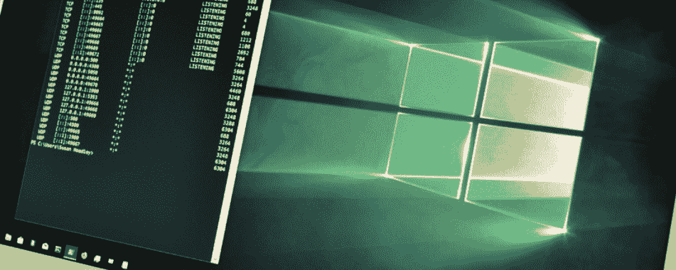

# Speakeasy : Windows 内核和用户模式模拟

> 原文：<https://kalilinuxtutorials.com/speakeasy/>

**Speakeasy** 是一款便携式、模块化、二进制仿真器，旨在仿真 Windows 内核和用户模式恶意软件。

查看第一篇 Speakeasy 博客文章中的概述。

Speakeasy 将模拟 Windows 的特定组件，而不是尝试使用整个虚拟化操作系统来执行动态分析。具体来说，通过模拟操作系统 API、对象、运行的进程/线程、文件系统和网络，应该可以呈现一个样本可以完全“执行”的环境。可以在容器或云服务中轻松模拟样本，这允许同时分析许多样本的巨大可扩展性。目前，Speakeasy 支持用户模式和内核模式的 Windows 应用程序。

在模拟之前，在二进制文件中识别入口点。例如，导出的函数都被顺序识别和模拟。另外，在运行时发现的动态入口点(例如，新线程、注册的回调、IRP 处理程序)也被仿真。这里的目标是在模拟过程中尽可能多地覆盖代码。事件是基于每个入口点记录的，因此功能可以归属于特定的函数或导出。

Speakeasy 目前完全用 Python 3 编写，并依赖于 Unicorn 仿真引擎来仿真 CPU 指令。CPU 仿真引擎可以被替换掉，并且有计划在将来支持其他引擎。

在 Python 代码中模拟 API，以便处理它们预期的输入和输出，从而使恶意软件保持在它们的“快乐路径”上。这些 API 及其结构应该与微软提供的 API 文档一致。

**安装**

Speakeasy 可以作为独立脚本在 docker 容器中执行，也可以在云服务中执行。最简单的安装方法是首先安装所需的软件包依赖项，然后运行包含的 setup.py 脚本(用当前的 python3 解释器替换“Python3”):

**CD
python 3-m pip install-r requirements . txt
python 3 setup . py 安装**

为了构建 docker 映像，还包括一个 docker 文件，但是，Speakeasy 的依赖项可以安装在本地系统上，并直接从 Python 运行。

**在 docker 容器内运行**

包含的 docker 文件可用于生成 docker 图像。

**构建 docker 映像**

*   建立码头工人形象；以下命令将创建一个标签名为“my_tag”的容器:

**CD
docker build-t " my _ tag "**

*   运行 Docker 映像并在`/sandbox`中创建一个本地卷:

**docker run-v:/sandbox-it " my _ tag "**

**用途**

**作为图书馆**

可以导入 Speakeasy 并将其用作通用的 Windows 仿真库。当与框架交互时，应该使用名为`**Speakeasy**`的主公共接口。也可以使用较低级别的仿真器对象，但是它们的接口将来可能会改变，并且可能缺少文档。

下面是一个如何模拟 Windows DLL 的快速示例:

**导入地下酒吧
#获取一个地下酒吧对象
se =地下酒吧。Speakeasy()
#将一个 dll 加载到仿真空间**
**module = se . Load _ module(" my file . DLL ")
#仿真 DLL 的入口点(即 DllMain)**
**se . run _ module(module)
#为导出设置一些 args
arg 0 = 0x 0
arg 1 = 0x 1
#遍历 DLL 导出
以用于 module.get 中的 exp 对其进行解析或保存以便进行后期处理**

有关更多示例，请参见示例目录。

**作为独立的命令行工具**

对于不希望以库的形式与 speakeasy 框架进行编程交互的用户，提供了一个独立的脚本来自动模拟 Windows 二进制文件。可以通过基本 repo 目录中的`**run_speakeasy.py**`脚本调用 Speakeasy。这个脚本将解析指定的 PE 并调用适当的模拟器(内核模式或用户模式)。该脚本的参数如下所示。

**用法:run _ speakeasy . py[-h][-t TARGET][-p[PARAMS…]][-c CONFIG][-m][-r][–RAW _ OFFSET RAW _ OFFSET]
[-a ARCH][-d DUMP _ PATH][-q time out][-z DROP _ FILES _ PATH][-l MODULE _ DIR][-k][–no-MP]
用 speakeasy 仿真一个 Windows 二进制文件
可选参数:
-h，–help –PARAMS[PARAMS…]
提供给仿真进程的命令行参数(例如 main(argv))
-c CONFIG，–CONFIG CONFIG
仿真器配置文件的路径
-m，–mem-tracing 启用内存跟踪。 这将记录样本的所有内存访问，但会影响速度
-r，–raw 尝试不经解析直接模拟文件(例如外壳代码)
–RAW _ offset RAW _ OFFSET
在 RAW 模式下，OFFSET(十六进制)开始模拟
-a ARCH，–ARCH ARCH 强制模拟期间使用的体系结构(针对多体系结构文件或外壳代码)。支持的
archs:[x86 | amd64]
-d DUMP _ PATH，–DUMP DUMP _ PATH
存储压缩内存转储包的路径
-q TIMEOUT，–time out time out
仿真超时秒数(默认 60 秒)
-z DROP_FILES_PATH，–DROP-FILES DROP _ FILES _ PATH
存储仿真期间创建的文件的路径
-l MODULE_DIR，–MODULE-DIR MODULE _ DIR
包含可加载 PE 模块的目录的路径。当模块被 samples 解析或加载时，来自这个目录的 PE
将被加载到仿真地址空间
-k，–Emulate-children
在输入文件完成仿真
之后，仿真使用 CreateProcess APIs 创建的任何进程–no-MP 在当前进程中运行仿真以辅助而不是子进程。当
调试自身时有用(使用** g pdb.set_trace())。

**例题**

模拟 Windows 驱动程序:

**user @**my box:~/speakeasy $ python 3 run _ speakeasy . py-t ~/drivers/my driver . sys

模拟 32 位 Windows 外壳代码:

**user @ my box:~/speakeasy $ python 3 run _ speakeasy . py-t ~/sc . bin-r-a x86**

模拟 64 位 Windows 外壳代码并创建完整的内存转储:

**user @ my box:~/speakeasy $ python 3 run _ speakeasy . py-t ~/sc . bin-r-a x64-d memdump . zip**

**配置**

Speakeasy 使用配置文件来描述呈现给模拟二进制文件的环境。有关这些字段的完整描述，请参见此处的自述文件。

**内存管理**

Speakeasy 在模拟器引擎的内存管理之上实现了一个轻量级的内存管理器。恶意软件分配的每个内存块都被跟踪和标记，以便获得有意义的内存转储。能够将活动归因于特定的内存块对分析师来说非常有用。记录对敏感数据结构的内存读取和写入可以揭示 API 调用记录无法揭示的恶意软件的真实意图，这对于 rootkits 之类的样本尤其有用。

**速度**

因为 Speakeasy 是用 Python 编写的，所以速度是一个明显的问题。在本机代码和 Python 之间进行转换是极其昂贵的，应该尽可能少地进行。因此，我们的目标是只在绝对必要的时候执行 Python 代码。默认情况下，Python 中唯一处理的事件是内存访问异常或 Windows API 调用。为了捕捉 Windows API 调用并在 Python 中模拟它们，导入表中掺杂了无效的内存地址，因此只有在访问导入表时才会执行 Python 代码。当外壳代码访问加载在外壳代码的仿真地址空间内的 dll 的导出表时，使用类似的技术。通过执行尽可能少的 Python 代码，可以获得合理的速度，同时仍然允许用户快速开发框架的功能。

**限制**

由于我们不依赖物理操作系统来处理 API 调用、对象和内存分配以及 I/O 操作，这些职责就落在了仿真器的肩上。在模拟多个样本时，用户可能会遇到没有完全模拟的样本。这很可能是由于缺少 API 处理程序、特定的操作系统实现细节或环境因素造成的。有关更多详细信息，请参见文档/限制。

**模块导出解析**

许多恶意软件样本(如外壳代码)会尝试手动解析 PE 模块的导出表，以解析 API 函数指针。尝试使用当前支持的仿真函数名来制作“诱饵”导出表，但这对于某些示例来说可能还不够。配置文件支持两个名为`**module_directory_x86**`和`**module_directory_x64**`的字段。这些字段是可以包含加载到仿真样本的虚拟地址空间中的 dll 或其他模块的目录。还有一个命令行选项(`**-l**`)可以在运行时指定这个目录。这对于对预期要加载到内存中的 PE 模块进行深度解析的示例来说非常有用。

**添加 API 处理程序**

像大多数模拟器一样，对操作系统的 API 调用由框架处理。可以通过简单地在相应的仿真模块中定义一个具有正确名称的函数来添加仿真 API 处理程序。根据 API 预期的输出，简单地返回一个成功代码可能就足够了。为了正确清理堆栈，必须指定参数计数。如果没有指定调用约定，则假定使用 stdcall。论点单作为原始整数传递给仿真函数。

下面是 kernel32 模块中 HeapAlloc 函数的 API 处理程序示例。

**@apihook('HeapAlloc '，argc=3)
def HeapAlloc(self，emu，argv，CTX = { }):
" '
DECLSPEC _ ALLOCATOR LPVOID heap alloc(
HANDLE hHeap，
DWORD dwFlags，
SIZE _ T dw bytes
)；
"'
hHeap，dwFlags，dw bytes = argv
chunk = self . heap _ alloc(dw bytes，heap = ' heap alloc ')
if chunk:
emu . set _ last _ error(windefs。错误 _ 成功)
返回组块**

[**Download**](https://github.com/fireeye/speakeasy)