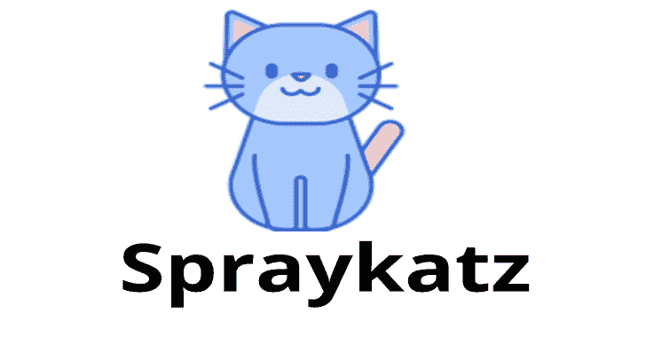
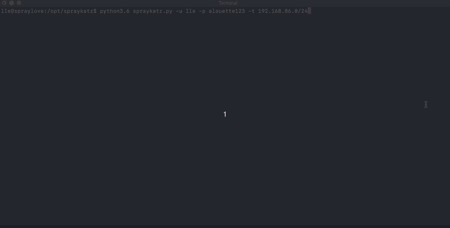

# Spraykatz:证书收集工具自动远程转储和解析 Lsass 进程

> 原文：<https://kalilinuxtutorials.com/spraykatz-credentials-gathering-tool/>

**Spraykatz** 是一款没有任何保护的工具，能够**在 Windows 机器和大型活动目录环境中检索凭证**。

它只是试图远程处理转储机器和解析转储，以尽可能避免防病毒软件的检测。

**安装**

这个工具是为 **`python>=3`** 编写的。不要在生产环境中使用它！

**Ubuntu**

在最新更新的 Ubuntu 上。

**apt 更新
apt install-y python 3.6 python 3-pip
git nmap git clone–recurse-submodules https://github.com/aas-n/spraykatz.git
CD spray Katz
pip 3 install-r requirements . txt**

**也可阅读-[银:易受攻击服务的大规模扫描 IPs](https://kalilinuxtutorials.com/silver-mass-scan-ips-vulnerable-services/)**

**使用 Spraykatz**

快速开始可以是:

**。/spray Katz . py-u H4x0r-p l0 C4 l4d m1 n-t 192 . 168 . 1 . 0/24**

**强制参数**

| 开关 | 描述 |
| --- | --- |
| -u，–用户名 | 用于喷涂的用户。他必须拥有目标系统的管理员权限，才能远程执行代码。 |
| -p，–密码 | 用户密码或`LM:NT`格式的 NTLM 散列。 |
| 目标 | IP 地址和/或 IP 地址范围。您可以通过目标文件(每行一个目标)或内联(用逗号分隔)提交它们。 |

**可选参数**

| 开关 | 描述 |
| --- | --- |
| -d，–域 | 用户的域。如果他是某个域的**而不是**成员，只需使用`-d .`即可。 |
| -v，–冗长 | 详细模式{警告，信息，调试}。默认值==信息。 |

[**Download**](https://github.com/aas-n/spraykatz)