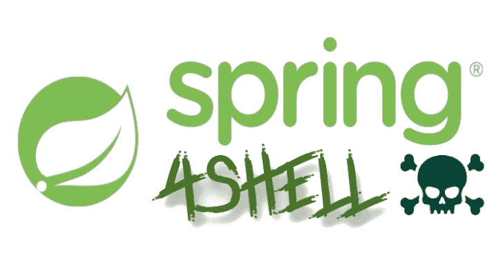

# spring 4 shell-POC:Dockerized spring 4 shell(CVE-2022-22965)POC 应用和开发

> 原文：<https://kalilinuxtutorials.com/spring4shell-poc/>

.png)

**Spring4Shell-POC** 是一个 dockerized 应用程序，容易受到 Spring4Shell 漏洞(CVE-2022-22965)的攻击。提供了 war 的完整 Java 源代码，并且可以修改，只要构建了 docker 映像，war 就会重新构建。构建的 WAR 将由 Tomcat 加载。这个应用程序没有什么特别的，它是一个简单的 hello world，基于 Spring 教程。

## 要求

*   码头工人
*   Python3 +请求库

## 说明

*   克隆存储库
*   构建并运行容器:`**docker build . -t spring4shell && docker run -p 8080:8080 spring4shell**`
*   应用程序现在应该可以在 http://localhost:8080/hello world/greeting
*   运行 exploit.py 脚本:`**python exploit.py --url "http://localhost:8080/helloworld/greeting"**`
*   访问创建的 webshell！修改命令的`**cmd**`获取参数。(`**http://localhost:8080/shell.jsp**`默认)

[**Download**](https://github.com/reznok/Spring4Shell-POC)