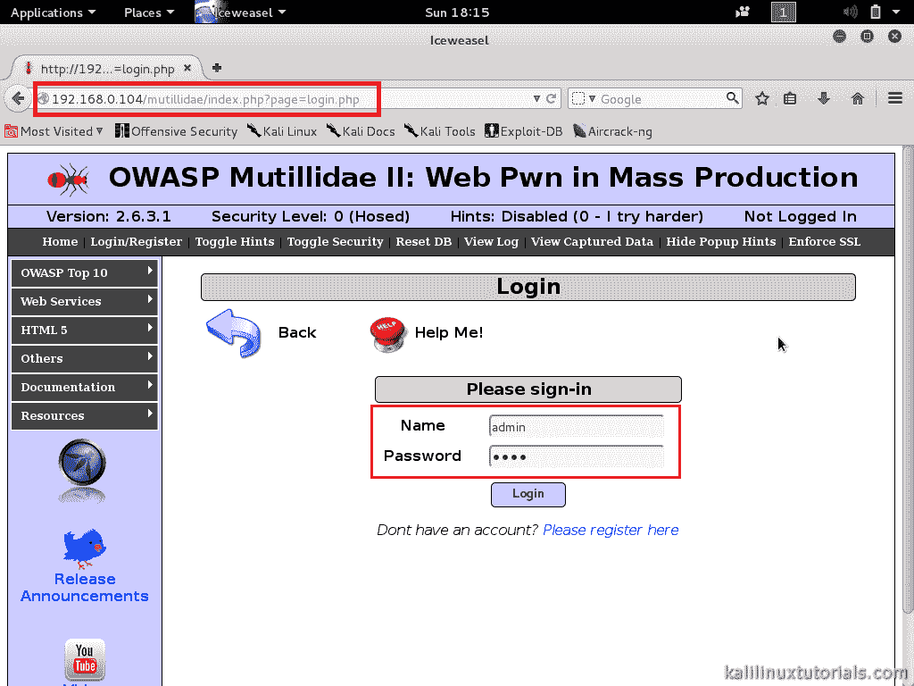
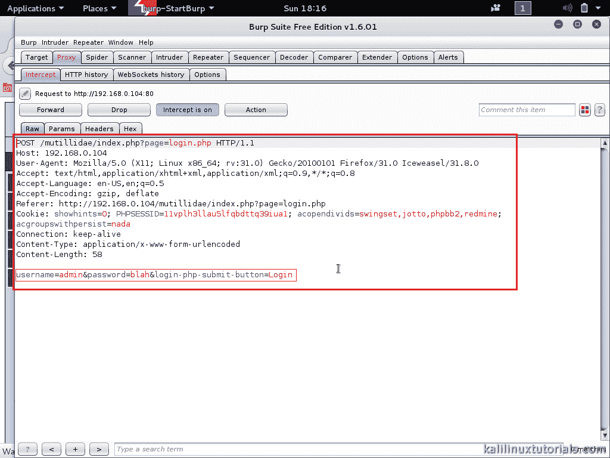
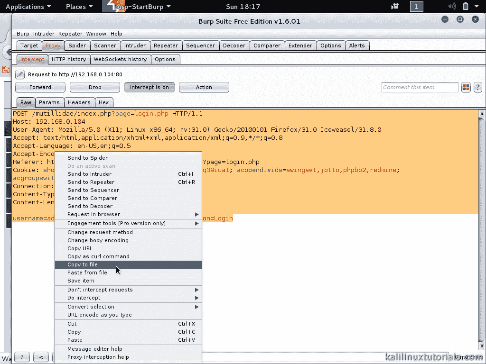
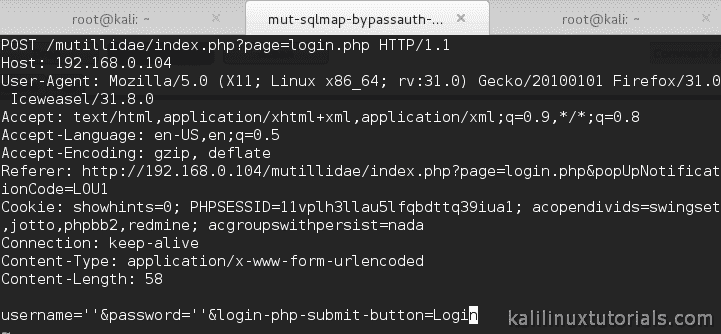
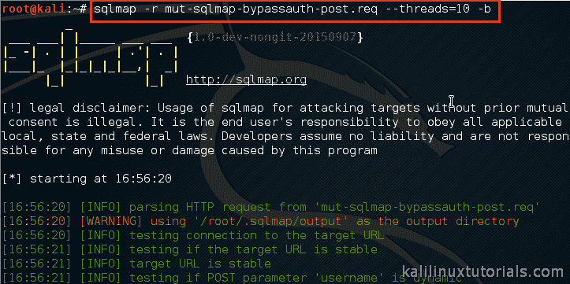
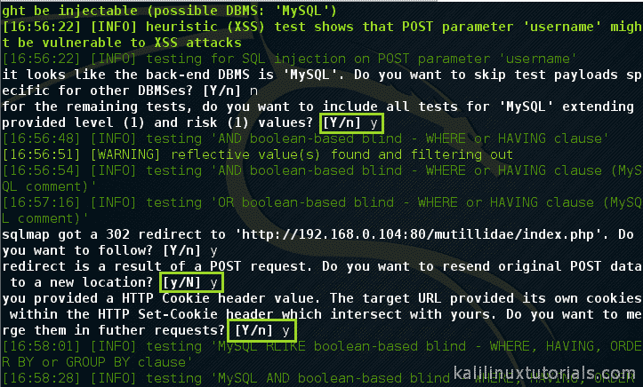
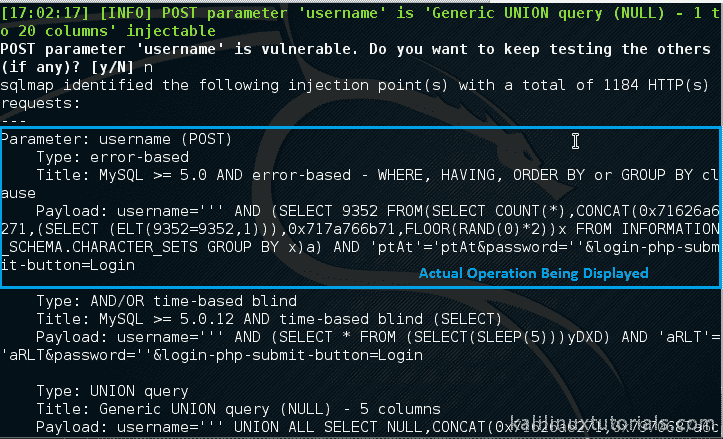
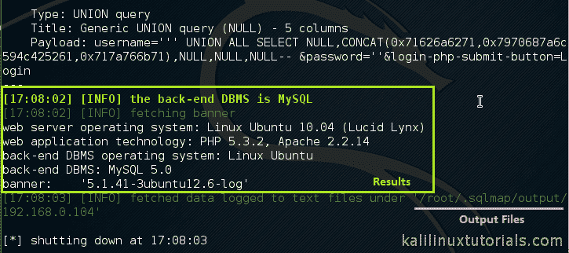

# SQLMAP–SQLi 的介绍和自动化

> 原文：<https://kalilinuxtutorials.com/sqlmap/>

## SQLMAP 的基本操作&通过自动 SQL 注入枚举服务器。

SQLMAP 是一个数据库测试工具，用于自动化 SQL 注入。实际上，使用 sqlmap，我们可以从易受攻击的服务器上转储整个数据库。SQLMap 是用 python 编写的，具有动态测试特性。它可以非常高效地对各种数据库后端进行测试。Sqlmap 为 web 测试提供了高度灵活的模块化操作。它可以作为一个基本的指纹工具，直到一个完整的数据库开发工具。简单地说，没有 sqlmap 就没有 web 应用程序测试。总而言之，满载而归..！

### SQLMAP 的功能

1.  支持
    *   MySQL，
    *   甲骨文，
    *   PostgreSQL，
    *   Microsoft SQL Server、Microsoft Access、
    *   IBM DB2，
    *   SQLite，火鸟，
    *   赛贝斯，
    *   SAP MaxDB
    *   HSQLDB
2.  支持 6 种注射技术
    *   基于布尔的盲，
    *   基于时间的盲，
    *   基于错误，
    *   基于联合查询，
    *   堆叠查询
    *   带外的
3.  能够对特定数据库、表、列执行操作，甚至转储整个数据库。还提供多种数据库功能。
4.  支持任意查询和系统命令的执行
5.  注入后门的能力。
6.  特定的攻击者对数据库起作用。
7.  多色输出指示不同的信息。(绿色= Info 黄色=警告；红色=危急；粗体绿色=有趣等。)

### 链接:

[主页](http://sqlmap.org/)

[来源(Github)](https://github.com/sqlmapproject/sqlmap)

## 关于 SQLi 的一些信息

> SQL 注入是一种代码注入技术，用于攻击数据驱动的应用程序，在这种应用程序中，恶意的 SQL 语句被插入到条目字段中以供执行——维基百科

Sql 注入基本上是让后端数据库服务器执行非预期的查询，以获取信息或绕过身份验证或在远程主机中执行命令，以及其他各种恶意目的。这些非预期的查询通常是通过网页中的输入表单(如登录表单)输入特殊的操作字符(取决于后端 DBMS)来执行的。通过执行 SQLi，攻击者可以在远程机器上执行各种类型的任务。SQLi 是网站中发现最多的漏洞。[点击这里](http://www.hackmageddon.com/2015/09/10/august-2015-cyber-attacks-statistics/)查看一些统计数据。

### 方案

**攻击机** : Kali Linux 2.0 (VM)

**目标** : OWASPBWA(虚拟机)，IP 地址:192.168.0.104，应用程序:Mutillidae

**目标 URL** (范围):http://192 . 168 . 0 . 104/mutillidae/

## 实验 1:抓取横幅

在本实验中，我们只是从远程机器上抓取横幅。从该操作中检索诸如后端 DBMS、Web 应用技术、服务器操作系统、Web 服务器类型和版本等细节。为此，我们需要指定确切的 url 或包含 url 请求的文件。在本教程中，我们将使用包含请求的文件来执行操作。我们可以在 burpsuite 的帮助下接受这个请求。我们可以打开拦截功能，将来自浏览器的请求转发给 burpsuite。看到请求后，我们可以复制请求并将其粘贴到文件中。参考 [burpsuite 教程，了解如何开始使用 burpsuite。](http://kalilinuxtutorials.com/wa/burpsuite/)

### 第一步:接受请求

打开 Mutillidae 的登录页面(或者你曾经有过的目标)。

[](http://kalilinuxtutorials.com/wa/sqlmap-introduction-automation-of-sql-injection/attachment/sqlmap5/)

Filling the form

打开 Burpsuite 并打开拦截代理。还要将浏览器配置为将连接作为代理发送到 burpsuite。[参考这里的](http://kalilinuxtutorials.com/wa/burpsuite/)来看看怎么做。

[](http://kalilinuxtutorials.com/wa/sqlmap-introduction-automation-of-sql-injection/attachment/sqlmap6/)

Burpsuite intercepting the request

回到浏览器，在文本框中输入一些数据，然后提交。

参见在 burpsuite 截获的请求。将整个请求复制到一个新文件中。这里我用的是“mut-sqlmap-bypassauth-post.req”。然后保存文件。

[](http://kalilinuxtutorials.com/wa/sqlmap-introduction-automation-of-sql-injection/attachment/sqlmap7/)

Copying the Request

**注意**:打开打嗝拦截后，只选择**岗位**请求。该请求应该是您在执行基于浏览器的手动 SQL 注入时会执行的请求。

[](http://kalilinuxtutorials.com/wa/sqlmap-introduction-automation-of-sql-injection/attachment/sqlmap8/)

Saving the file

在任何文本编辑器中编辑文件，使用户名和密码为空。给出两个单引号。

[](http://kalilinuxtutorials.com/wa/sqlmap-introduction-automation-of-sql-injection/attachment/sqlmap9/)

Editing request file2

### 步骤 2:使用该文件运行 SQLMAP

```
Command: sqlmap -r mut-sqlmap-bypassauth-post.req<replace with yours> --threads=10<optional> -b
```

[](http://kalilinuxtutorials.com/wa/sqlmap-introduction-automation-of-sql-injection/attachment/sqlmap1/)

Executing sqlmap

Sqlmap 在执行过程中会问几个问题。你可以对所有问题回答“是”(“是”)，但一定要仔细阅读。

[](http://kalilinuxtutorials.com/wa/sqlmap-introduction-automation-of-sql-injection/attachment/sqlmap2/)

Sqlmap prompts

您可以看到各种消息& sqlmap 完成的实际操作，最后显示结果。

[](http://kalilinuxtutorials.com/wa/sqlmap-introduction-automation-of-sql-injection/attachment/sqlmap3/)

Operations displayed

[](http://kalilinuxtutorials.com/wa/sqlmap-introduction-automation-of-sql-injection/attachment/sqlmap4/)

Results

这里展示了网络服务器、后端数据库网络技术和系统操作系统。所有这些信息也存储在本地目录中。你也可以试着阅读它们。

### 参考

**章鱼下载链接**:【http://sourceforge.net/projects/mutillidae/ 

**OWASP BWA 下载链接**:【http://sourceforge.net/projects/owaspbwa/?source=directory 

[http://blog . check point . com/2015/05/07/latest-SQL-injection-trends/](http://blog.checkpoint.com/2015/05/07/latest-sql-injection-trends/)

[http://www . dark reading . com/risk/SQL-injections-top-attack-statistics/d/d-id/1132988](http://www.darkreading.com/risk/sql-injections-top-attack-statistics/d/d-id/1132988)