# SQLMAP–从易受攻击的 Web 表单中枚举数据库和用户

> 原文：<https://kalilinuxtutorials.com/sqlmap2/>

Sqlmap 是一个数据库评估工具，pentesters &安全研究人员可以用它来列举各种类型的数据库。Sqlmap 自动化了普通的&高级 sql 注入技术，并在常规表单上执行它们。请参考关于 SQLMAP 的[介绍的文章。](http://kalilinuxtutorials.com/wa/sqlmap-introduction-automation-of-sql-injection/)

以下实验课程是上一节 sqlmap 课程的延续。所以我建议你在继续写这篇文章之前，先看看那篇文章，除非你知道自己在做什么。[点击此处](http://kalilinuxtutorials.com/wa/sqlmap-introduction-automation-of-sql-injection/)阅读第一篇文章。

## 实验 1:数据库枚举

在本实验中，我们从易受攻击的 web 应用程序中枚举和转储整个数据库。为此，我们需要 URL 或复制请求到我们正在尝试 sql 注入的表单。在本实验中，我使用的是保存在文件中的请求。参考[此处](http://kalilinuxtutorials.com/wa/sqlmap-introduction-automation-of-sql-injection/)看如何拿这个。这里的场景与参考链接中描述的相同。

### 步骤 1:获取所有数据库

在获取请求并保存为文件后，我们可以继续使用 sqlmap。如果你发现网页不容易受到攻击，抓取横幅不会给出确切的结果。因此，由于页面易受攻击，让我们使用 sqlmap 执行一些攻击。

```
Command: sqlmap -r mut-sqlmap-bypassauth-post.req <replace this with your filename> --dbs

```

[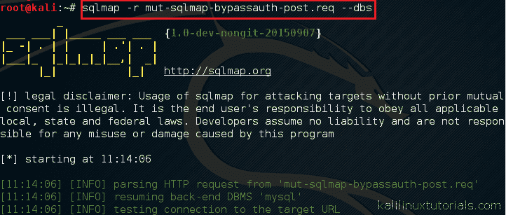](http://kalilinuxtutorials.com/wa/sqlmap2/attachment/sqlmap2-1/)

Performing DB Enumeration

输出显示远程服务器中的数据库列表。

[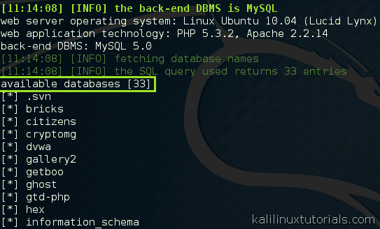](http://kalilinuxtutorials.com/wa/sqlmap2/attachment/sqlmap2-2/)

Databases in the remote server

现在我们有了一个数据库列表，我们可以专注于其中的一个。为此，我关注一个名为 Mutillidae 的数据库。

### 步骤 2:从选定的数据库中获取表。

```
Command: sqlmap -r mut-sqlmap-bypassauth-post.req -D mutillidae <replace with your db name> --tables
```

[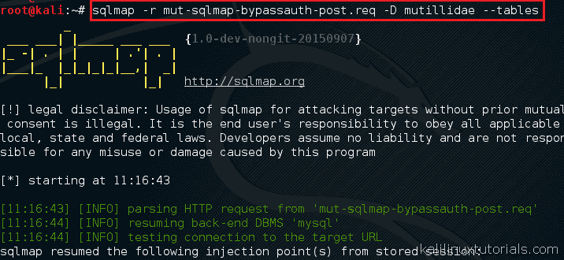](http://kalilinuxtutorials.com/wa/sqlmap2/attachment/sqlmap2-3/)

Enumerating Tables

现在我们可以看到表格填充

[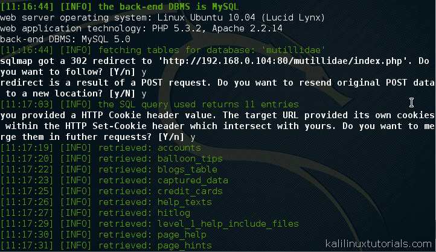](http://kalilinuxtutorials.com/wa/sqlmap2/attachment/sqlmap2-4/)

Tables Populating

[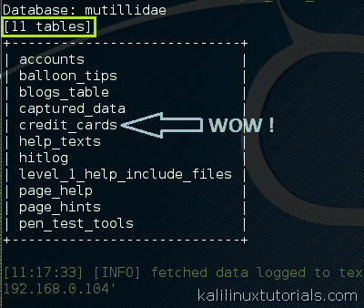](http://kalilinuxtutorials.com/wa/sqlmap2/attachment/sqlmap2-5/)

Tables Populating

现在我们有了驻留在远程服务器中的表的列表，我们可以将其中任何一个表转储到我们的系统中。所执行操作的所有细节都由 sqlmap 自动存储。现在，让我们专注于名为 credit_cards 的表。

```
Command: sqlmap -r mut-sqlmap-bypassauth-post.req -D mutillidae <replace with your db name> -T credit_cards <replace with your table> --dump
```

[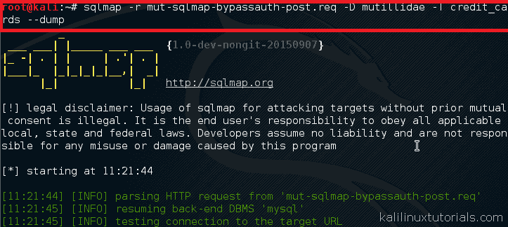](http://kalilinuxtutorials.com/wa/sqlmap2/attachment/sqlmap2-6/)

Dumping the target table

现在我们可以在屏幕上看到表格，一个包含表格内容的文件将自动生成。

[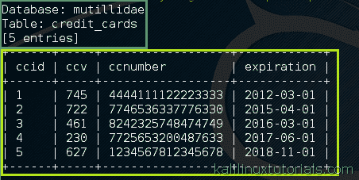](http://kalilinuxtutorials.com/wa/sqlmap2/attachment/sqlmap2-8/)

Table Contents

## 实验 2:用户枚举

在本实验中，我们使用相同的请求文件来枚举数据库用户。Sqlmap 可以检测数据库服务器中的用户，以及他们的角色和权限。

```
Command: sqlmap -r mut-sqlmap-bypassauth-post.req --users
```

[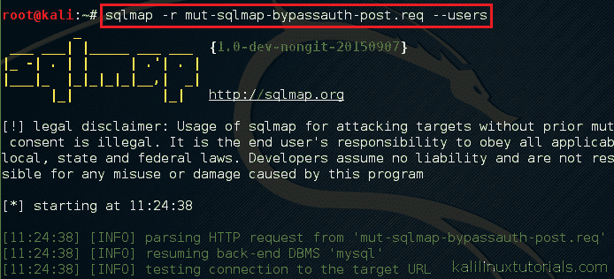](http://kalilinuxtutorials.com/wa/sqlmap2/attachment/sqlmap2-9/)

Enumerating Users

[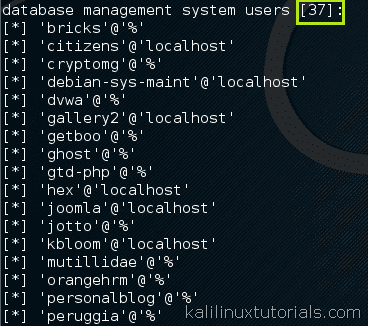](http://kalilinuxtutorials.com/wa/sqlmap2/attachment/sqlmap2-10/)

A list of users present on the Database server

现在我们必须从屏幕上显示的列表中选择一个目标用户。对于本教程，我将选择 root 用户。现在让我们看看分配给用户 root 的角色是什么。当然，root 用户将拥有所有角色和权限，但是您可以用其他用户的命令来代替。

```
Command: sqlmap -r mut-sqlmap-bypassauth-post.req -U root<replace with your username> --roles
```

[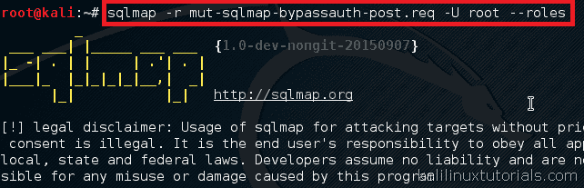](http://kalilinuxtutorials.com/wa/sqlmap2/attachment/sqlmap2-13/)

Enumerating Roles

[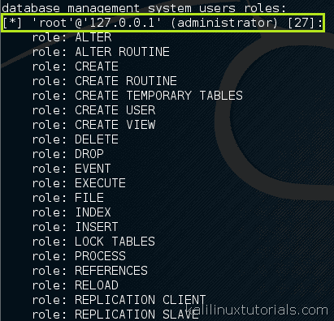](http://kalilinuxtutorials.com/wa/sqlmap2/attachment/sqlmap2-14/)

Roles of root user being displayed

好了，现在让我们看看用户的权限

```
Command: sqlmap -r mut-sqlmap-bypassauth-post.req -U root<replace with your username> --privileges
```

[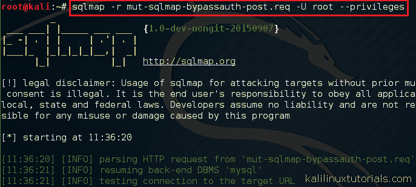](http://kalilinuxtutorials.com/wa/sqlmap2/attachment/sqlmap2-11/)

Enumerating Privileges

[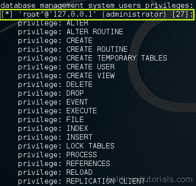](http://kalilinuxtutorials.com/wa/sqlmap2/attachment/sqlmap2-12/)

List of Privileges for root user

现在最好的部分，让我们看看我们是否能得到用户的密码。是的，sqlmap 也能为您做到这一点，方法如下:

```
Command: sqlmap -r mut-sqlmap-bypassauth-post.req -U root<replace with your username> --passwords
```

[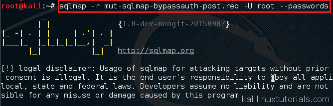](http://kalilinuxtutorials.com/wa/sqlmap2/attachment/sqlmap2-15/)

Enumerating Passwords

在这个操作中，sqlmap 提出了几个新问题。一个是你是否想把散列存储在一个临时文件中。还有一个就是你要不要马上做一个基于字典的攻击。可以根据自己的意愿回答。

[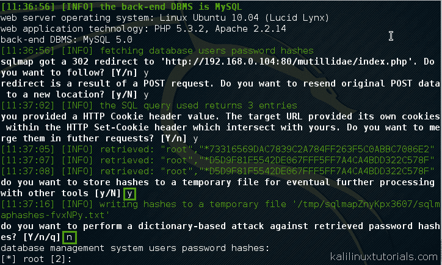](http://kalilinuxtutorials.com/wa/sqlmap2/attachment/sqlmap2-16/)

Sqlmap Prompts

最后，你来的目的，密码散列。有了这个恢复，我们可以尝试对任何密码破解像 JTR 或在线工具等。

[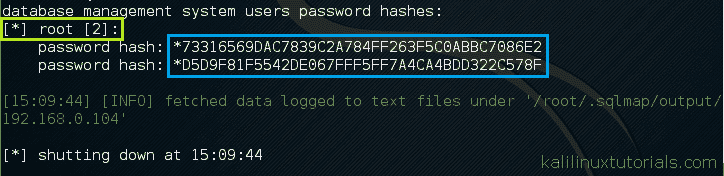](http://kalilinuxtutorials.com/wa/sqlmap2/attachment/sqlmap2-17/)

Password hashes being dumped to screen

现在，您已经了解了 sqlmap 如何帮助您自动化 SQL 注入，以及它的功能和特性。所有这些都可以在执行 Web 应用程序安全测试时广泛地付诸实践。

由于 SQLi 是 web 应用程序中最常见的漏洞，您肯定可以使用 sqlmap 来检查各种各样的安全问题&快速执行各种测试。正如我前面说过的，我想重复这句话“事实上，没有 sqlmap 就没有 Web 应用程序测试”。