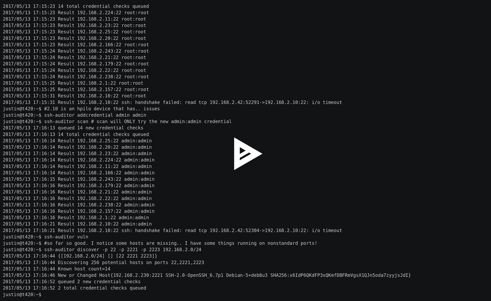
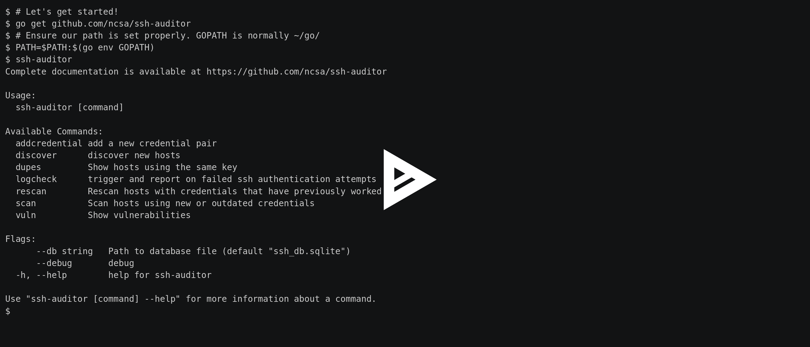

# SSH Auditor–扫描网络上的弱 SSH 密码

> 原文：<https://kalilinuxtutorials.com/ssh-auditor-scan-weak-ssh-passwords/>

SSH Auditor 是在您的网络上扫描弱 SSH 密码的最佳方式。SSH Auditor 将自动:

*   添加新凭据时，重新检查所有已知主机。它将只检查新的凭证。
*   对发现的任何新主机进行完全凭据扫描。
*   在 ssh 版本或密钥指纹发生变化的任何已知主机上，对完全凭据扫描进行排队。
*   尝试执行命令以及尝试建立 TCP 连接的隧道。
*   使用每个凭据`scan_interval`重新检查每个凭据–默认为 14 天。

它的设计使得您可以每小时从 cron 运行`**ssh-auditor discover**` + **`ssh-auditor scan`** 来执行一次持续的审计。

**亦读 [蝎狮:符号执行工具](https://kalilinuxtutorials.com/manticore-symbolic-execution-tool/)**

## **安装 SSH 审计器**

```
$ brew install go # or however you want to install the go compiler
$ go get github.com/ncsa/ssh-auditor
```

## **或者从 git 克隆构建**

```
$ go build
```

## **构建包含 SQLite 的静态二进制文件**

```
$ make static
```

## **确保您可以使用足够的文件描述符**

```
$ ulimit -n 4096
```

## **创建初始数据库并发现 ssh 服务器**

```
$ ./ssh-auditor discover -p 22 -p 2222 192.168.1.0/24 10.0.0.1/24
```

## **添加凭证对进行检查**

```
$ ./ssh-auditor addcredential root root
$ ./ssh-auditor addcredential admin admin
$ ./ssh-auditor addcredential guest guest --scan-interval 1 #check this once per day
```

## **在一批 20000 台**主机上尝试凭证

```
$ ./ssh-auditor scan
```

## **输出关于哪些凭证有效的报告**

```
$ ./ssh-auditor vuln
```

## **重新检查有效的凭证**

```
$ ./ssh-auditor rescan
```

## **输出关于重复密钥使用的报告**

```
$ ./ssh-auditor dupes
```

## **视频演示**

#### **展示所有功能的早期演示**

[ ](https://asciinema.org/a/5rb3wv8oyoqzd80jfl03grrcv?autoplay=1) **演示显示改进的日志输出**

[](https://asciinema.org/a/F3fQYyJcieCS9Kfna6xWferjK?autoplay=1)

[ ](https://github.com/ncsa/ssh-auditor) ** *您可以在 [Linkedin](https://www.linkedin.com/company/gbhackers/) 、 [Twitter](https://twitter.com/GbhackerOn) 、[脸书](https://www.facebook.com/gbhackersadmin)上关注我们的日常网络安全更新，您还可以在线参加[最佳网络安全课程](https://ethicalhackersacademy.com/)以保持自我更新。***