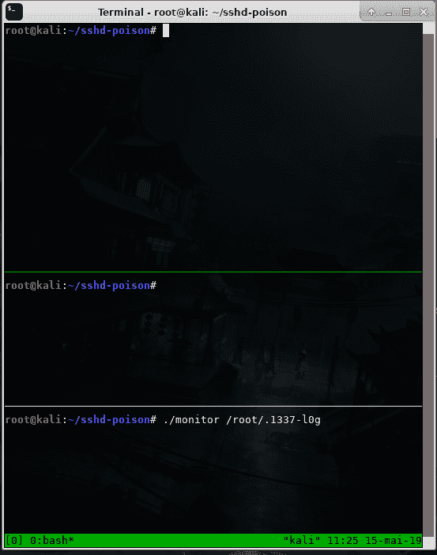

# SSHD 毒药:获得基于 SSHD 认证的 Pam 信用的工具

> 原文：<https://kalilinuxtutorials.com/sshd-poison/>

SSHD 毒药是一个获得基于 sshd 认证的 pam 的凭证的工具，这不是最简单的方法(你可以创建一个 pam 模块，或者只是在服务配置中添加`**auth optional pam_exec.so quiet expose_authtok /bin/bash -c {read,-r,x};{echo,-e,"`env`\n$x"}>>somefile**`)，甚至不是最隐秘的方法(该工具没有任何隐藏自己的机制，并且需要一直控制主要的 sshd pid)，但是编写这个代码给了我很多乐趣。

**工作原理**

该工具开始附加主 sshd pid 并等待一些事件，当一个新的进程被创建时，这意味着一个新的连接被启动，在此之后，该工具将等待一个 execve 事件，然后检查执行的程序是否与主 pid 相同，以确保重新执行(这就是为什么我们需要控制主 pid，每次重新执行都将擦除任何内存修改)，然后在新进程的入口点设置一个断点，用于等待程序加载共享库。

当它完成并且断点命中时，它被取消设置，程序将把外壳代码写到一个代码洞穴，并且 libpam 使用的 pam_set_item 的 get 条目将被改变，以挂钩对 pam_set_item 函数的内部 libpam 调用。

日志格式有`**password\0rhost\0user\0**`。

这只适用于 x86_64 PIE 二进制文件，以及内核 3.4 或更早版本(PTRACE _ SEIZE)，我测试了这款带有内核`**5.0.13-arch1-1-ARCH**`**`**OpenSSH_7.9p1 Debian-10, OpenSSL 1.1.1b 26 Feb 2019**`**`**4.19.0-kali3-amd64**`****

 ******也可理解为-[交联:LinkedIn 枚举工具，用于从组织中提取有效的员工姓名](https://kalilinuxtutorials.com/crosslinked/)**

**编译**

–**git 克隆–递归子模块 https://github.com/hc0d3r/sshd-poison
–CD sshd-poison
–make**

**演示**

[**Download**](https://github.com/hc0d3r/sshd-poison)****