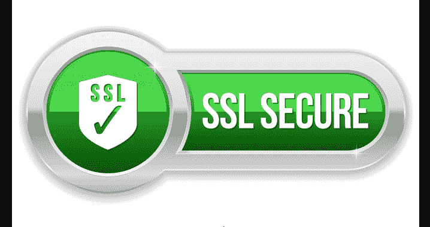
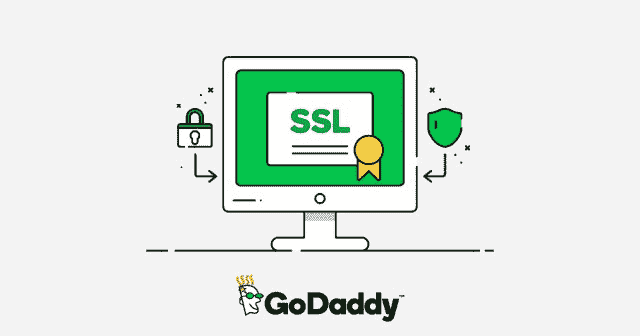

# SSL 证书验证的工作原理

> 原文：<https://kalilinuxtutorials.com/ssl-certificate/>

想让你的生意暴涨吗？做到这一点的最好方法无疑是把它放到万维网上。在这个进步的世界里，每个人都需要互联网来完成他们的任务，没有互联网的日子似乎是不可能的。

随着这些年来互联网应用的增加。现在有更多的人利用你的服务或使用你的产品。但是，如果我们谈论在万维网上做生意，事情并不像看起来那么简单——这主要是由于网上的威胁。

为了交付产品或提供服务，您需要从客户那里获得一些信息。但是，你如何确保最终用户信任你，并愿意在你的网站上转换？随着黑客变得日益先进，传输的数据被窃取的威胁迅速增加。

没有一天不听说一些欺诈或身份盗窃。在数据传输过程中，身份盗窃的一个重大风险是中间人( [MITM](http://kalilinuxtutorials.com/drmitm-globally-log-traffic-website/) )攻击。当犯罪者截获双方之间的通信并成功窃取交换的信息时，就会发生这种情况。

许多曾经成功的大公司日子不好过，主要是因为他们的网上商店不够安全，因此转化率下降。重要的是要记住，要想成功；你必须“赢得”顾客的信任。

最好的方法之一就是**为你的网站购买一个便宜的 SSL 证书**。随着越来越多的人开始关注他们在万维网上的安全，拥有 SSL 证书是必须的。

# **什么是 SSL？**

SSL，也称为安全套接字层，将携带纯文本的 [HTTP](http://kalilinuxtutorials.com/https-everywhere/) 协议转换为安全的超文本传输协议(HTTPS)。SSL 的工作原理是加密信息，这样只有传输的端点知道如何加密或解密信息。

数据在传送到传输通道之前进行编码，最后进行解码。因此，即使黑客或一些恶意软件成功地获得了正在传输的信息，他们也无法理解他们所窃取的内容。因此，SSL 有助于使客户免受最常见的网络犯罪，并且他/她的身份保持安全。

# **SSL 证书的作用**

SSL 证书就像一面盾牌，保护您的客户端免受数据传输过程中发生的攻击。要在互联网上取得成功，最关键的因素是“信任”如果你的网站不能为你的客户提供一个安全的环境，他们就不太可能购买或再次访问你的网站。这是 SSL 证书帮助您解决的根本问题。拥有 SSL 证书为您——所有者和最终用户——之间的信任奠定了基础。

这些证书由被称为[认证机构](https://en.wikipedia.org/wiki/Certificate_authority) (CA)的可信第三方颁发。这些机构确保在通信方之间创建安全的编码网络。通过加密数据，他们可以确保没有恶意软件或黑客窃取您的个人信息，而被转移。

**SSL 证书的种类**

证书颁发机构负责对申请 SSL 证书的域名和公司进行身份验证。根据发生的验证级别，有三种类型的证书:

*   **域验证(DV) SSL 证书**

已知这些证书具有最不严格的验证级别。在这种情况下，CA 或证书颁发机构只验证申请证书的域由有效的组织控制，而不是欺诈。

在这个简单的验证之后，域验证 SSL 证书被提供给相关的网站。这是获得证书最便宜的方式，通过电子邮件就可以轻松获得。要进行验证，您可以更改与域相关联的 DNS 记录，或者将 CA 提供的文件上载到域。这通常是一个自动化的过程。

当这些证书被授予网站时，网站地址窗口的左侧会显示一个挂锁。这种证书被认为是不涉及销售产品的网站的一个好选择，比如博客和小企业。

*   **组织验证的(OV) SSL 证书**

这些类型的证书具有适度的验证级别，并且涉及手动检查过程。认证机构对提出申请的组织进行认证，尽管没有很多细节。此外，他们会进行更多的调查并与组织联系，以确保这不是一个欺诈网站，并且对用户来说是一个安全的网站。

人类会这么做，所以相对来说比 DV 证书要贵一点。这个过程需要几天时间才能完成。这个 SSL 证书提供了域的所有权和公司地址等信息。

当颁发这些证书时，会显示一个带有网站相关详细信息的证书。这些 OV 证书通常用于 S/MIME 电子邮件证书、文档签名、客户端身份验证和代码签名。

*   **扩展验证(EV) SSL 证书**

众所周知，这些证书具有最严格的验证级别。认证机构对申请 EV SSL 证书的组织执行完整的背景检查。该机构检查公司的合法存在，甚至检查它们的实际位置。

它还确保组织知道以他们的名义提出的 SSL 证书签名请求，并且只批准它。由于高层次的人工参与，它是所有 SSL 证书中成本最高的。这一过程可能需要几周时间，因为需要进行深入的验证。

浏览器 URL 变为绿色表示 EV SSL 证书已颁发给该特定站点。这些证书通常由处理敏感客户数据(如信用卡号和密码)的公司购买。例如，电子商务商店和银行。

# **在浏览器中验证:**

以下是客户端浏览器在与使用 SSL 的站点进行交互时所使用的验证过程的高级描述:

*   网站将其 SSL 证书提交给浏览器，由浏览器根据颁发证书的 CA 进行验证。
*   所有浏览器都预装了所有重要的证书颁发机构的公钥列表。使用相关的公钥验证签名的证书；数据被解密并以可理解的形式显示。
*   通过身份验证后，浏览器和网站之间将使用 SSL 建立安全的 HTTPS 连接。
*   所有的证书都有一个私钥，用于加密服务器端的数据。
*   加密的数据被安全地传输，另一方面，在网络浏览器中被解密。相同的机制用于相反的方向。

**结论:**

你还在等什么？购买一个便宜的 SSL 证书，这是赢得客户信任和确保您的网站在客户数据交换中安全的最具成本效益和最佳方式之一。拥有 SSL 证书将提高您的转换率，并将您的业务扩展到您想象不到的领域。你也将从 SEO 提升中获益，这意味着免费的有针对性的有机流量——最终增加你的底线。