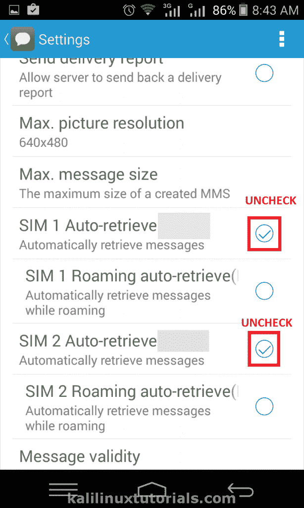

# 怯场——你需要知道的一切

> 原文：<https://kalilinuxtutorials.com/stagefright-all-you-need-to-know/>

# 找出您的设备是否易受攻击，并防御 Stagefright 漏洞

Stagefright 是最新的大规模漏洞之一，席卷了全球多达 10 亿台 android 设备。基本上来说，stagefright 漏洞是一个缺陷，它允许攻击者通过向您发送彩信来控制您的 android 设备。它可以通过您的运营商服务或 Google Hangouts 或任何其他具有自动下载彩信功能的服务。攻击者可以通过向您发送恶意彩信来访问您的设备。如果恶意彩信下载到您的设备中，攻击者就可以访问。你根本不需要打开彩信。通过这样做，攻击者可以访问你的电子邮件、facebook、whatsapp 和你设备中的许多其他服务。因此，首先也是最重要的，now 本身关闭了你安装在 android 设备上的信息、Google Hangouts 和其他特定服务中的自动下载媒体选项。

## 更具体的细节给 IT 人员。

Stagefright 实际上是捆绑到单个库中的一组媒体格式的集合，用于 android 操作系统中的媒体播放。这是用 C++ native 编写的，目的是提高媒体处理性能。但是 C++更容易出现内存损坏和溢出。2015 年 8 月(即本文撰写的这个月)，一家名为 Zimpremium 提供企业移动安全解决方案和服务的公司在 stagefright 库中发现了一组漏洞。zLabs 公司的 R&D 团队于 8 月 7 日在 Blackhat USA 月 5 日和 DEFCON 23 上正式展示了该漏洞。2015 年 4 月，zLabs 安全研究员 Joshua Drake 在 Stagefright 库中发现了这个漏洞。尽管他已经向谷歌报告了此事&他们已经发布了补丁，但安全研究人员认为，仍有 9.5 亿部安卓设备存在漏洞。

### 技术上来说

stagefright 库中存在七个远程代码执行和权限提升漏洞。深入的技术细节是不可用的，尽管他们被分配了以下 CVE 号码。分别论述了脆弱性的类型、影响和脆弱对象。

*   CVE-2015-1538–整数溢出、远程代码执行、MP4 Atom
*   CVE-2015-1539–整数溢出、远程代码执行、MP4 Atom
*   CVE-2015-3824–整数溢出、远程代码执行、MP4 Atom
*   CVE-2015-3826–缓冲区过度读取，3GPP 元数据
*   CVE-2015-3827–整数溢出，远程代码执行，MP4 原子
*   CVE-2015-3828–整数下溢，远程代码执行，3GPP
*   CVE-2015-3829–整数溢出，远程代码执行，MP4 原子

[POC](https://youtu.be/PxQc5gOHnKs)见此视频

## 面向普通用户和儿童

这没什么大不了的，不需要关掉你的智能手机或者增加你的血压。这只是一个简单的坏的彩信/媒体消息，它会出现在你的消息或谷歌视频或类似的应用程序中。你需要做的只是关闭自动媒体下载&确保不要打开任何来自未知发件人的彩信，甚至是短信。另外，记得更新你手机上的应用程序&一看到新的安卓更新就安装。如果你仍然害怕，关掉 Wifi 或移动数据，那么没人敢碰你的设备。(:P)

## 如何检测您的设备是否受到影响

Play store 中有一些应用程序已经开始检测此漏洞。使用这些应用程序，你可以将它们直接安装到你的设备上，并在你的设备上亲自检查。这里我描述了两个有用的应用程序。它们如下所示:

1.  舞台恐惧探测器–了望移动安全
2.  怯场探测器 Zimperium 公司。

### 舞台恐惧探测器–了望移动安全

Lookout Security

这更适合不想要技术怪的普通用户。这个应用程序只是清楚地检测您的设备是否有漏洞，并显示结果摘要。找到这个应用程序很简单。大多数情况下，当你在 Play store 中搜索“Stagefright Detector”时，这个应用程序将是第二个。然而，这里有一个链接:

[怯场探测器——瞭望移动安全](https://play.google.com/store/apps/details?id=com.lookout.stagefrightdetector&hl=en)

像安装普通应用程序一样安装它。安装后，只需打开应用程序&它开始检测。检测完成后，它会显示结果。它还包括一些有趣的链接。

这很简单，因为你解锁你的手机。试试看。

下面是一些截图。

### 怯场探测器 Zimperium 公司。

Zimperium

这是发现该漏洞的官方安全研究公司的应用程序。除了检测是否易受攻击之外，它还提供了关于您的设备易受攻击的确切变量的附加信息。它还以红色和绿色 CVE 数字给出了一些更详细的输出。

如果你的设备有 2015-3824 漏洞，它会变红。其他不存在的变成绿色。

查找和安装应用程序很简单。当你在 play store 中搜索“stagefright detector”时，这个应用将是第一个弹出的应用。以下是该应用程序的链接:

[Stagefright 探测器——Zimperium 公司](https://play.google.com/store/apps/details?id=com.zimperium.stagefrightdetector&hl=en)

安装后，打开应用程序并点击“开始分析”按钮开始分析您的设备。成功检测后，应用程序以前面描述的方式显示结果。

以下是截图:

## 如何防御？

### 1。更新 Android

最好的解决办法是等安卓到了再更新。谷歌官方发布了修补这个问题的 Android 5.1.1_r9。截至目前(2015 年 8 月)，它已适用于 Nexus、HTC &三星。预计更多设备的补丁将很快推出。

### 2。禁用自动下载

事实上，首先要做的是阻止所有未知来源的短信和彩信。攻击者可以像钓鱼链接一样使用这些短信来访问您的 android 设备。所以这里有一个任务清单

关闭彩信的自动检索功能。

在您的 Android 设备中，进入信息>设置>自动检索&取消选中该选项。

对常去的地方也做同样的事情。

Disabling Auto Retrive

## 结论

除了 heartbleed 漏洞之外，影响大范围设备的最广泛的漏洞是 stagefright 漏洞。这个缺陷有系统级和人级的补丁。在我看来，人类层面的修补和防御更有必要，因为许多最终用户设备都受到了影响。对于所有 android 设备用户来说，让他们基本意识到这个缺陷是什么以及如何防范它是同等重要的。帮助一个人保护他们的隐私更像是一项社会工作，而不仅仅是说你的设备容易受到攻击。所以尽你所能去做吧。

当然，如果你认为这篇文章会有所帮助，分享这篇文章会帮助一些人保护自己。那你为什么还在等？请喜欢我们，关注我们，订阅并提供反馈。