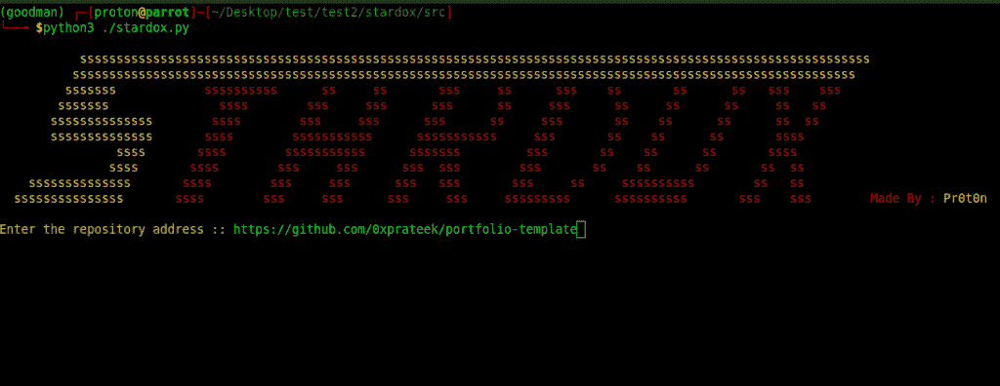
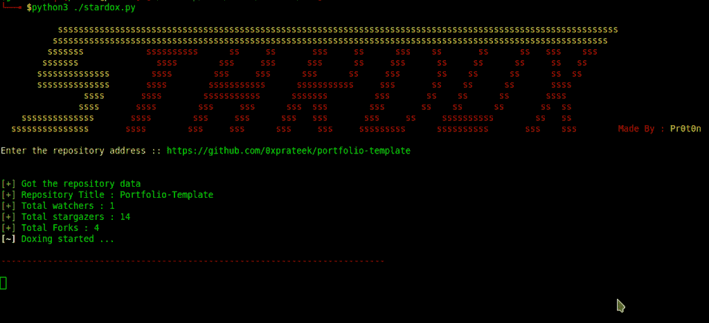
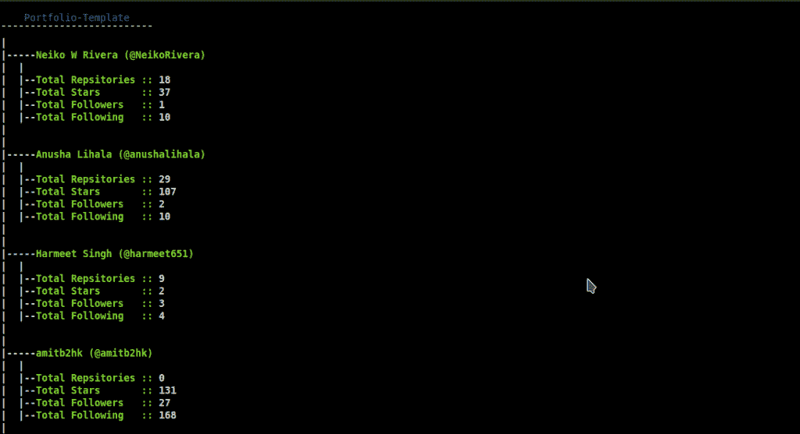

# stardox-Github Stargazers 信息收集工具

> 原文：<https://kalilinuxtutorials.com/stardox-github-gathering-tool/>

Stardox 是一个先进的 github stargazers 信息收集工具。它从 Github 中提取信息，并在列表树视图中显示出来。它可以用来收集你的/某人的储存库观星者详细信息。

##### 它获取什么数据:

*   `Total repsitories`
*   `Total stars`
*   `Total Followers`
*   `Total Following`

页（page 的缩写）许多新的东西很快就会被添加进来

**也可阅读:** [网络管理器——管理网络的强大工具&排查网络问题](https://kalilinuxtutorials.com/networkmanager-manage-troubleshoot/)

### **入门**

#### **设置步骤:**

**git 克隆 https://github . com/0 xprateek/stardox
star DOX CD
python。/setup.py 安装〔T3〕**

#### **开始明星生涯:**

**CD stardox/src
python 3 stardox . py**

示例用法:` python3。/stardox.p

#### **画廊**

#### **获取仓库数据。**

#### **提取数据的列表树视图**

[**Download**](https://github.com/0xPrateek/Stardox)