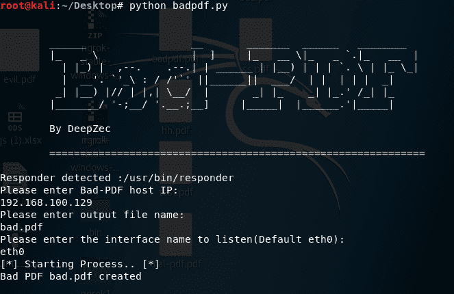
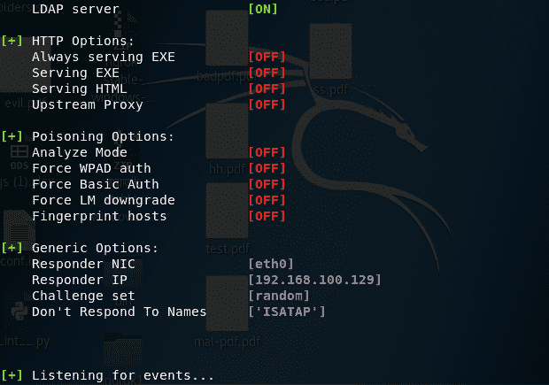
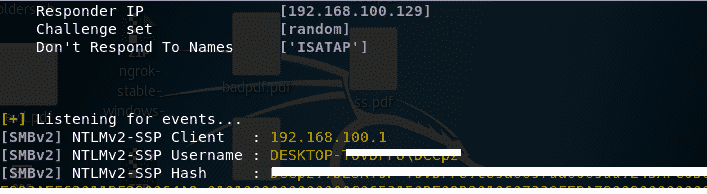

# Bad-PDF 从 Windows 机器上窃取 NTLM 散列

> 原文：<https://kalilinuxtutorials.com/steal-ntlm-hashes-windows-machines/>

Bad-PDF make 恶意 PDF 从 windows 机器中窃取 NTLM 散列，它利用检查点组显示的无防备性来制作恶意 PDF 记录。Bad-Pdf 使用 Responder listener 仔细检查 NTLM 散列。

这种策略处理所有 PDF 阅读器(任何版本),这种攻击不需要 java 脚本。

**参考:**[https://research . check point . com/NTLM-credentials-theft-via-pdf-files/](https://research.checkpoint.com/ntlm-credentials-theft-via-pdf-files/)

**又读 [蛋壳——iOS/MAC OS 远程管理工具](http://kalilinuxtutorials.com/eggshell-remote-administration-tool/)**

## **依赖窃取 NTLM 哈希**

**Responder/Kali Linux**

**用法:** python badpdf.py

#### **在 Kali linux 中运行 Bad-PDF:**

#### **响应者等待 NTLM 哈希:**

#### **在 windows 机器上运行生成的 Bad-PDF 文件并获取 NTLM 哈希:**

**作者:[Deepu](http://twitter.com/DeepZec)**

****