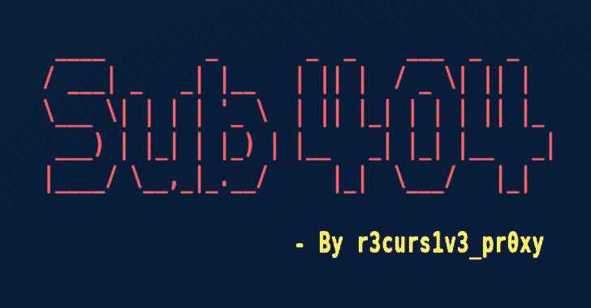
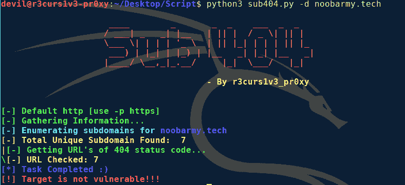
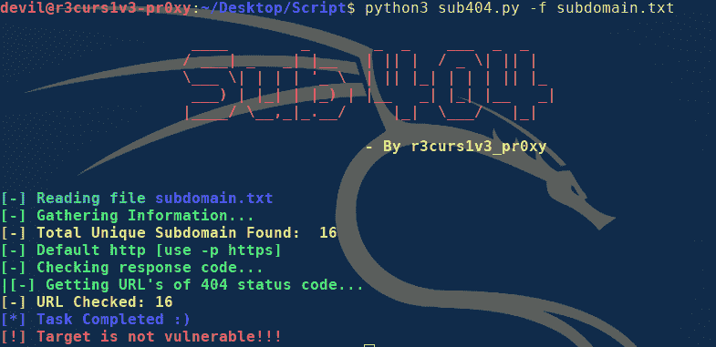

# SUB 404:检查子域接管漏洞的快速工具

> 原文：<https://kalilinuxtutorials.com/sub-404/>

Sub 404 是一个用 python 编写的工具，用于检查子域接管漏洞的可能性，它是快速的，因为它是异步的。

**为什么？**

在侦察过程中，你可能会得到很多子域(例如超过 10k)。不可能手动或用传统的请求或 urllib 方法测试每一个，因为它非常慢。使用 **Sub 404** 你可以更快地自动完成这项任务。Sub 404 使用 **aiohttp/asyncio** ，这使得该工具异步且更快。

它是如何工作的？

Sub 404 使用来自文本文件的子域列表，并检查未找到状态代码的 **404 的 url，此外，它获取 **CNAME** (规范名称)并删除那些目标域名在 CNAME 的 URL。如果没有目标子域，它还会组合来自**子指针**和**子列表**(子域枚举工具)的结果，因为两个比一个好。但是对于这个子列表 3r 和子查找工具必须安装在您的系统中。Sub 404 能够在不到 5 分钟的时间内检查 **7K** 子域。**

**主要特征**

–快速(因为它是异步的)
–使用另外两个工具来提高效率
–将结果保存在文本文件中以备将来参考
–嗯，就是这样，没什么！

**如何使用？**

**注意:仅适用于 Python3.7+**

*   https://github.com/r3curs1v3-pr0xy/sub404.git
*   安装依赖项:pip install -r requirements.txt
*   安装[子指示器](https://github.com/projectdiscovery/subfinder)(可选)
*   安装[子列表 3r](https://github.com/aboul3la/Sublist3r) (可选)
*   python3 sub404.py -h

**使用 Docker**

作为替代，也可以构建 Docker 映像，因此不需要任何先决条件。

$ docker build -t sub404。
$ docker run–RM sub 404-h

**使用示例**

**注:**如果安装了 subfinder 和 sublist3r。

*   这结合了 sublist3r 和 subfinder 工具的结果，并检查接管的可能性。
    *   `**$ python3 sub404.py -d anydomain.com**`

*   如果没有安装 subfinder 和 sublist3r，请在文本文件中提供子域
    *   **T2`$ python3 sub404.py -f subdomain.txt`**

**注意:**该工具主要在 linux 上测试，但也可以在其他操作系统上运行。

**使用选项**

**$ python3 sub404.py -h**

这将显示该工具的帮助。这里是它支持的所有开关。

| 旗 | 描述 | 例子 |
| --- | --- | --- |
| -d | 目标的域名。 | python 3 sub 404 . py-d noobammy . tech |
| -f | 如果未安装 subfinder，请提供子域文件的位置以检查接管。 | python 3 sub 404 . py-f subdomain . txt |
| -p | 为请求设置协议。默认为“http”。 | python 3 sub 404 . py-f subdomain . txt-p https 或 python 3 sub 404 . py-d noobammy . tech-p https |
| 表示“具有…性质的” | 将 sublist3r 和 subfinder 的唯一子域输出到文本文件。默认为“uniqueURL.txt” | python 3 sub 404 . py-d noobarmy . tech-o output . txt |
| -h | 显示此帮助消息并退出 | python3 sub404.py -h |

**注意:**此工具获取 404 响应代码 URL 的 CNAME，并删除所有目标域在 CNAME 的 URL。So chan