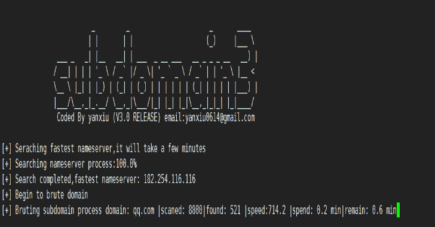

# 子域 3:发现子域的新一代工具

> 原文：<https://kalilinuxtutorials.com/subdomain3-tool-discovering-subdomains/>

**Subdomain3** 是新一代工具，它帮助渗透测试人员在比其他工具更短的时间内发现更多的信息。这些信息包括子域、IP、CDN 等等。请享受它。

**特性**

*   **更快**

速度的三种模式。用户可以修改配置(lib/config.py)文件来加速。

*   **CDN 支持**

确定子域是否自动使用 CDN 存储，即使 CDN 服务器的 dict 不包含 cname 后缀。

*   **RFC CIDR**

整理 ip 并报告 CIDR(例如 1.1.1.1/24)不使用 CDN 存储；

*   **多级子域支持**

发现更多子域，例如:admin.test.xx.com

*   **大字典支持**

数百万人支持

*   **更少的资源消耗**

1 个 CPU/1GB 内存/1Mbps 带宽

*   **更加智能**

发现最快的域名服务器；通过从其他来源导入子域来动态调整字典的策略；防止 dns 缓存污染；

**入门**

**git 克隆 https://github.com/yanxiu0614/subdomain3.git
pip install-r requirement . txt
python 2/3 brutedns . py-d tagetdomain-s high-l 5**

**用法**

| 简易格式 | 长格式 | 描述 |
| --- | --- | --- |
| -d | –域 | 目标域，例如:Baidu.com |
| 构成名词复数 | –速度 | 速度，三种模式:快，中，低 |
| -我 | –水平 | 例:2:w . Baidu . com；3:w . w . Baidu . com； |
| -f | –文件 | 目标域列表 |
| -丙 | –cname | n 或 y，收集名称 |
| -生理盐水 | –默认 _dns | n 或 y |
| -f1 | –子文件 | 副字典 |
| -f2 | –下一个文件 | 下一个分词典 |
| -f3 | –其他 _ 文件 | 来自搜索引擎的子域日志 |

**变更日志**

*   **2019-09-22:** 防止 dns 缓存污染的新策略；优化流程，修复错误，例如
*   **2019-09-17:** 自动发现最快的名称服务器支持；确定子域是否使用 CDN 存储自动支持；提高速度；优化流程，修复错误，例如
*   **2018-11-6:** 提高速度；优化流程；
*   **2018-10-6:** Api 支持，导入 brutedns_api 你会得到最终的结果数；优化了重复数据删除策略；
*   **2018-2-14:** 修复问题(类型错误:类型' NoneType '的参数不可迭代)
*   **2018-1-9:** CDN 计划；添加 opthon oc 收集 cname(-c–cdn t/f)
*   **2017-11-11:** 从其他来源导入子域支持(你要新建一个 target_domain.log 的文件，和' brutedns.py '放在同一个目录下)，会提高准确率；使用 API 更方便；
*   **2017-10-26:** 优化流程；修复 bug
*   **2017-10-11:** 重建部分程序；Api 支持；结果更具可读性；更新 cdn-服务器；更快的
*   **2017-6-17** :删除通用解析 opthon(-p t/f)；添加一个配置文件；通用语法分析的优化策略
*   **2017-5-2:** 添加一个模块(验证域)，如果要使用请修改 validate_domain.py 中的“结果 _ 名称”；修复通用 bug 更新 cdn 服务器等
*   **2017-4-21:** 优化子名称生成策略，提高速度
*   **2017-3-23** :增加通用解析 opthon(-p t/f)
*   **2017-3-17:** 大字典支持(比如:两百万)
*   **2017-3-10:** 从文件支持(-f 域)支持读取几个域；更新 cdn-服务器
*   **2017-2-26:** 多级域支持(无上限)；大字典支持；占用大约三分之一到四分之一的内存；更快的
*   **2017-2-24:** Mac 支持

[**Download**](https://github.com/yanxiu0614/subdomain3)