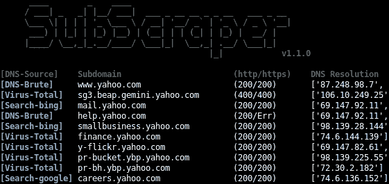

# sub craper–通过各种技术执行子域枚举的工具

> 原文：<https://kalilinuxtutorials.com/subscraper/>

SubScraper 使用 DNS 暴力、Google & Bing 抓取和 Virus Total 来枚举子域，无需 API。SubScraper 用 Python3 编写，在枚举过程中执行 HTTP(S)请求和 DNS“A”记录查找，以验证发现的子域。这提供了进一步的信息，有助于确定目标的优先级，并有助于潜在的后续步骤。枚举后，显示“CNAME”查找以识别子域接管机会。



**也读[Drltrace——一个为 Windows 调用 Tracer 的库& Linux 应用](https://kalilinuxtutorials.com/drltrace-windows-linux-applications/)**

## **订阅服务器安装**

```
pip3 install -r requirements.txt
```

## **用途**

```
python3 subscraper.py example.com
python3 subscraper.py -t 5 -o csv example.com
```

## **选项**

```
 `-s              Only use internet to find subdomains
  -b              Only use DNS brute forcing to find subdomains
  -o OUTFILE      Define output file type: csv/txt (Default: None)
  -t MAX_THREADS  Max threads (Default: 10)
  -w SUBLIST      Custom subdomain wordlist
```

[](https://github.com/m8r0wn/subscraper)