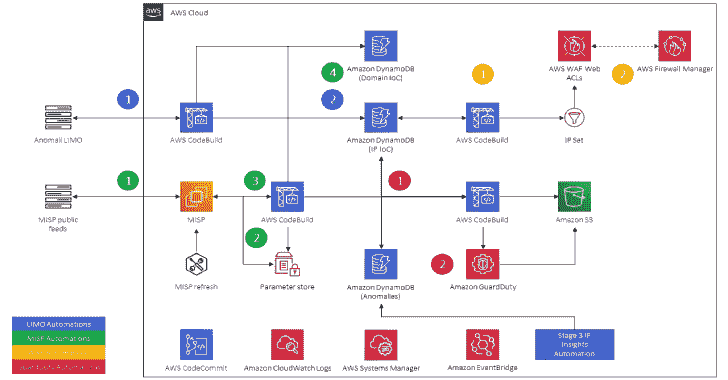

# SyntheticSun:深度防御安全自动化和监控框架

> 原文：<https://kalilinuxtutorials.com/syntheticsun/>

**synthetics sun**是一个深度防御安全自动化和监控框架，它利用威胁情报、机器学习、托管 AWS 安全服务和无服务器技术来持续预防、检测和响应威胁。

*你睡在破碎的玻璃里*
*有你的倒影，*
*但你感觉活着吗？*
*耶让我问你，*
*你感觉活着吗？*

**剧情简介**

*   使用基于事件和时间的无服务器自动化(例如 AWS CodeBuild、AWS Lambda)来收集、标准化、丰富和关联基巴纳的安全遥测数据
*   利用威胁情报、地理定位数据、开源情报、机器学习(ML)支持的异常检测和 AWS APIs 来进一步丰富安全遥测并识别潜在威胁
*   利用随机切割森林(RCF)和 IP Insights 无监督 ML 算法分别识别时间序列和 IP 实体对数据中的异常。提供无服务器、容器协调的资源，以随意训练和部署新的 IP Insights 端点。
*   动态更新 AWS WAFv2 IP 集和 Amazon GuardDuty 威胁英特尔集，以加强对您的帐户和基础架构的保护，抵御已知威胁

**描述**

SyntheticSun 是围绕恶意软件信息共享平台(MISP)和 Anomali 的 LIMO 的使用而构建的，这两个平台是社区驱动的威胁情报平台(TIPs)，提供各种类型的危害指标(IoC)。标准化和消除重复的威胁英特尔可以近乎实时地快速识别各种类型网络流量中的已知威胁。为了增加识别潜在威胁的动力，部署了 IP 洞察模型来寻找 IP 地址和实体(例如 IAM 主体 ID、用户代理等)对之间的异常(以及其中的潜在威胁)。)，本地 RCF 探测器也被用于 Elasticsearch，以在近实时安全遥测数据流入基巴纳时发现异常。为了在安全团队中普及 ML 模型的使用和微调，提供了用于训练 IP Insights 模型的实用程序作为核心解决方案的附件。

为了执行编排和自动化以及安全遥测的提取、转换和加载(ETL)到 Kibana，使用了各种 AWS 无服务器技术，如 AWS Lambda、Amazon DynamoDB 和 AWS CodeBuild。诸如此类的无服务器技术因其可伸缩性、易用性、相对于沉重的基于 MapReduce 或 Glue ETL 的解决方案而言相对便宜的成本而被使用。该解决方案的大部分是通过 CloudFormation 部署的，在各个阶段提供了 Python 和 shell 形式的助手脚本，以促进持续集成管道中的采用和潜在部署。

为了使解决方案的“内脏”尽可能精简，基本的 Python 模块如`**boto3**`、`**request**s`、`**json**`、`**ipaddress**`、`**socket**`和`**re**`执行大部分提取、转换和加载(ETL)到下游服务中。因为所有的地理位置信息都是由 ip-api.com 提供的，所以它不需要帐户或付费层，并且有一个很棒的 API，它在响应头中包含节流信息。Elasticsearch 和 Kibana 的大部分依赖项也在代码中提供(索引、映射、可视化等),以避免繁重的手动配置。

**设置**

由于解决方案的规模和所需的依赖性，SyntheticSun 分为三个阶段。所有架构和安装说明(以及适当的常见问题)都存在于它们自己的阶段中。还提供了附加模块(称为附录)来扩展功能，它们有自己的本地化体系结构和安装说明。

**开工前:生产部署考虑**

SyntheticSun 是你在 GitHub 上找到的东西，它是一个概念验证，因此我没有在第一个版本中做更多的工作来绝对强化一切。如果您在我还没有做出必要更改的时候阅读本文，那么在您将该解决方案部署到生产环境(或任何具有更高安全需求的环境)之前，请考虑以下事项。我会把这些项目放在路线图上，并在适当的时候更新它们。

*   使用附录 a 中提供的示例训练您自己的 IP Insights 模型。使用您自己的数据，并不断地重新训练模型，将有助于精确化结果。
*   在 VPC 中部署您的 CodeBuild 项目、MISP 服务器和 Elasticsearch 服务域，以加强对互联网攻击的防御。考虑使用 AWS 的客户端 VPN、AWS 站点到站点 VPN、DirectConnect、Amazon Workspaces 和 AppStream 2.0，或者(如果您绝对需要的话)使用反向代理来访问 VPC 中的 MISP 控制台和 Kibana。
*   考虑使用 Cognito 来验证 Kibana。更进一步，将您的用户池与您的公司 IdP 联合起来。
*   考虑为 MISP 烘焙你自己的 AMI 或者使用 Fargate 来托管它。我还会考虑将 Suricata 和 Amazon CloudWatch 代理预集成到未来的版本中，以帮助扩展代理和 HIDPS 在您的资产中的部署。
*   修改您的 Suricata 配置以满足您的 SecOps 团队查看日志的需要，因为这个解决方案所做的只是将它们转储进来。您也可以考虑编写自己的规则或导入其他资源来加强主机抵御攻击的能力。

[**Download**](https://github.com/jonrau1/SyntheticSun)