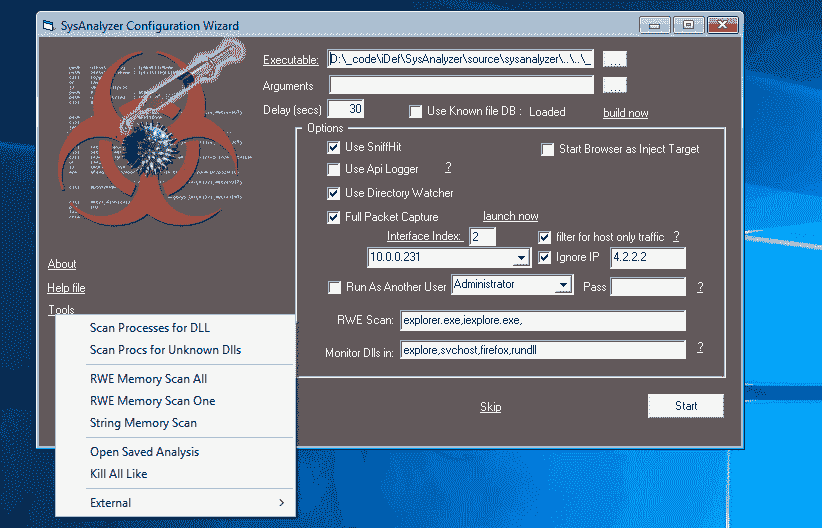

# SysAnalyzer:自动化恶意代码分析系统

> 原文：<https://kalilinuxtutorials.com/sysanalyzer-automated-malcode-analysis-system/>

SysAnalyzer 是一个应用程序，旨在为恶意代码分析师提供一个自动化工具，以快速收集、比较和报告二进制文件在系统上运行时采取的操作。

SysAnalyzer 的主要组件在用户指定的时间间隔内比较系统的快照。与实时日志实现相比，使用快照机制的原因是为了减少分析师在进行分析时必须费力处理的数据量。

通过使用快照系统，我们可以有效地向查看者呈现自应用程序首次运行以来在系统上发现的持久变化。

虽然这种机制确实有助于消除其他应用程序可能造成的噪音，或者无关紧要的运行时细微差别，但它也有可能丢失关键数据。因此，SysAnalyzer 还为分析师提供了将几种形式的实时日志记录纳入分析过程的选项。

注意:SysAnalyzer 不是沙盒实用程序。目标可执行文件在系统上完全实时的测试中运行。如果你正在测试恶意代码，你必须意识到你将会感染你的测试系统。

SysAnalyzer 设计用于拍摄以下系统
属性的快照:

*   运行流程
*   开放端口和相关流程
*   加载到 explorer.exe 和 Internet Explorer 中的 dll
*   加载到内核的系统驱动程序
*   某些注册表项的快照

有关更多信息，请参见 chm 帮助文件或视频。

**也读作-[Metame:用于任意可执行文件的变形代码引擎](https://kalilinuxtutorials.com/metame-metamorphic-code-engine/)**

**演示**

**更新**

[https://www.youtube.com/embed/4twR8xtVWPk?feature=oembed&enablejsapi=1](https://www.youtube.com/embed/4twR8xtVWPk?feature=oembed&enablejsapi=1)

**养蜂人**

[https://www.youtube.com/embed/SqdGjihhDoU?feature=oembed&enablejsapi=1](https://www.youtube.com/embed/SqdGjihhDoU?feature=oembed&enablejsapi=1)

**原培训师**

[https://www.youtube.com/embed/OPXwKChdO4c?feature=oembed&enablejsapi=1](https://www.youtube.com/embed/OPXwKChdO4c?feature=oembed&enablejsapi=1)

[**Download**](https://github.com/dzzie/SysAnalyzer)