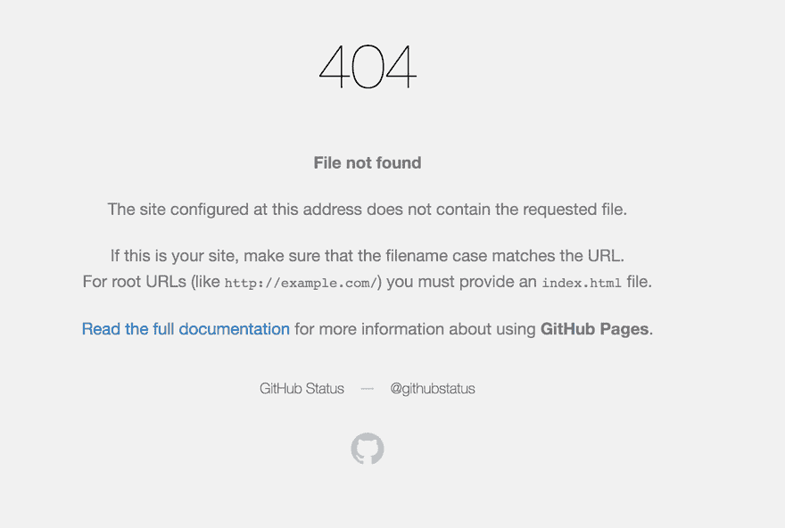

# 接管:接管脚本提取所有子域的 CNAME 记录一次

> 原文：<https://kalilinuxtutorials.com/takeover-cname-record-subdomains/>

子域接管是一类漏洞，其中子域指向已被删除的外部服务。对外的服务有 Github，Heroku，Gitlab，Tumblr 等等。假设我们有一个子域 sub.example.com，它指向一个外部服务，比如 GitHub。如果 GitHub 页面被其所有者删除，并且忘记删除指向 Github 服务的 DNS 条目。攻击者可以简单地通过添加包含 sub.example.com 的 CNAME 文件来接管子域。

**也读[xeno scan——用 C++](https://kalilinuxtutorials.com/xenoscan-memory-scanner/) 写的开源内存扫描仪 **

下面是检查一个子域的 CNAME 记录的命令。

```
$dig CNAME apt.shopify.com --> apt.shopify.com.s3-website-us-east-1.amazonaws.com.
```

有很多网站有成千上万的子域，很难检查每个子域。这里我们有一个显示每个域的 CNAME 记录的脚本。它将一个文件名作为输入，执行一些操作，最后产生输出，显示每个域的 CNAME 记录。输入文件应该包含一个子域列表。

当服务被删除而 DNS 条目保持原样时，需要分析一些指纹。攻击者在访问诸如“这里没有 Github Pages 站点”等易受攻击的子域时会得到此错误或查看下图了解更多细节。



## **收购视频教程**

[https://www.youtube.com/embed/vpCI8foxP00?feature=oembed](https://www.youtube.com/embed/vpCI8foxP00?feature=oembed)

[](https://github.com/samhaxr/TakeOver-v1)