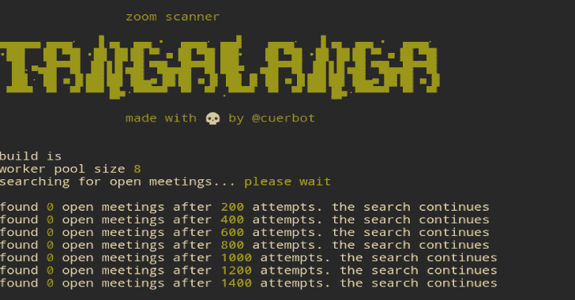
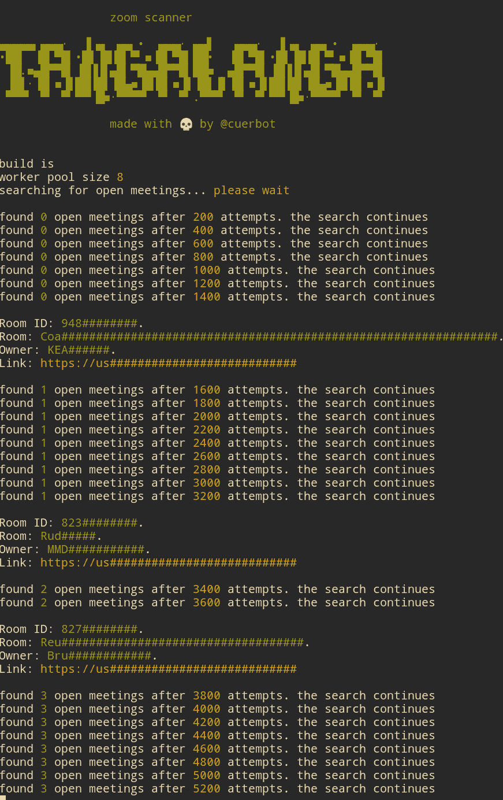
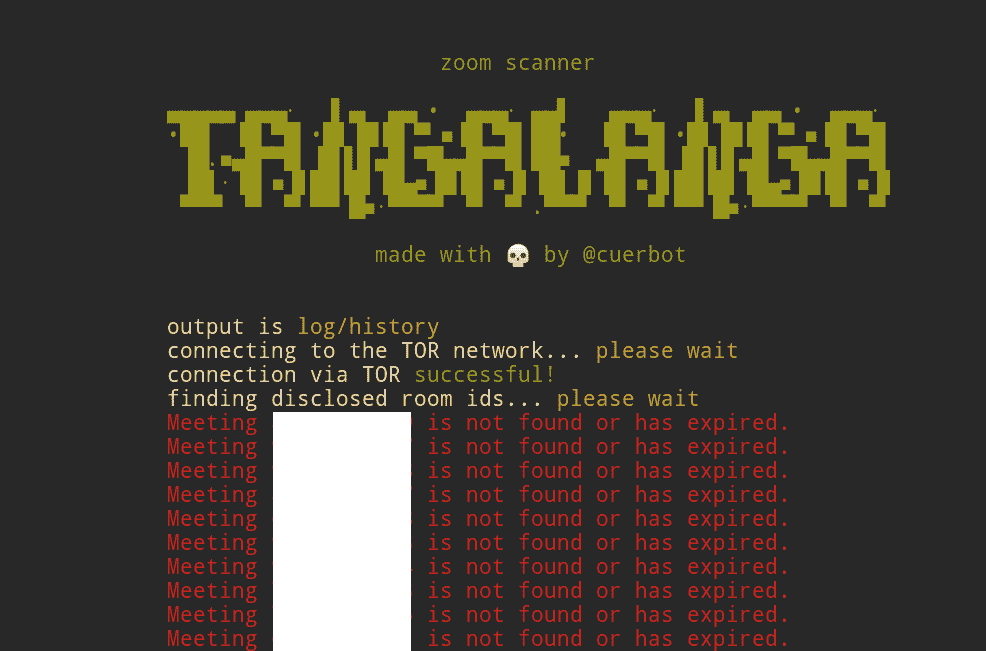

# tanga langa:Zoom 会议扫描仪黑客工具

> 原文：<https://kalilinuxtutorials.com/tangalanga/>

**Tangalanga** 是一款变焦会议扫描仪。该扫描仪将检查随机会议 id 并返回信息(如果有)。

**安装**

首先试着看看是否有日期的预烤版本:https://github.com/elcuervo/tangalanga/releases.
这个版本已经有一个令牌准备使用。
无论哪种方式，你都可以在 https://github.com/elcuervo/tangalanga/releases.
的发布会上找到 Windows、Linux 和 Mac 版本，下载、解压缩并欣赏。

**用途**

以下是所有可能的标志:

tanga langa \

-TOKEN = user-TOKEN \ #[默认值:env TOKEN]要使用的用户令牌。
-colors = false \ #[default:true]启用/禁用颜色
-inspect = true \ #[default:false]审查者输出
-output = history \ #[default:stdout]将找到的会议写入文件
-debug = true \ #[default:false]显示所有 attmpts
-tor = true \ #[default:false]启用 tor 连接(将使用默认 socks 代理)
-hidden = true \ #[default:false]启用嵌入式 tor 连接(仅限 linux)

**代币**

不幸的是，我找不到令牌生成的方式，但核心概念是，在加入期间发送的 zpk cookie 密钥在过期前大约可以使用 24 小时。这使得参加几个已知的会议，获得一些令牌，然后用它们进行扫描变得很简单。

尝试加入会议后，可以嗅探令牌。这意味着要“钓鱼”一个令牌，你需要一个可以嗅探流量和伪造证书的设置。

使用 Wireshark、Charles 或任何其他有 ssl 代理能力的工具就可以了。

**TOR(仅限 linux)**

Tangalanga 嵌入了 tor 运行时，因此它可以连接到 onion 网络并在那里运行查询，而不是暴露自己的 ip。

对于任何其他系统，我推荐 VPN

**为什么取这个古怪的名字？**

这参考了《拉普拉塔河》中一位 80/90 年代的名人。喜欢电话恶作剧的唐加兰加医生。