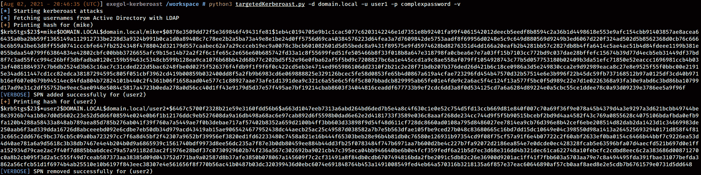

# targetedKerberoast:具有 ACL 滥用功能的 Kerberoast

> 原文：<https://kalilinuxtutorials.com/targetedkerberoast/>

**targetedKerberoast** 是一个 Python 脚本，可以像许多其他脚本(例如 GetUserSPNs.py)一样，为设置了 SPN 的用户帐户打印“kerberoast”散列。这个工具带来了以下附加特性:对于每个没有 SPN 的用户，它试图设置一个(滥用对`**servicePrincipalName**`属性的写权限)，打印“kerberoast”散列，并删除为该操作设置的临时 SPN。这被称为有针对性的 Kerberoasting 发布。该工具可用于域中的所有用户，或在列表中提供，或在 CLI 中提供一个用户。

关于这次攻击的更多信息

*   黑客食谱——Kerberos ast
*   黑客食谱——有针对性的 Kerberoasting 认证

**用法**

该工具支持以下身份认证

*   (NTLM)明文密码
*   (NTLM)传杂烩
*   (Kerberos)明文密码
*   (Kerberos)传递密钥/通过散列
*   (Kerberos)传递缓存(传递票证的类型)

除此之外，targetedKerberoast 支持多级详细度，只需将`**-v**`、`**-vv**`、…附加到命令中🙂

**用法:targetedkerberoast . py[-H][-v][-q][-D TARGET _ DOMAIN][-U USERS _ FILE][–request-USER username][-o OUTPUT _ FILE][–use-ldaps][–only-abuse][–no-abuse][–DC-IP IP IP address][-D DOMAIN][-U USER]
[-k][–no-pass |-p PASSWORD |-H[lm hash:]n hash |–AES-key hex key]【T2 –quiet 不显示任何信息
-D TARGET_DOMAIN，–TARGET-DOMAIN TARGET _ DOMAIN
如果与用户的域不同，则查询/请求的域。 允许跨信任进行 Kerberoasting 发布。
-U USERS_FILE，–USERS-FILE USERS _ FILE
FILE with user per line to test
–request-user username
请求与指定用户关联的 SPN 的 TGS(只需要用户名，不需要域)
-o OUTPUT_FILE，–OUTPUT-FILE OUTPUT _ FILE
输出文件名以 JtR/hashcat 格式写入密码
–Use-ldaps 使用 ldaps 而不是 LDAP
–only-abuse 忽略已经有 SPN 的帐户如果省略，它将使用身份参数
-d 域中指定的域部分(FQDN)，–域域
(FQDN)域对
-u 用户进行身份验证，–用户用户用户使用
机密进行身份验证:
-k，–kerberos 使用 Kerberos 身份验证。从获取凭据。基于目标参数的 ccache 文件(KRB5CCNAME)。如果找不到有效的凭证，它将使用在
命令行
中指定的凭证–不通过不询问密码(对-k 有用)
-p 密码、–密码密码
用于验证的密码
-H[LM hash:]n 哈希[LM hash:]n 哈希
NT/LM 哈希，格式为 LM hashes 哈希
–aes-key 十六进制密钥用于 Kerberos 验证的 AES 密钥(128 或 28**

下面是该工具能做什么的一个例子。

[**Download**](https://github.com/ShutdownRepo/targetedKerberoast)