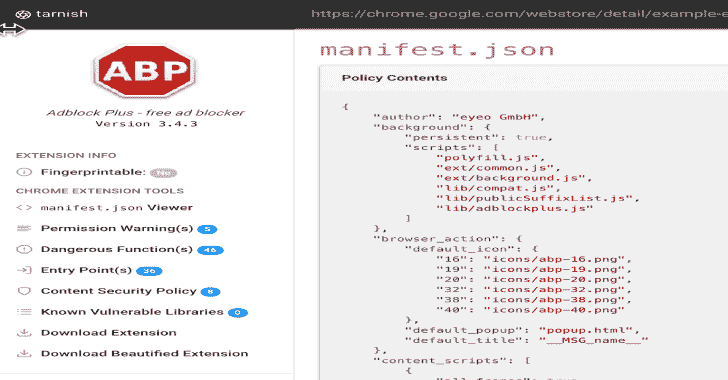

# 一个 Chrome 扩展静态分析工具

> 原文：<https://kalilinuxtutorials.com/tarnish-chrome-extension-static-analysis/>

是一个静态分析工具，帮助研究人员对 Chrome 扩展进行安全审查。它自动化了许多常规的繁重工作，并帮助您快速识别潜在的安全漏洞。

这个工具伴随着研究博客文章，可以在这里找到。如果你不想设置这个麻烦，你可以点击[这里](https://thehackerblog.com/tarnish/)来使用这个工具。

**未打磨的通知&备注**

应该指出的是，这是一个不完善的版本。这与位于 [`**https://thehackerblog.com/tarnish/**`](https://thehackerblog.com/tarnish/) 的部署来源相同。将来我可能会清理它，使它更容易运行，但我现在没有时间。

要进行设置，您需要了解如何:

*   配置 S3 存储桶
*   (如果使用自动缩放)设置 ElasticBeanstalk
*   使用`**docker-compose**`
*   设置重定向

由于几个设计目标，设置有点复杂:

*   有效地对 Chrome 扩展执行静态
*   通过更多实例自动纵向扩展到增加的工作负载，然后纵向扩展。
*   在预算有限的情况下工作(因此对 Spot 实例使用 ElasticBeanstalk)。

一些快速注释可以帮助试图设置它的人:

*   利用 Python Celery 分析扩展。
*   Python Celery 配置使用 redis 作为代理(这将必须被创建)。
*   处理扩展分析作业的工人在 AWS ElasticBeanstalk spot 实例上运行。对于那些不熟悉的人来说，spot 实例基本上是对未使用的计算进行投标。这使得这项服务的运营成本非常低廉。
*   workers 需要至少一个 AWS `**t2.medium**`实例来运行。
*   `**tarnish**`前端只是一组静态文件，上传到静态 web 主机配置的 S3 桶。

环境变量配置见`**docker-compose.yaml.example**`。理想情况下，您应该运行`**./start.sh**`并导航到静态前端，让事情运行起来。你可以为静态站点使用 S3，或者只是一个简单的静态 web 服务器，比如`**python -m SimpleHTTPServer**`(你必须修改 JavaScript 文件以确保原始匹配，等等。

**也读作——[SQLMap:自动 SQL 注入&数据库接管工具](https://kalilinuxtutorials.com/sqlmap-automatic-sql-injection-database/)**

**特色**

从提供的 Chrome 网络商店链接中提取任何 Chrome 扩展。

*   查看器:简单地显示扩展清单的 JSON 美化版本。
*   指纹分析:检测`**web_accessible_resources**`并自动生成 Chrome 扩展指纹 JavaScript。
*   潜在的点击劫持分析:检测带有`**web_accessible_resources**`指令集的扩展 HTML 页面。根据页面的用途，这些页面可能容易被点击劫持。
*   权限警告查看器:显示所有 Chrome 权限提示警告的列表，当用户试图安装扩展时会显示这些警告。
*   危险函数:显示可能被攻击者利用的危险函数的位置(例如 innerHTML、chrome.tabs.executeScript 等函数)。
*   入口点:显示扩展接收用户/外部输入的位置。这有助于了解扩展的外围应用，并寻找可能向扩展发送恶意制作的数据的点。
*   危险功能和入口点扫描器都生成以下警报:
    *   引起警报的相关代码片段和代码行。
    *   问题的描述。
    *   “查看文件”按钮查看包含代码的完整源文件。
    *   警报文件的路径。
    *   警告文件的完整 Chrome 扩展 URI。
    *   文件的类型，如背景页面脚本、内容脚本、浏览器操作等。
    *   如果易受攻击的行在一个 JavaScript 文件中，包含它的所有页面的路径以及这些页面的类型和`**web_accessible_resource**`状态。
*   内容安全策略(CSP)分析器和绕过检查器:这将指出您的扩展的 CSP 中的弱点，还将说明由于列入白名单的 cdn 等而绕过您的 CSP 的任何潜在方法。
*   已知易受攻击的库:它使用 Retire.js 来检查已知易受攻击的 JavaScript 库的使用情况。
*   下载扩展和格式化版本。
*   下载原始扩展。
*   下载扩展的美化版本(自动美化 HTML 和 JavaScript)。
*   扫描结果的自动缓存，第一次运行扩展扫描会花费很长时间。然而，第二次，假设扩展没有被更新，将几乎是即时的，因为结果被缓存。可链接的报告网址，很容易将其他人链接到一个由失去光泽产生的扩展报告。

[**Download**](https://github.com/mandatoryprogrammer/tarnish)