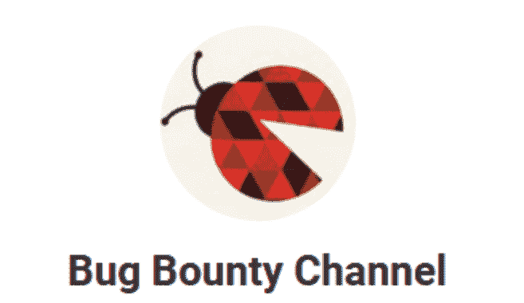

# BBBot 报文:Bug Bounty Bot 报文

> 原文：<https://kalilinuxtutorials.com/telegram-bbbot/>

Telegram BBBot 是一个 [Telegram](https://telegram.me/bug_bounty_channel) Bug 赏金机器人。

**历史** **电报 BBBot**

*   这个机器人采用了部署到 Heroku 的特殊技术
*   这个 got 的一般目的是“对信息安全社区有所帮助！”
*   Bot 使用`https://github.com/maddevsio/bbcrawler`获取信息
*   使用 heroku `https://github.com/heroku/go-getting-started`作为项目的模板
*   在`heroku.com`和`firebase.com`使用免费帐号

**也可理解为-[Thc Hydra:从远程系统获得未授权访问的工具](https://kalilinuxtutorials.com/thc-hydra/)**

**目的**

*   bot 的目的:
    *   “尽可能快地传递信息！”
    *   “对信息安全社区有所帮助”

**架构**

*   用于网络服务器`GIN`
    *   `github.com/gin-gonic/gin`
*   对于使用的机器人功能`telegram-bot-api.v4`
    *   `gopkg.in/telegram-bot-api.v4`

**Bot 配置**

*   `TELEGRAM_BBBOT_TOKEN`–从@BotFather 收到电报 Api 令牌
*   `TELEGRAM_BBBOT_URL`–指向 bot 公共网址的 Webhook url
*   `PORT`–端口号的标准 heroku 环境变量
*   `TELEGRAM_BBBOT_FIREBASE_TOKEN`–Firebase 数据库令牌
*   `TELEGRAM_BBBOT_FIREBASE_URL`–fire base 项目的 Url
*   `TELEGRAM_BBBOT_HO_SEARCH_URL`–hacker one 搜索 url(爬虫)
*   `TELEGRAM_BBBOT_CHANNEL`–公共频道标识符，例如`@some_channel_name`
*   `TELEGRAM_BBBOT_HOST`–用于 ping 目的的公共 bot 主机 url(用于在 30 分钟不活动后禁用睡眠功能)
*   `TELEGRAM_BBBOT_H1_HACK_SEARCH_URL`–hacker one 黑客活动 url(爬虫)
*   `TELEGRAM_BBBOT_BUGCROWD_NEW_PROG_URL`–用于抓取新程序的 BugCrowd url(爬虫)

**机器人工作流程**

*   Bot 已启动
*   从 firebase 获取数据`(synchronising)`
*   从 hackerone.com 抓取程序`(in parallel)`
*   来自 hackerone.com 的爬行黑客活动`(in parallel)`
*   从 bugcrowd.com 抓取程序`(in parallel)`
*   从所有抓取的信息中确定新数据`(in parallel)`
*   将数据从`ENV`变量发布到电报通道
*   **注意:**如果 heroku.com 的 bot 实例重新启动了从 firebase 存储中恢复的所有数据。

**麻省理工学院许可证**

版权所有(c) 2016 Maddevs

特此免费授予获得本软件和相关文档文件(“软件”)副本的任何人不受限制地经营本软件的权利，包括但不限于使用、复制、修改、合并、发布、分发、再许可和/或出售本软件副本的权利，并允许获得本软件的人在遵守以下条件的情况下这样做:

上述版权声明和本许可声明应包含在软件的所有副本或重要部分中。

本软件按“原样”提供，不含任何明示或暗示的担保，包括但不限于对适销性、特定用途适用性和不侵权的担保。在任何情况下，作者或版权所有者都不对任何索赔、损害或其他责任负责，无论是在合同诉讼、侵权诉讼或其他诉讼中，还是在与软件或软件的使用或其他交易相关的诉讼中。

[**Download**](https://github.com/maddevsio/telegram_bbbot)