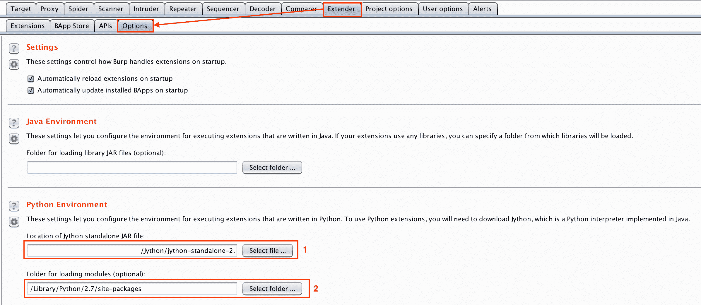
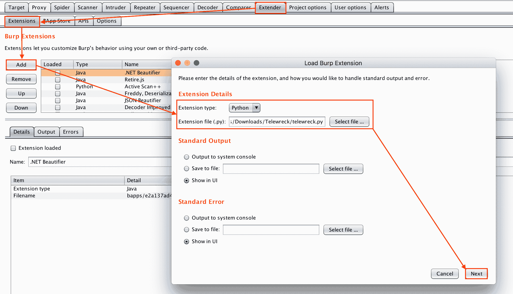
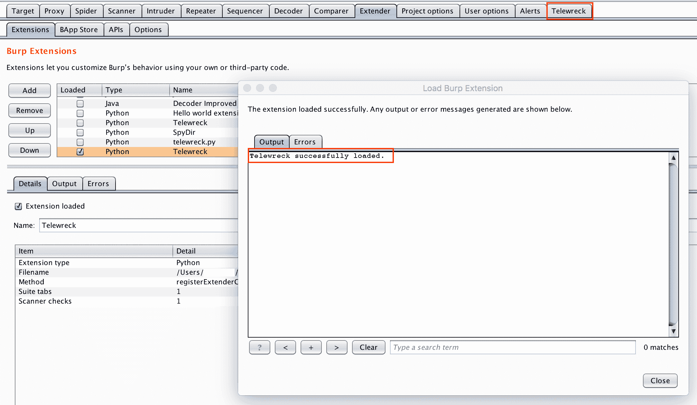
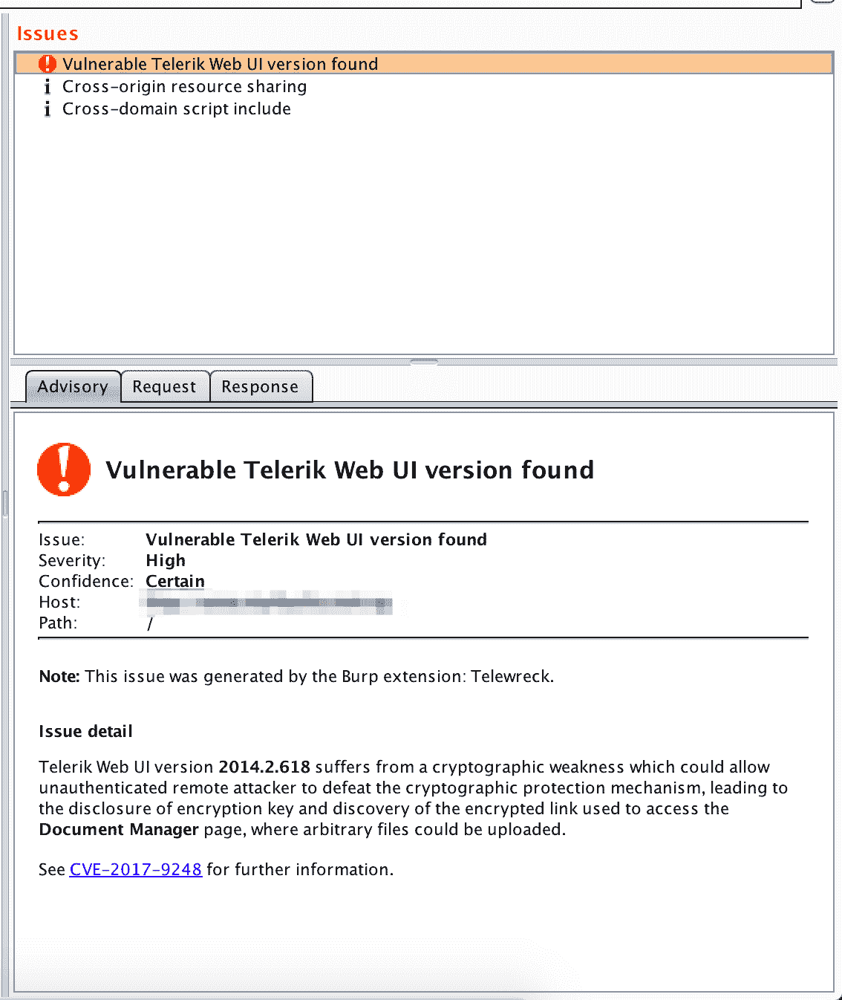
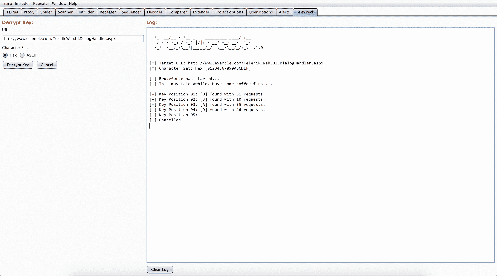

# Telewreck 检测和利用 CVE 的打嗝扩展-2017-9248

> 原文：<https://kalilinuxtutorials.com/telewreck-extension-detect-exploit-cve-2017-9248/>

**Telewreck** 是一个 Burp 扩展，用于检测和利用易受 CVE-2017-9248 攻击的 Telerik Web UI 版本。

## **远程残骸属性**

*   在被动扫描期间检测易受攻击的 Telerik Web UI 版本。
*   暴力破解密钥并发现“文档管理器”链接，就像最初的漏洞利用工具一样。

## **要求**

1.  找到 Telerik。Web.UI.DialogHandler.aspx
2.  这个扩展需要 Python 的**请求**模块。只需运行`**pip install requests**`即可安装。
3.  Telewreck 选项卡下的文本区域不能作为控制台使用。因此，这里看不到`**stoud**`和`**stderr**`输出。但是，您可以在**扩展器**选项卡的**输出**和**错误**部分查看它们。
4.  在运行另一个强制之前，首先通过点击**取消**按钮取消当前过程。
5.  如果密钥不能被破解，那么可能密钥已经被安全地设置和/或应用程序没有使用 Telerik 的默认安装。
6.  如果密钥无法被破解和/或存在一些问题，建议使用原始的漏洞利用工具。

**也读作[SQL map–SQL 注入&数据库自动接管工具](https://kalilinuxtutorials.com/sql-injection-database/)**

## **安装过程**

*   [下载](https://raw.githubusercontent.com/capt-meelo/Telewreck/master/telewreck.py) **telewreck.py** 到你的机器上。
*   使用 **`sudo pip install requests`** 安装 Python 的**请求**模块。
*   在你打嗝的时候，去 ***扩展器>选项*** 选项卡。然后在 **Python 环境**部分下，找到你的**jython-standalone-2 . 7 . 0 . jar**文件(1)和 Python 的请求模块所在的目录(2)。

*   转到 ***扩展器>扩展*** 选项卡，然后点击 ***添加*** 按钮。在新窗口中，浏览 **telewreck.py** 的位置，点击 ***下一个*** 按钮。

*   如果有任何错误， **Telewreck** 标签会出现在你的打嗝声里。

## **截图**

##  

## **免责声明**

该工具仅用于教育目的。

 **信用:保罗·泰勒( [@bao7uo](https://twitter.com/bao7uo) )**