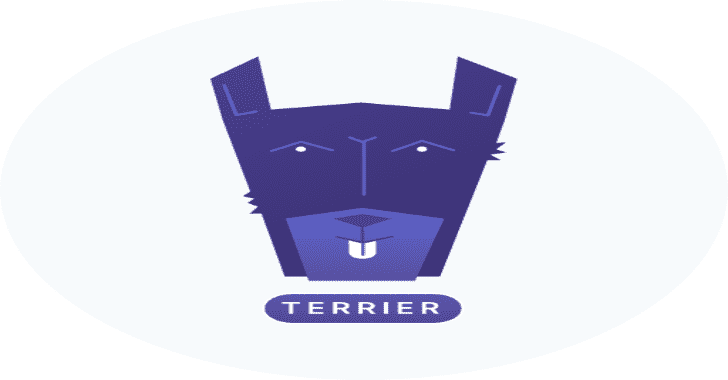
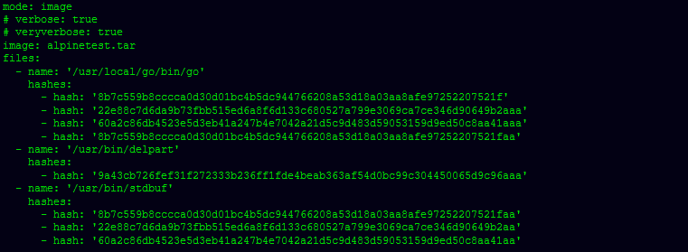
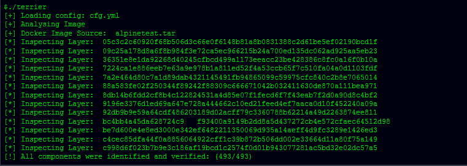
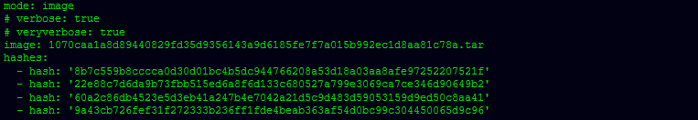
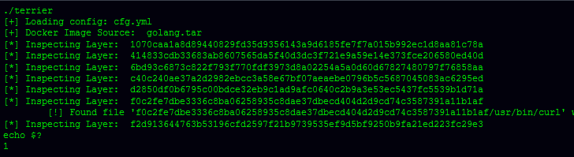
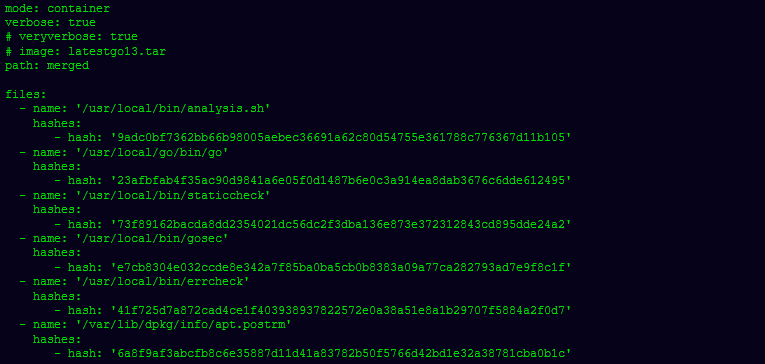

# Terrier:一个图像和容器分析工具

> 原文：<https://kalilinuxtutorials.com/terrier/>

**Terrier** 是一个图像和容器分析工具，可以用来扫描图像和容器，根据它们的哈希来识别和验证特定文件的存在。

关于 Terrier 的详细报道可以在 Heroku 博客上找到，[https://blog . Heroku . com/Terrier-open-source-identifying-analyzing-containers](https://blog.heroku.com/terrier-open-source-identifying-analyzing-containers)。

**安装**

*   **二进制**
    *   有关二进制文件的安装说明，请访问发布页面。

**Via Go**

**$去找 github.com/heroku/terrier**

*   **从源构建**

**Via go**

**$去建造
或
$全部制造**

**也可阅读-[nucleus:可配置靶向扫描的快速工具](https://kalilinuxtutorials.com/nuclei/)**

**用途**

**$。/terrier -h
的用法。/terrier:
-cfg 字符串
从提供的 yaml 文件中加载配置(默认为“CFG . yml”)**

需要扫描的图像的 OCI 焦油，这通过 cfg.yml 中的“图像”值提供给 Terrier

以下 Docker 命令可用于将 Docker 图像转换为 Terrier 可以扫描的 TAR。

**# dock save imageid-o image . tar**

$ ./terrier
**[+]加载配置:cfg.yml
[+]解析图片
[+] Docker 图片来源:image.tar
[*]检层:05 C3 C2 c 60920 f 68 b 506d 3c 66 E0 f 6148 b 81 A8 b 0831388 C2 d 61 be 5 ef 02190 BCD 1 f【T5！]所有组件均已识别并验证:(493/493)**

**YML 配置示例**

梗解析 YAML，下面是一个配置示例。

*   **这是一个示例配置，根据您的需求进行修改**
    *   模式:图像
        *   图片:image.tar
            *   **#模式:**容器
            *   **#路径:**合并
            *   **#详细:**真
            *   **#veryverbose:** 真
*   **文件:**
    *   **名称:'/usr/bin/curl '哈希:**
        *   **哈希:**' 2353 cbb 7b 47d 0782 ba 8 cdd 9 c 7438 b 053 c 982 ea AEA 6 fbef 8620 c 31 a 58 D1 e 276 e 8 '
        *   **哈希:**' 22e 88 c 7 D6 da 9 b 73 fbb 515 ed 6 A8 f 6d 133 c 680527 a 799 e 3069 ca 7 ce 346d 90649 B2 AAA '
        *   **哈希:**' 9a 43 CB 726 fef 31 f 272333 b 236 ff 1 FDE 4 beab 363 af 54 d0 BC 99 c 304450065 d9c 96 '
        *   **哈希:**' 8b7c 559 b 8 cccca 0d 30d 01 BC 4b 5 DC 944766208 a53d 18 a 03 aa AFE 97252207521 FAA '
    *   **名称:'/usr/bin/go '哈希:**
        *   **哈希:**' 2353 cbb 7b 47d 0782 ba 8 cdd 9 c 7438 b 053 c 982 ea AEA 6 fbef 8620 c 31 a 58 D1 e 276 e 8 '
*   **取消注释以分析哈希**
    *   **哈希:**
        *   **哈希:**' 8b7c 559 b 8 cccca 0d 30d 01 BC 4b 5 DC 944766208 a53d 18 a 03 aa AFE 97252207521 FAA '
        *   **哈希:**' 22e 88 c 7 D6 da 9 b 73 fbb 515 ed 6 A8 f 6d 133 c 680527 a 799 e 3069 ca 7 ce 346d 90649 B2 aa '
        *   **哈希:**' 60 a2 c 86 db 4523 e 5d 3 EB 41 a 247 b4e 7042 a 21 D5 C9 d 483d 59053159d 9 ed 50 c 8 aa 41 aa '

**它做什么？**

它是一个 CLI 工具，允许您:

*   扫描 OCI 映像，查看是否存在与一个或多个提供的 SHA256 哈希匹配的一个或多个文件
*   扫描正在运行的容器，看是否存在一个或多个与提供的 SHA256 哈希匹配的文件

**用途**

*   **例 1**

梗是一个 CLI 和利用 YAML。YAML 配置示例:

在下面的例子中，通过上面的 YAML 指示 Terrier 验证多个文件。

Terrier 根据测试的结果设置其返回代码，在上述测试的情况下，返回代码将为“0 ”,这表示测试成功，因为每个提供的组件的 1 个实例已被识别和验证。

*   **例 2**

Terrier 被指示识别所提供的图像中与所提供的 SHA256 散列相匹配的任何文件。YAML 文件 cfg.yml

跑步梗。

*   **例 3**

指示 Terrier 分析和验证位于“merged”的集装箱的合并内容的内容，其中 merged 可能位于`**/var/lib/docker/overlay2/..../merged**` 。这种情况下的 YAML 文件示例可能如下所示:

**与 CI 整合**

Terrier 旨在帮助防止供应链攻击。要使用带有 CI(如 Github actions 或 CircleCI)的 Terrier，以下示例配置可能会有用。

*   **CircleCI 示例**

config.yml

*   **版本:2**
    *   **职务:**
    *   **构建:**
        *   **机器:真**
            *   **步骤:**
                *   **结账**
                *   **运行:**
                    *   名称:构建 Docker 图像
                    *   命令:|docker build -t builditall。
                *   **运行:**
                    *   名称:在本地保存 Docker 图像
                    *   命令:|docker 保存 build it all-o builditall.tar
                *   **运行:**
                    *   名称:验证 Docker 映像二进制文件
                    *   命令:|。/terrier_linux_amd64

**梗 cfg.yml**

*   **模式:图像**
*   **图片:builditall.tar**
*   **文件:**
    *   **名称:'/bin/wget'**
        *   **哈希:**
            *   **哈希:**' 8b7c 559 b 8 cccca 0d 30d 01 BC 4b 5 DC 944766208 a53d 18 a 03 aa AFE 97252207521 f '
            *   **哈希:**' 22e 88 c 7 D6 da 9 b 73 fbb 515 ed 6 A8 f 6d 133 c 680527 a 799 e 3069 ca 7 ce 346d 90649 b2a '
            *   **哈希:**' 60 a2 c 86 db 4523 e 5d 3 EB 41 a 247 b4e 7042 a 21 D5 C9 d 483d 59053159d 9 ed 50 c 8 aa 41a '
        *   **名称:“/sbin/sulin”**
            *   **哈希:**
                *   **哈希:**' 9 a 43 CB 726 fef 31 f 272333 b 236 ff 1 FDE 4 beab 363 af 54d 0 BC 99 c 304450065d 9 c 96 aa '

[**Download**](https://github.com/heroku/terrier)