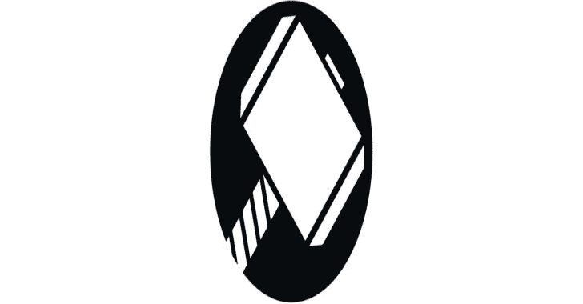
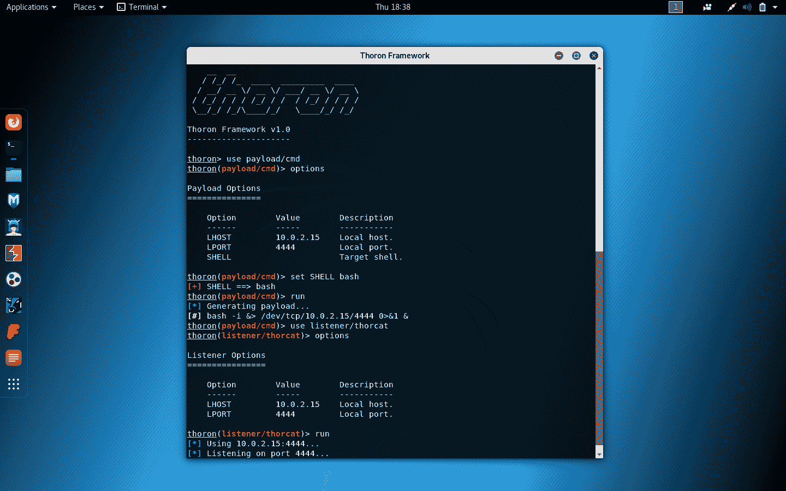
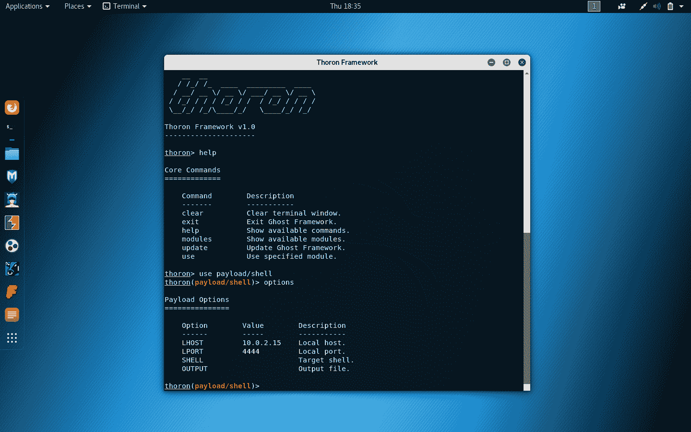

# Thoron:一个利用 Linux TCP 漏洞的 Linux 后开发框架

> 原文：<https://kalilinuxtutorials.com/thoron/>

**Thoron** Framework 是一个 Linux 后开发框架，利用 Linux tcp 漏洞获得类似 shell 的连接。Thoron 框架能够生成简单的有效载荷来提供 Linux tcp 攻击。

**入门**

*   **安装**

**CD thoron
chmod+x install . sh
。/install.sh**

*   **卸载**

**CD thoron
chmod+x uninstall . sh
。/uninstall.sh**

*   **框架执行**

要执行 Thoron Framework，您应该执行以下命令。

**索伦**

**又读-[Print-My-Shell:生成各种逆向 Shell 的过程](https://kalilinuxtutorials.com/print-my-shell/)**

**为什么选择 Thoron 框架**

*   简单明了的 UX/UI。

Thoron 框架有一个简单清晰的 UX/用户界面。它很容易理解，你也更容易掌握 Thoron 框架。

*   **很多不同的有效载荷**。

Thoron 框架中有许多不同的有效负载，如 Shell、Python 和 C 有效负载。

*   强大的 ThorCat 监听器。

Thoron Framework 中有一个强大的 ThorCat 监听器，支持安全的 SSL 连接和其他有用的功能。

**免责声明**

未经双方同意，使用索伦框架攻击目标是非法的。最终用户有责任遵守所有适用的地方、州、联邦和国际法律。开发人员不承担任何责任，也不对本程序造成的任何误用或损坏负责。

[**Download**](https://github.com/entynetproject/thoron)