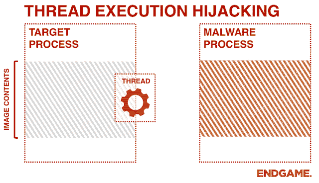

# ThreadBoat:程序使用线程执行劫持将本机外壳代码注入标准 Win32 应用程序

> 原文：<https://kalilinuxtutorials.com/threadboat/>

**ThreadBoat** 是一个利用线程劫持将原生外壳代码注入标准 Win32 应用程序的程序。

**关于**

我开发这个小项目是为了延续我在不同代码注入方法方面的经验，并允许 RedTeam 安全专家利用这种方法作为执行软件渗透测试的独特方式。通过线程劫持，它允许 hijacker.exe 程序挂起 target.exe 程序中的一个线程，从而允许我们向该目标线程写入外壳代码，并在稍后被执行(通过；WriteProcessMemory()、SetThreadContext()、ResumeThread()、CreateThread())。

**GIF 示例(残局积分)**

**用途**

**int main()
{
系统 sys
截击机 incp
异常 exp
sys . returnversionstate()；
if(sys . returnprivilegeescalationstate())
{
STD::cout<<"令牌权限已调整\ n "；
}
if (DWORD m_procId = incp。find win 32 process id((PCHAR)m _ win 32 process name))
{
incp。execute win 32 shell code(m _ procId)；
}
系统(“暂停”)；
返回 0；
}**

**环境**

*   Windows Vista+sssss
*   Visual C++

**Libs**

*   Winapi
    *   user32.dll
    *   kernel32.dll
*   ntdll.dll

[**Download**](https://github.com/MandConsultingGroup/ThreadBoat)