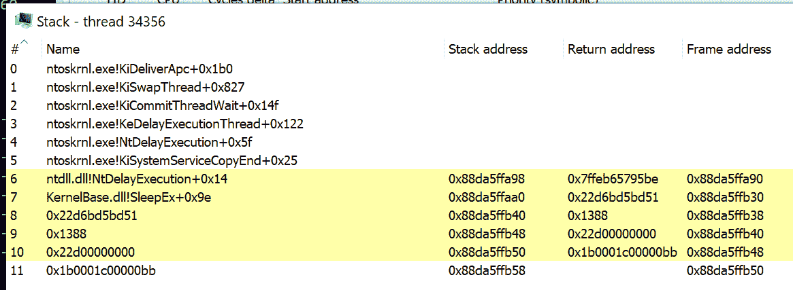
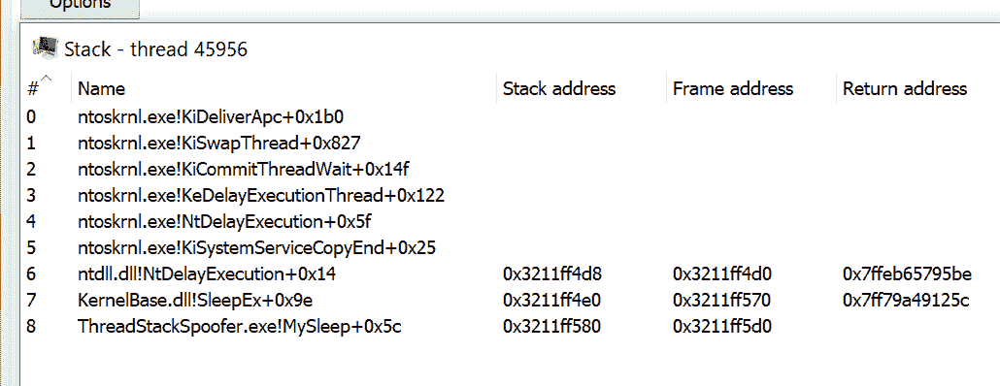
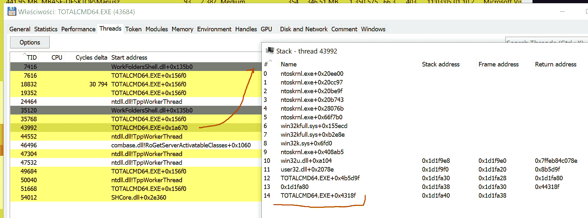

# ThreadStackSpoofer:一种高级内存规避技术的 PoC

> 原文：<https://kalilinuxtutorials.com/threadstackspoofer/>

[](https://blogger.googleusercontent.com/img/a/AVvXsEgKDldqyMlprBkJETpFaIC1DulRBCRGLzlD8U_WXChAxt8-Ye4xE82Am_U0bwPukzmjnriISN19HUUrrZFFLqdaIoOKsDKBIVOux2pZYVYpqmRmKrL9zwTTOhV0vpB-qqPOVmnCkcw2vWfyX9L3mwK-QH_PD77V8ei2wH8nLQ9RwakMSyb_YXtkTLSu=s724)

**ThreadStackSpoofer** 是一种欺骗线程调用堆栈的高级内存规避技术的 PoC 实现。这种技术允许绕过基于线程的内存检查规则，并在处理内存时更好地隐藏外壳代码。

**简介**

这是*线程堆栈欺骗*技术的一个示例实现，旨在规避恶意软件分析师、AVs 和 EDRs 在被检查线程的调用堆栈中查找外壳代码帧的引用。这个想法是在线程的调用堆栈中隐藏对外壳代码的引用，从而伪装包含恶意软件代码的分配。

实现和我的 shellcode 波动带来了攻击性安全社区示例实现，以赶上商业 C2 产品提供的产品，因此我们可以在我们的红队工具上做得更好。💪

**实现变了**

当前的实现与最初发布的大相径庭。这是因为我意识到有一种更简单的方法来终止线程的调用堆栈 processal 并隐藏 shellcode 的相关帧，只需将`0`写入我们控制的第一个帧的返回地址:

**void WINAPI my sleep(DWORD _ dw milliseconds)
{
[…]
自动覆盖=(PULONG _ PTR)_ AddressOfReturnAddress()；
const auto origin return address = * overwrite；
* overwrite = 0；
[…]
* overwrite = origin return address；
}**

利用`**StackWalk64**`的先前实现可以在提交 c250724 中访问。

这种实现更加稳定，并且在两种架构下的`**Debug**`和`**Release**`上都能很好地工作，这两种架构是`**x64**`和`**x86**`。

**试玩**

这是调用栈在被**而不是**欺骗时的样子:



反过来，当线程堆栈欺骗被启用时:



从上面我们可以看到，调用栈上的最后一帧是我们的`**MySleep**`回调。人们不禁要问，这会不会立即给新的 IOC 带来机遇？搜寻规则可以寻找调用堆栈没有展开到位于系统库中的以下预期线程入口点的线程:

然而，欺骗线程的调用堆栈起初可能看起来很奇怪，对我的系统的简单检查表明，还有其他线程没有展开到上述入口点:



上面截图是未修改的**总指挥官 x64** 的一个线程。正如我们所见，它的调用堆栈在初始调用堆栈帧方面与我们的非常相似。

当有进程表现出我们可以简单模仿的特征时，我们为什么要小心地伪造我们的调用堆栈呢？

**它是如何工作的？**

粗略的算法如下:

*   从文件中读取外壳代码的内容。
*   从`**dbghelp.dll**`获取所有必要的函数指针，调用`**SymInitialize**`
*   钩子`**kernel32!Sleep**`指向我们的回调。
*   通过 **`VirtualAlloc` + `memcpy` + `CreateThread`注入并启动外壳代码。**线程应该从我们的 **`runShellcode`** 函数开始，以避免线程的 *StartAddress* 指向某个意想不到的异常的地方(比如`**ntdll!RtlUserThreadStart+0x21**`
*   一旦 Beacon 试图休眠，我们的`**MySleep**`回调就会被调用。
*   然后，我们将堆栈上的最后一个返回地址覆盖为`**0**`，这将有效地完成调用堆栈。
*   最后，调用`**::SleepEx**`来让信标休眠，同时等待进一步的通信。
*   睡眠结束后，我们恢复先前保存的原始函数返回地址，并继续执行。

函数返回地址分散在线程的堆栈内存区域，由`**RBP/EBP**`寄存器指向。为了在堆栈中找到它们，我们需要首先收集帧指针，然后取消对它们的引用以进行覆盖:


*the above image was borrowed from **Eli Bendersky’s** post named [Stack frame layout on x86-64](https://eli.thegreenplace.net/2011/09/06/stack-frame-layout-on-x86-64/))*

***(PULONG _ PTR)(frame addr+sizeof(void*)= Fake _ Return _ Address；**

最初的`**ThreadStackSpoofer**`实现在`**walkCallStack**`和`**spoofCallStack**`函数中做到了这一点，然而当前的实现表明这些努力*并不需要维护隐形调用栈*

**示例运行**

使用案例:

C:【ThreadStackSpoofer.exe】T2

其中:

*   `**<shellcode>**`是外壳代码文件的路径
*   `**<spoof>**`当`**1**`或 **`true`** 将启用线程堆栈欺骗，其他任何东西禁用它。

运行欺骗信标线程调用堆栈的示例:

**PS D:\ de v2 \ ThreadStackSpoofer>。\ x64 \ Release \ threadstackspoofer . exe。\tests\beacon64.bin 1
。正在读取外壳代码字节…
。]挂钩 kernel32！睡眠…
【睡眠。]正在注入外壳代码……
[+]外壳代码现在正在运行。
[ > ]原回邮地址:0x1926747bd51。结束调用堆栈…
= = =>my sleep(5000)
[<]恢复原返回地址… [ > ]原返回地址:0x1926747bd51。正在整理调用栈…
= = =>my sleep(5000)
[<]正在恢复原返回地址… [ > ]原返回地址:0x1926747bd51。正在完成调用堆栈…**

我如何使用它？

查看代码及其实现，理解概念，并在您自己的 Shellcode 加载器中重新实现概念，您利用这些加载器来交付您的 Red Team 项目。这是另一种先进的内存规避技术，增加了您的团队不被反病毒、EDRs 和恶意软件分析师发现的机会。

在开发高级外壳代码加载器时，您可能还想实现:

*   **进程堆加密**——从这篇博客文章中获得灵感:挂钩堆并免费使用——它可以让你避开像`**BeaconEye**`这样的信标配置提取器
*   **将你的信标的内存页面保护改为** `**RW**` **(从`RX/RWX`)并加密它们的内容**——使用 Shellcode [](https://github.com/mgeeky/ShellcodeFluctuation)波动技术——就在睡觉前(这可以躲避扫描仪，如 **`Moneta`或 [`pe-sieve`](https://github.com/hasherezade/pe-sieve)** )
*   **清除反射加载程序**的任何残留物，以避免内存中的签名检测
*   **睡觉前解开所有你可能已经钩住的东西**(比如 AMSI、ETW、WLDP)，然后再重新钩住。

* * *

**实际上这还不是一个真正的栈欺骗**

正如有人向我指出的那样，这里的技术还没有真正成为名副其实的*栈欺骗器*。因为我们只是在线程的堆栈上覆盖返回地址，所以我们没有欺骗堆栈本身的剩余区域。此外，我们让我们的调用栈*不可解*看起来不正常，因为系统将不能正确地遍历整个调用栈帧链。

然而，我知道这些缺点，目前我让它保持原样，因为我最关心的是避开自动扫描器，这些扫描器可以迭代进程，枚举它们的线程，遍历这些线程堆栈，并拾取任何指向非图像内存的返回地址(例如`**SEC_PRIVATE**`——由`**VirtuaAlloc**`和朋友动态分配的那个)。专注的恶意软件分析师会立即发现奇怪之处，并认为该线程相当不寻常，追捕我们的植入物。非常确定。然而，我不相信如今像 AV/EDR 这样的自动化扫描器已经实现了各种试探法，这些试探法将*实际上遍历每个线程的堆栈*来验证它是否是不可缠绕的 **`¯\_(ツ)_/¯`** 。

毫无疑问，这个项目(以及 C2 框架中的商业实现)给了 AV & EDR 厂商考虑实现覆盖这种新颖规避技术的适当启发的理由。

为了改进这项技术，人们可以通过插入在反向解卷过程中建立的精心制作的假堆栈帧来瞄准真正的*线程堆栈欺骗器*。在下面阅读更多关于这个想法的内容。

**实现真正的线程堆栈欺骗器**

与 namazso 长达数小时的谈话教会了我，为了开发一个合适的线程堆栈欺骗器，我们需要反转 x64 调用堆栈展开过程。首先，需要仔细了解下面链接的(a)中解释的堆叠展开过程。当遍历 x64 架构上的线程调用堆栈时，系统不会简单地依赖分散在线程堆栈中的返回地址，而是:

1.  接受回信地址
2.  尝试识别包含该地址的函数(使用 RtlLookupFunctionEntry)
3.  该函数返回`**RUNTIME_FUNCTION**`、`**UNWIND_INFO**`和`**UNWIND_CODE**`结构。这些结构描述了函数的起始地址、结束地址以及修改`**RBP**`或`**RSP**`的所有代码序列。
4.  系统需要知道在调用堆栈的每个函数中发生的所有堆栈和框架指针的修改，然后虚拟地*回滚*这些改变，并在发生对已处理的调用堆栈框架的调用时虚拟地恢复调用堆栈指针(这在 RtlVirtualUnwind 中实现)
5.  系统处理所有检查过函数 exhbits 的`**UNWIND_CODE**`,以精确计算该帧的返回地址和堆栈指针值的位置。
6.  通过这种模拟，系统能够沿着调用堆栈链向下走，并有效地“展开”调用堆栈。

为了干扰这个过程，我们需要通过使用 **`RtlVirtualUnwind`的恢复形式来*恢复它*。**我们需要迭代一个模块中定义的函数(假设是`k**ernel32**`)，扫描每个函数的`**UNWIND_CODE**`代码，并向后模拟它(与 **`RtlVirtualUnwind`** 和精确的`**RtlpUnwindPrologu**e`相比)，以便在堆栈中找到放置我们的假返回地址的位置。

namazso 提到了引入 3 个伪堆栈框架来很好地缝合调用堆栈的必要性:

*   一个“去同步”框架(可以把它看作是一个*小工具框架*)，与我们的`M**ySleep**`(具有不同的`**UWO**P`–展开操作代码)的调用方相比，它的展开方式不同。我们通过查看模块中的所有函数，查看它们的 UWOPs，计算假帧应该有多大来做到这一点。这一帧必须有与我们的**`MySleep`**s 呼叫者不同的**。**
*   **我们想要找到的下一帧是一个通过从堆栈中弹出到`RBP`来打开窗口的函数——基本上是通过`**UWOP_PUSH_NONVOL**`代码。**
*   **第三帧我们需要一个通过代码`**UWOP_SET_FPREG**`从`**RBP**`恢复`**RSP**`的函数**

 **恢复的`**RSP**`必须用从控制流进入我们的 **`MySleep`** 的任何地方取得的`**RSP**`来设置，这样我们所有的框架都变成隐藏的，作为第三个小工具在那里展开的结果。

为了开始这个过程，可以通过解引用`**IMAGE_DIRECTORY_ENTRY_EXCEPTION**`数据目录条目来迭代可执行文件的`**.pdata**`。考虑下面的例子:

```
ULONG_PTR imageBase = (ULONG_PTR)GetModuleHandleA("kernel32");
PIMAGE_NT_HEADERS64 pNthdrs = PIMAGE_NT_HEADERS64(imageBase + PIMAGE_DOS_HEADER(imageBase)->e_lfanew);
auto excdir = pNthdrs->OptionalHeader.DataDirectory[IMAGE_DIRECTORY_ENTRY_EXCEPTION];
if (excdir.Size == 0 || excdir.VirtualAddress == 0)
    return;
auto begin = PRUNTIME_FUNCTION(excdir.VirtualAddress + imageBase);
auto end = PRUNTIME_FUNCTION(excdir.VirtualAddress + imageBase + excdir.Size);
UNWIND_HISTORY_TABLE mshist = { 0 };
DWORD64 imageBase2 = 0;
PRUNTIME_FUNCTION currFrame = RtlLookupFunctionEntry(
    (DWORD64)caller,
    &imageBase2,
   &mshist
);
UNWIND_INFO *mySleep = (UNWIND_INFO*)(currFrame->UnwindData + imageBase);
UNWIND_CODE myFrameUwop = (UNWIND_CODE)(mySleep->UnwindCodes[0]);
log("1\. MySleep RIP UWOP: ", myFrameUwop.UnwindOpcode);
for (PRUNTIME_FUNCTION it = begin; it < end; ++it)
{
    UNWIND_INFO* unwindData = (UNWIND_INFO*)(it->UnwindData + imageBase);
    UNWIND_CODE frameUwop = (UNWIND_CODE)(unwindData->UnwindCodes[0]);
    if (frameUwop.UnwindOpcode != myFrameUwop.UnwindOpcode)
    {
        // Found candidate function for a desynch gadget frame
    }
}
```

这个过程有点复杂，但是可以归结为恢复线程的调用堆栈展开过程，用类似 ROP 的方法，用精心选择的其他堆栈帧替换任意堆栈帧。

这个 PoC 没有复制这个算法，因为我目前的理解允许我在基于`**EXE**`的堆栈框架上接受调用堆栈结束，我不想过度复杂我的外壳代码加载器和这个 PoC。把实现和公开分享的工作留给一个热心的读者。或者，如果有更多的空闲时间，我会坐下来试着自己做这件事🙂

[**Download**](https://github.com/mgeeky/ThreadStackSpoofer)**