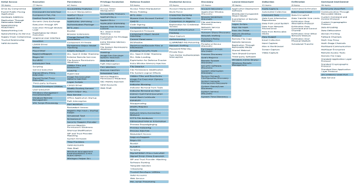

# ThreatHunting:一个映射到米特 ATT 和 CK 的 Splunk 应用程序

> 原文：<https://kalilinuxtutorials.com/threathunting-splunk-mitre-attck/>

**ThreatHunting** 是一个 Splunk 应用程序，包含几个仪表盘和 120 多个报告，有助于调查初始搜索指标。

很明显，您需要将 Sysmon 数据接收到 Splunk 中，在这里可以找到一个好的配置

**注意:**这个应用程序不是灵丹妙药，它需要调整和真正的调查工作才能在您的环境中真正有效。试着和你的系统管理员成为最好的朋友。他们将能够解释许多最初发现的迹象。

ATT & CK

我努力将所有搜索映射到 ATT&CK 框架。所有链接配置的当前 ATT&CK 导航器导出可在[此处](https://github.com/olafhartong/ThreatHunting/blob/master/attack_matrix/threathunting.json)找到，并可在[此处](https://mitre.github.io/attack-navigator/enterprise/#layerURL=https%3A%2F%2Fraw.githubusercontent.com%2Folafhartong%2Fthreathunting%2Fmaster%2Fattack_matrix%2Fthreathunting.json&scoring=false&clear_annotations=false)查看。

**也可理解为-[osme deus:侦察安全框架&漏洞扫描](https://kalilinuxtutorials.com/osmedeus-reconnaissance-vulnerability-scanning-2/)**

**应用先决条件**

将以下应用程序安装到您的 SearchHead:

*   [微软 Sysmon 插件](https://splunkbase.splunk.com/app/1914/)
*   [穿孔卡可视化](https://splunkbase.splunk.com/app/3129/)
*   [力导向可视化](https://splunkbase.splunk.com/app/3767/)
*   [桑基图可视化](https://splunkbase.splunk.com/app/3112/)
*   [查找文件编辑器](https://splunkbase.splunk.com/app/1724/)

**部署后需要采取的行动**

*   确保 threathunting 索引存在于您的索引中
*   编辑宏以适应您的环境>[https://yours plunk/en-US/manager/threahunting/admin/macros](https://yoursplunk/en-US/manager/ThreatHunting/admin/macros)(*确保 sourcetype 正确*
*   该应用程序没有白名单查找文件，你需要自己创建它们。这样你就不会在升级应用程序时不小心覆盖了它们。
*   安装查找 csv 或自己创建，空 csv 在此处[显示](https://github.com/olafhartong/ThreatHunting/raw/master/files/ThreatHunting.tar.gz)

Kirtar Oza 写的一步一步的指导可以在这里找到

**用法**

更详细的解释可以在[这里](https://github.com/olafhartong/ThreatHunting/wiki)或者[这篇博文](https://medium.com/@olafhartong/endpoint-detection-superpowers-on-the-cheap-threat-hunting-app-a92213f5e4b8)中找到

[**Download**](https://github.com/olafhartong/ThreatHunting)