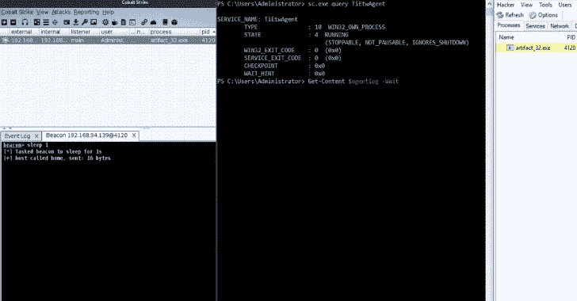
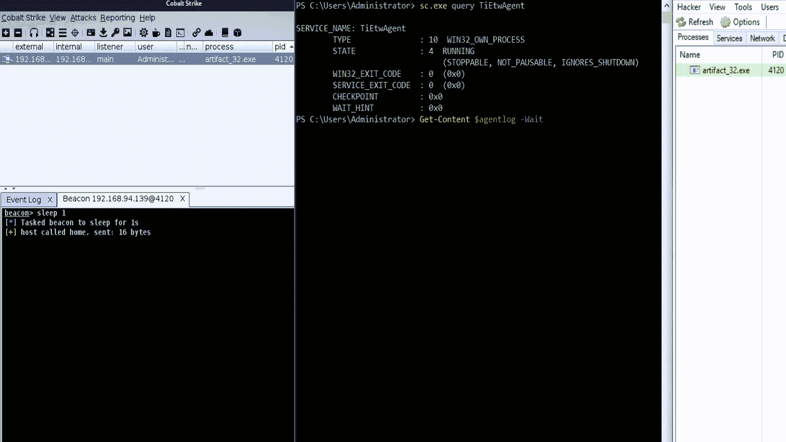

# TiEtwAgent:基于 ETW 的 PoC 内存注入检测代理，用于攻击和防御研究目的

> 原文：<https://kalilinuxtutorials.com/tietwagent/>

**tiet agent**项目旨在研究、构建和测试不同的内存注入检测用例及旁路技术。该代理利用 Microsoft-Windows-Threat-Intelligence 事件跟踪提供程序，作为一种更现代、更稳定的用户域挂钩替代方案，具有内核模式可见性的优势。

该项目依赖微软/krabsetw 库进行 ETS 设置和消费。

一篇附带的博文可以在这里找到:https://blog . red blue purple . io/windows-security-research/kernel-tracing-injection-detection

**添加新检测**

检测功能可以很容易地添加到`**DetectionLogic.cpp**`中，并从`**detect_event(GenericEvent evt)**`中调用任何源事件类型。对新事件字段的支持可以通过在`**GenericEvent**`类声明中将它们的名称附加到映射中来轻松添加。

**设置指令**

假设您没有 Microsoft 信任的签名证书:

*   用 bcdedit 将您的计算机置于测试签名模式
*   使用 ELAM 和代码签名 EKU 生成自签名证书
*   用证书给 TiEtwAgent.exe 和你的埃兰司机签名
*   。/tiet agent 安装
*   网络启动代理
*   默认情况下，在 C:\ Windows \ Temp \ tiet agent . txt 中查找日志

[**Download**](https://github.com/xinbailu/TiEtwAgent)