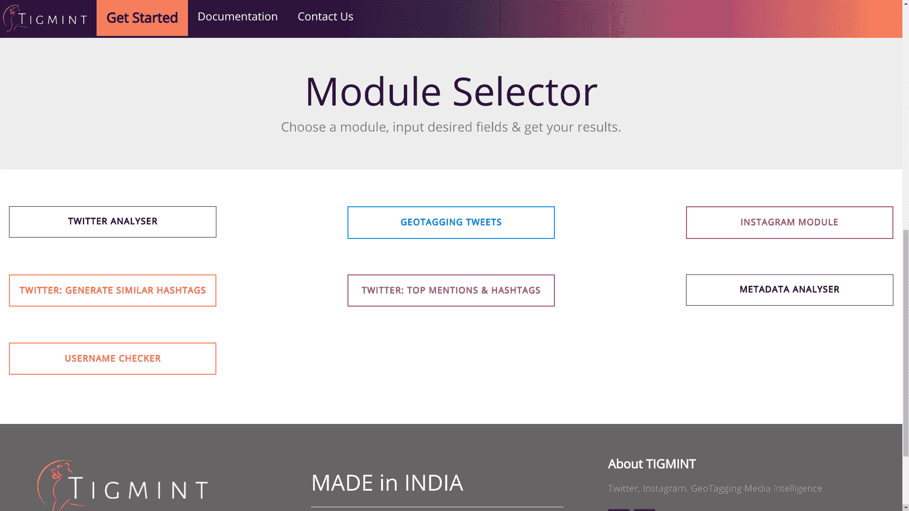
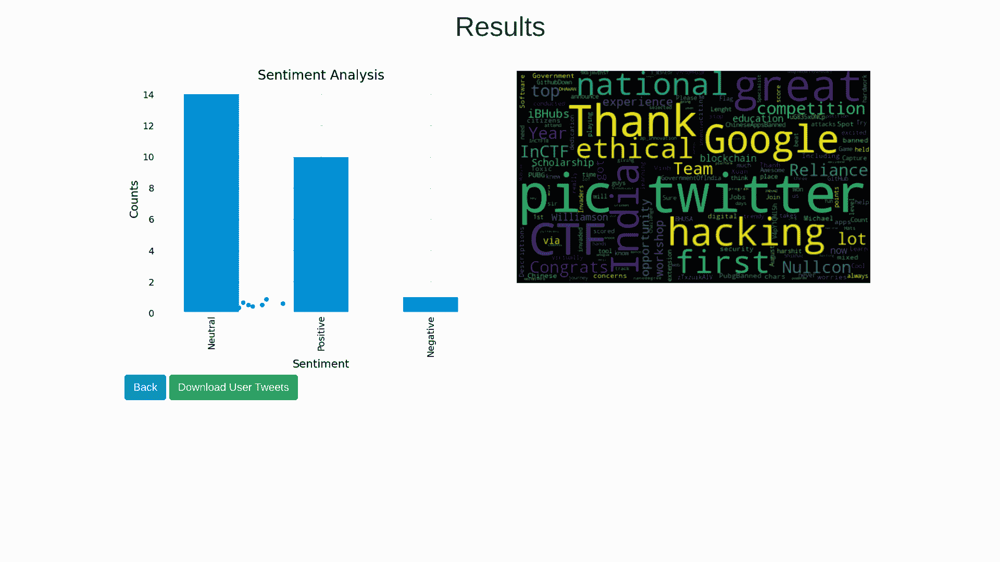
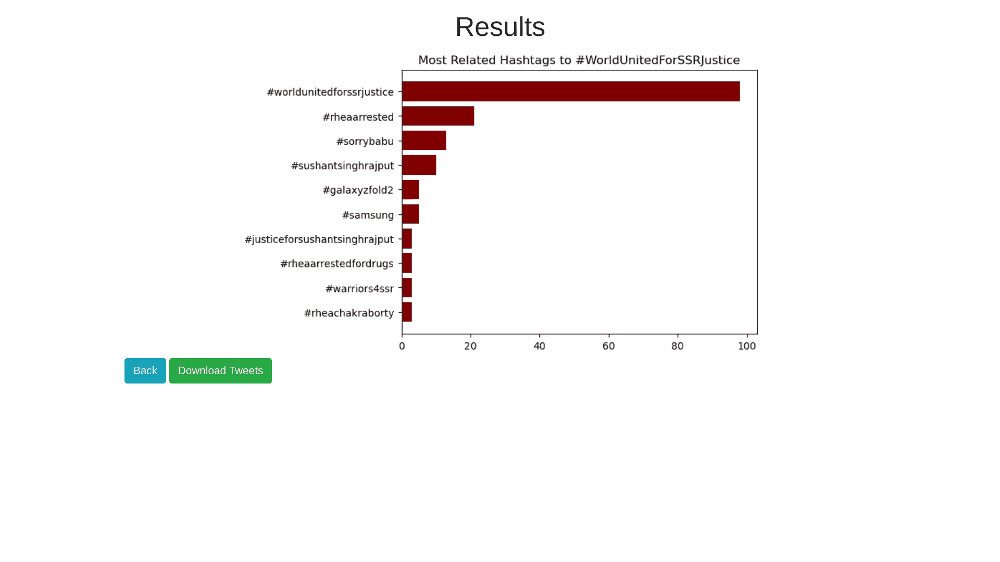
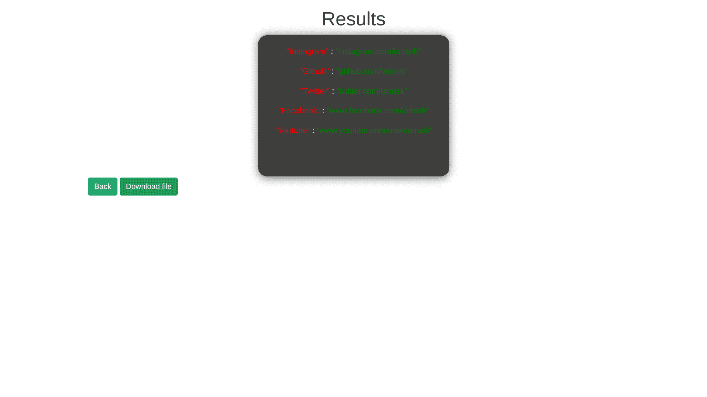
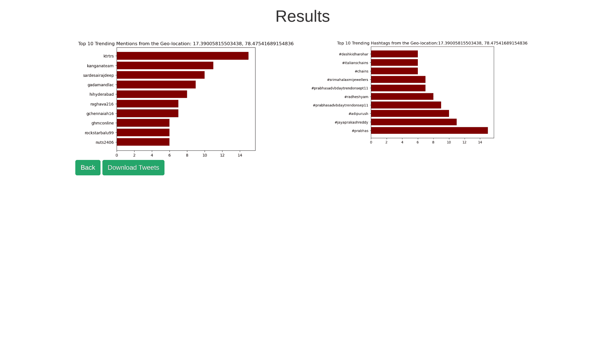

# TIGMINT : OSINT(开源智能)GUI 软件框架

> 原文：<https://kalilinuxtutorials.com/tigmint/>

**TIGMINT** 是一个 **OSINT(开源智能)**软件框架，其目标是通过实现抽象机制来隐藏背景技术复杂性，并将不同的**社交媒体智能分析技术**捆绑在一起，为用户提供一个简单直观的网络界面，从而使网络调查更加方便。

**预览**

**模块**

**我们的团队**

**文档**

**账户查找器**

**推特分析器**

**工作工具截图**

**本地设置**

**要求**

*   Python 3.6
*   beautifulsoup4
*   Nodejs
*   matplotlib;
*   熊猫；
*   NPM；
*   nltk

**Windows 安装问题**

对于 windows 用户，如果安装失败或应用程序总是重定向到 404 错误页面。您可以验证以下步骤。

*   使用**pip 3 install-r requirements.txt**命令验证 requirements . txt 中的所有模块都已成功安装。在 windows 中，你必须根据你的 python 版本手动安装 wordcloud 模块。
    WordCloud 模块下载链接| StackOverflow 帮助线程
    例如:如果你安装了 python 3.6，那么你必须从上面的链接安装*word cloud 1 . 8 . 0 cp36 cp36m win _ amd64 . whl*模块。
    安装完 wordcloud 模块后，再次运行命令**pip install-r requirements . txt**检查所有需求是否安装成功。
*   使用 **npm install** 命令检查是否安装了所有节点需求。

如果您还有任何问题，请打开模块名称、操作系统、输入和输出以及控制台日志。我们会尽快解决这个问题。

**Linux 元分析需求**

**sudo 安装 exiftool**

从各种文件格式中检索元数据需要上述工具。

**安装运行**

**去**

**git 克隆 https://github.com/TIGMINT/TIGMINT
CD TIGMINT
pip 3 install-r requirements . txt
pip 3 install–user–upgrade git+https://github . com/twint project/twint . git @ origin/master # egg = twint
NPM install
node Api/server . js**

**工具不工作？**

*   更新 python 依赖项。(pip3 安装–用户–升级 git+https://github . com/twint project/twint . git @ origin/master # egg = twint)
*   从 github repo 重新安装。
*   提出错误日志的问题。我们将尽快修复它！。

**使用 Docker**

您可以使用以下命令运行 docker

**docker run–name tigmint-p 3000:3000k 1m 0 ch 1/tigmint**

并打开`**http://localhost:3000**`

或者，您可以使用命令自己构建映像

docker build -t tigmint。

[**Download**](https://github.com/TIGMINT/TIGMINT)