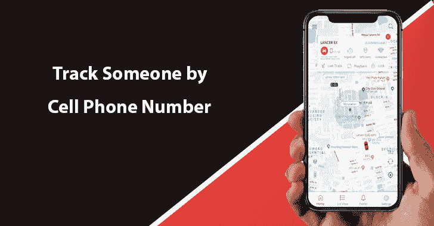
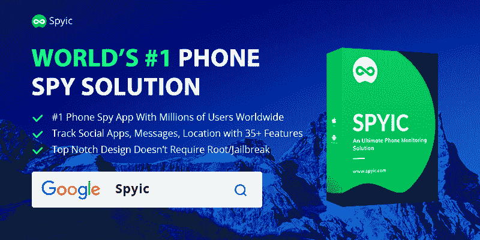
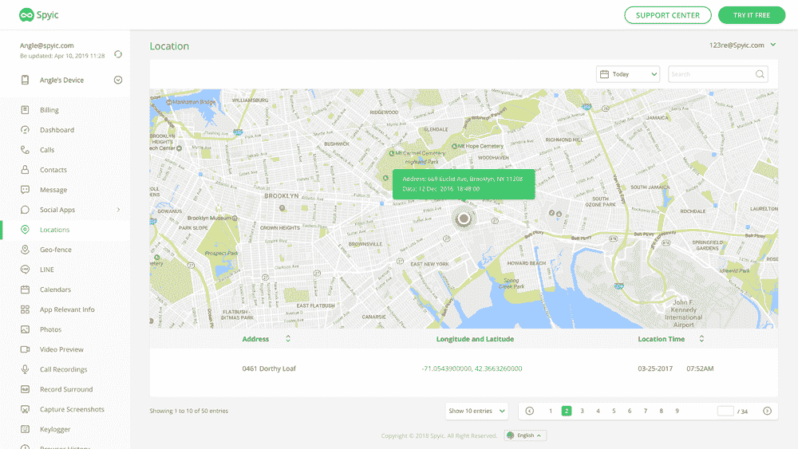
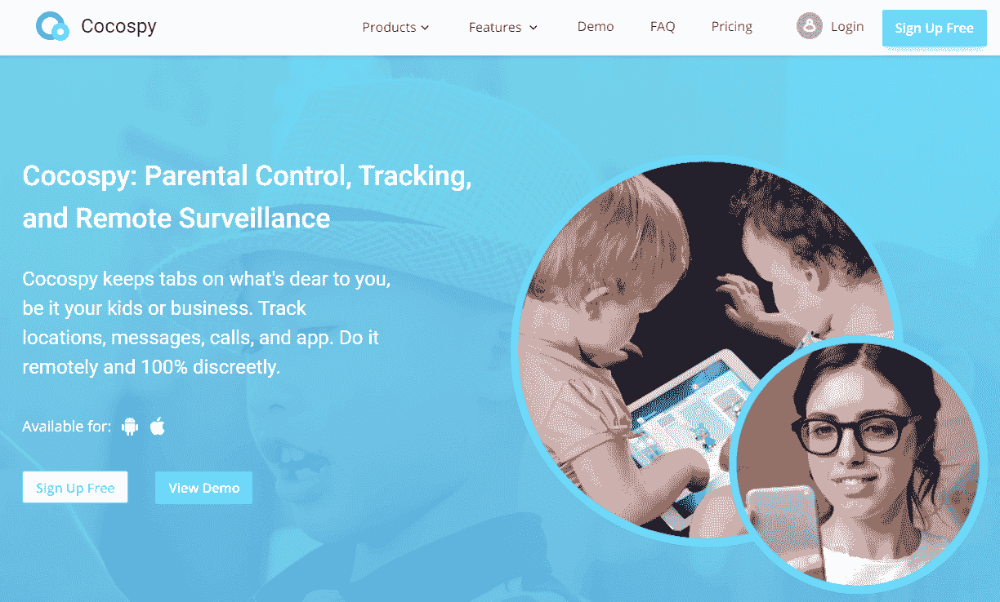
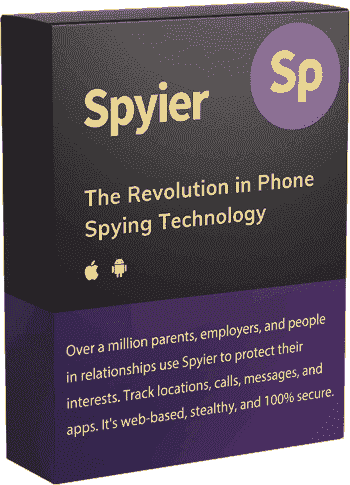

# 通过手机号码追踪某人的三大最佳方法

> 原文：<https://kalilinuxtutorials.com/track-someone-by-cell-phone-number/>

有很多人都知道如何通过手机号码跟踪某人，但也有一些人不知道如何做到这一点。

为了你的方便，我们写这篇文章，这样你就可以选择最好的方式来跟踪某人的手机，只要有他们的号码。你认为可能吗？显然，有些人对整个事情有了新的想法。

如果你也以同样的方式思考，那么我们将为你解决这个问题，建议一些最好的解决方案，当你需要追踪某人的电话时，可以用最好的方式工作。根据你的情况和条件，你的理由可以各不相同，对你来说它们是合法的，所以如果你期待一些动态的工具，可以帮助你追踪一个手机号码，那么你就来对地方了。

这里，在这篇文章中，我们向你推荐一些可以被 Android 和 iPhone 用户使用的方法。无论你跟踪背后的原因是什么，这些都会对你有用，不用担心暴露和被抓。

以下是仅通过手机号码追踪某人的一些最佳方法:

## **1。Spyic**

有许多工具和软件，可以帮助客户跟踪某人的位置，只需他们的手机号码，但没有什么可以打败 Spyic。这是世界上最好的手机监控应用工具之一。你可能以前就听说过，但是如果你从来没有听说过，那就看看它，自己决定吧。全世界有数百万用户在使用这个应用程序。因为它在隐形模式下工作，所以没有必要担心安全问题。

你可以完成所有的间谍任务，而不用担心被抓。当使用 Spyic 时，不需要对设备进行 root 或越狱。你不必亲自接触设备，以防你应该 [**通过手机号码**](https://www.ilounge.com/articles/track-someone-by-cell-phone-number-without-them-knowing-for-free) 跟踪某人的设备。

显然，它将在后台工作，该图标对于该设备的所有者来说将保持不可见，他们将无法发现他们正在被监视。我喜欢这个应用程序的一点是，它有一个动态的基于网络的界面，允许你通过使用任何浏览器来窥探设备，所以我们可以说，当我们谈论从某个浏览器进行跟踪时，没有硬性规定可以遵循。

百分百安全，不用着急。它还跟踪当前时刻的位置，并让你知道之前的时刻。它惊人的键盘记录器可以让你跟踪设备上输入的所有内容；显然它包括社交媒体账户密码。

通过使用 Spiyic，您还可以创建一个虚拟的地理限制，当超过设定的限制时，它将帮助您接收警报。它还为您提供了详细的浏览器历史记录，从社交媒体帐户读取群组和个人聊天记录，允许您阅读短信，轻松跟踪通话记录。您还可以看到联系人列表以及他们的姓名和号码。

它真的很容易利用，所以如果你是一个新手，没有足够的工具和软件知识，那么这是最好的选择。另一个吸引人的额外津贴是它的合理价格，所以如果你预算紧张或需要节省一些钱，那么就去 Spyic 吧。我觉得没有其他 app 比这个更好了。人们还能要求什么？

#### **使用 Spyic 跟踪某人的手机号码**

*   作为第一步，注册 Spyic 并查看您手机的订购计划。可以是 iOS，也可以是 Android。
*   下面是简单设置向导，它将引导您完成整个课程。
*   如果你正在跟踪一个 iOS，那么没有必要安装任何应用程序。只需添加目标手机的 iCloud 详细信息。不要忘记选择与 iCloud 帐户连接的设备名称。
*   如果你正在追踪一个机器人，那么你可以在目标设备上下载并安装应用程序。让它需要的任何重要许可。您可以在安装过程结束时隐藏应用程序。
*   最后，当系统在几分钟后同步了所有的信息，你就可以使用 Spyic 了。点击向导上的“开始”,您将进入仪表板。

## **2 .可可〔t1〕**

如果有任何其他应用程序可以达到 Spyic 的卓越水平，那么没有比 Cocospy 更好的了。这是一个神奇的应用程序，被世界各地的许多用户使用，因为它可以在 iPhone 和 Android 上完美地工作。像 Spyic 一样，它也可以在[隐身模式](https://en.wikipedia.org/wiki/Stealth_mode)下工作，所以你可以在任何浏览器中使用它。

没有必要越狱和 root 设备的情况下，你需要跟踪目标手机。如果是安卓系统，你只需要访问目标设备一次，但如果你在跟踪 iPhone，那么没必要担心，只需获得 iCloud 帐户的详细信息，你这方面的工作就完成了。

要使用 Cocospy，您不必遵循任何硬性指示，因为设置和遵循命令非常简单。通过使用它，您可以轻松跟踪目标帐户的位置，检查他们的浏览历史，阅读短信和社交媒体帐户消息，了解联系电话号码和姓名，跟踪通话记录，以及其他许多任何人都无法想象的事情。Cocospy 真的很划算，所以如果你不需要花很多钱在间谍软件上，这是最好的工具。

最后但不是最不重要的；它有一个令人难以置信的键盘记录器，可以让你跟踪目标手机上的每一个笔画。有了这个优势，我们可以说你已经完全获得了访问权限，因为现在无论通过目标设备进行什么活动，你都能够找到包括社交媒体帐户密码在内的一切信息。

#### **使用 Cocospy 追踪某人的手机号码**

*   开始的时候，如果你想通过他们的电话号码来追踪电话，你必须注册。这通常是免费的，你只需要一个电子邮件地址和一个密码。您必须对您将要选择的密码有所创新，这样就没有人能够访问您在 Cocospy 仪表板中的信息。
*   现在，如果你需要监视 Android 手机，那么至少有一次你应该获得目标手机的访问权限来安装该应用程序，但如果你正在监视 iOS，那么只需添加 iCloud 帐户细节。
*   最后，当您完成软件安装，并将设备连接到应用程序时，您可以轻松登录到应用程序的仪表板，并开始跟踪目标设备的位置。

## **3。间谍**

我们追踪应用列表中的最后一个是 Spyier。这个儿童监控应用程序被许多用户使用，因为它的易用性和可靠性而受到喜爱。如果您将要运行这些命令，就不必担心了。你可以很容易地按照一些简单的指示，让这个应用程序按照你的要求工作。它可以让你跟踪目标设备的位置，允许你阅读文本和社交媒体配置文件的信息，显示你的通话记录，联系号码和联系人名单。

通过使用这个应用程序，你现在可以通过地理围栏在地图上追踪目标手机。当越过限制边界时，它会向您发出警告。它是 100%安全的，所以在安全问题上不必惊慌。父母真的会发现它很棒，因为现在他们可以随时关注孩子的浏览器历史，因为这个应用程序为你提供了关于互联网的详细报告。

### **结论**

我们希望上面的文章能帮助你选择最好的方法，只通过他们的电话号码来追踪他们的设备。您可以轻松地让这些工具为您服务，因为我们上面提到的工具操作起来非常简单。选择最符合您需求的应用，并访问官方网页，因为您还可以查看这些应用的详细信息。现在把你所有的担心都抛在脑后，不要等待完美的应用程序，因为我们提到的那些应用程序是最好的应用程序中的最好的，因为它们只通过手机号码来监视某人的设备。去做吧，让我们知道你的经历。