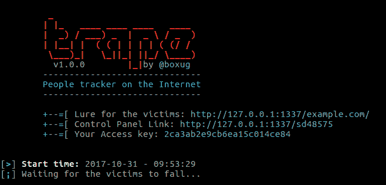

# trape——学会追踪世界，避免被追踪

> 原文：<https://kalilinuxtutorials.com/trape-track-avoid-traced/>

**Trape** 是一个识别工具，可以让你**跟踪人**，你能得到的信息非常详细。此外，大型互联网公司可以监控你，获取你的 IP 以外的信息。



**也可理解为[xat tacker——网站漏洞扫描器&自动开发工具](https://kalilinuxtutorials.com/xattacker-website-vulnerability-scanner/)**

## **使用陷阱识别会话**

*   脸谱网
*   推特
*   维生素 k
*   Reddit
*   谷歌邮箱
*   微博客
*   照片墙
*   开源代码库
*   Bitbucket
*   Dropbox
*   Spotify
*   贝宝
*   亚马孙
*   Foursquare ( *新*)
*   Airbnb ( *新*)
*   黑客新闻(*新*)
*   松弛(*新*)

## **用途**

*   首先卸载工具。

```
git clone https://github.com/boxug/trape.git
cd trape
python trape.py -h
```

如果不起作用，尝试安装位于文件 **requirements.txt** 中的所有库

```
pip install -r requirements.txt
```

**执行示例**

```
python trape.py --url http://example.com --port 8080
```

1.  在选项**–URL**中，你必须放置诱饵，可以是一个新闻页面，一篇文章，也可以是一个演示页面。
2.  在**–端口**选项中，您只需将端口放在您希望它运行的位置
3.  你喜欢监视你的人吗？有了 Trape 一切皆有可能
4.  是否要执行网络钓鱼攻击？有了 Trape 一切皆有可能
5.  在 Files 目录中，位于路径: **/static/files** 下。exe 扩展名或下载文件发送给受害者。

## **视频**

[https://www.youtube.com/watch?v=FdwyIZhUx3Y](https://www.youtube.com/watch?v=FdwyIZhUx3Y)

## **免责声明**

该工具已分发，用于教学目的，以向个人展示人们如何跟踪或监控他们或从他们的认证中获取数据，我们不负责使用或在何种程度上让人们完成这项任务。

[ ](https://github.com/boxug/trape#recognizes-the-sessions-of-the-following-services) **作者:何塞·皮诺**