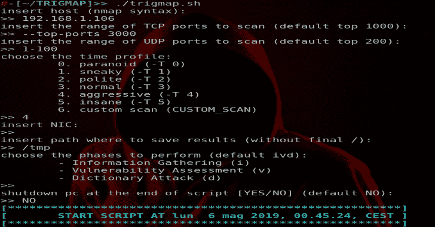
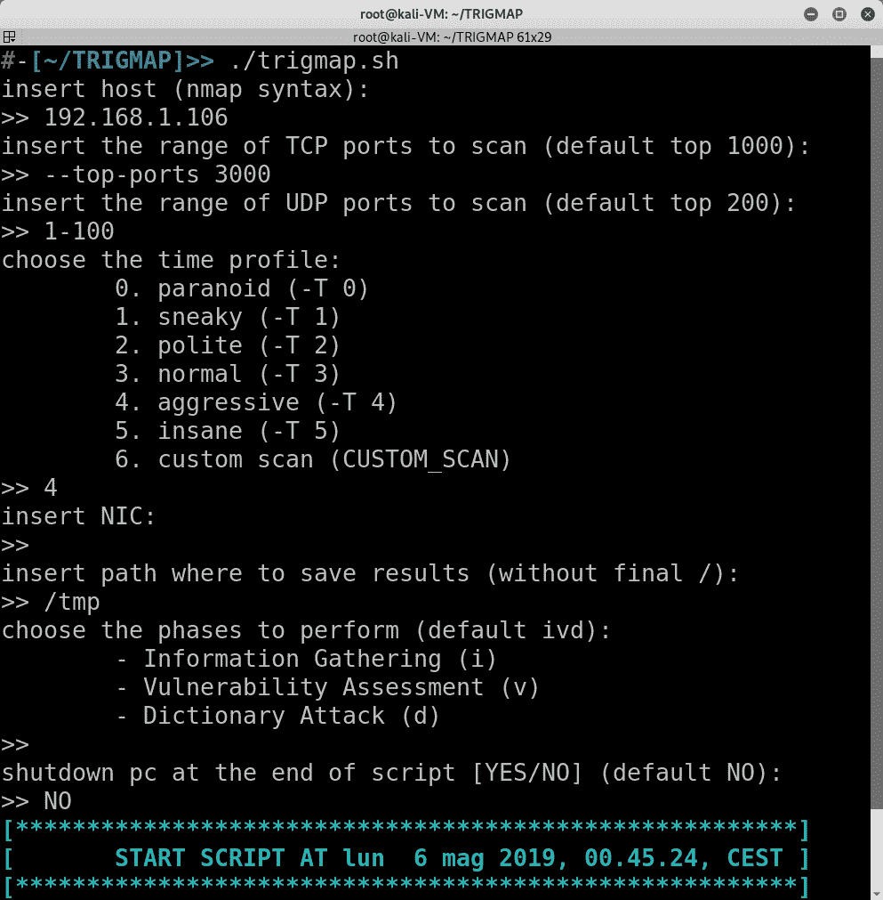

# trig map:Nmap 自动化 Pentest 的包装器

> 原文：<https://kalilinuxtutorials.com/trigmap-nmap-pentest/>

**Trigmap** 是 Nmap 的包装器。您可以使用它轻松地启动 Nmap 扫描，尤其是将信息收集到一个组织良好的目录层次结构中。

由于优化的 Nmap 算法，Nmap 的使用使得脚本可移植(不仅在 Kali Linux 上容易运行)并且非常高效。Trigmap 可以使用 Nmap 脚本引擎(NSE)执行多项任务:

*   端口扫描
*   服务和版本检测
*   Web 资源枚举
*   脆弱性评估
*   常见漏洞测试
*   常见漏洞测试
*   针对主动服务的字典攻击
*   默认凭据测试

**也读作-[Mquery:YARA 恶意软件查询加速器](https://kalilinuxtutorials.com/mquery/)**

**用途**

**Trigmap 有两种用法:**

**交互模式:**

**trigmap [ENTER]，脚本完成剩下的工作**

**非交互模式:**

**trig map-h |–host[-TP |–TCP TCP 端口][-up |–UDP UDP 端口][-f |–文件文件路径][-s |–速度时间配置文件][-n |–NIC NIC][-p |–相位相位]**

**如果你想看帮助:**

**trig map–帮助打印该助手**

**目录层级**

**定制**

可以通过改变文件开头的变量值来自定义脚本。

特别是，您可以选择 Nmap 脚本使用的单词列表和最重要的 Nmap 扫描参数(ping、扫描、定时和脚本)。

# # # ## # # # # # # # # # # # # # # # # # # # # # # # # # # # # #参数
# # # # # # # # # # # # # # # # # # # # # # # # #
GENERAL _ USER _ LIST = ' GENERAL _ USER _ word LIST _ SHORT . txt '
WIN _ USER _ LIST = ' WIN _ USER _ word LIST _ SHORT . txt '
UNIX _ USER _ LIST = ' UNIX _ USER _ word LIST _ SHORT . txt '【中

**免责声明**:

作者不承担任何责任，也不对该程序造成的任何误用或损害负责。分发 Trigmap 是希望它有用，但没有任何保证；甚至没有对适销性或特定用途适用性的暗示担保。更多细节请参见 GNU 通用公共许可证。

[**Download**](https://github.com/Leviathan36/trigmap)