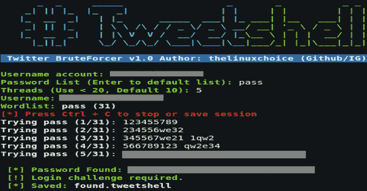

# tweet Shell:Shell 脚本中的多线程 Twitter BruteForcer

> 原文：<https://kalilinuxtutorials.com/tweetshell/>

**Tweetshell** 是一个针对 Twitter 执行多线程暴力攻击的 shell 脚本，该脚本可以绕过登录限制，并且可以使用 20 个线程以+400 密码/分钟的速度测试无限数量的密码。

Shell 脚本中的多线程 Twitter BruteForcer。

**特性**

*   多线程(400 次/分钟，20 个线程)
*   保存/恢复会话
*   通过 TOR 的匿名攻击
*   默认密码列表(最佳+39k 8 个字母)
*   检查有效的用户名
*   检查并安装所有依赖项

**用途**

**git 克隆 https://github.com/thelinuxchoice/tweetshell
CD tweet shell
chmod+x tweet shell . sh
service tor start
sudo。/tweetshell.sh**

**也可以理解为-[AWS px:一个基于图形的可视化有效访问工具](https://kalilinuxtutorials.com/awspx/)**

**安装要求**

**chmod +x install.sh
sudo。/install.sh**

**免责声明**

未经双方事先同意，使用此工具攻击目标是非法的。最终用户有责任遵守所有适用的地方、州和联邦法律。开发人员不承担任何责任，也不对本程序造成的任何误用或损坏负责。

[**Download**](https://github.com/thelinuxchoice/tweetshell)