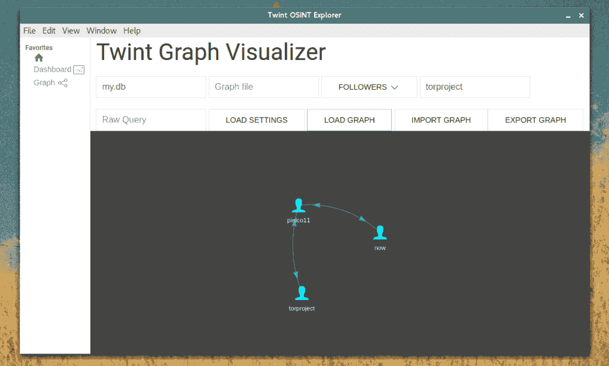

# Twint : Twitter 智能工具

> 原文：<https://kalilinuxtutorials.com/twint-twitter-osint-intelligence/>

TWINT 是一个用 Python 编写的高级 Twitter 抓取工具&,它不使用 Twitter 的 API，允许你抓取用户的关注者、追随者、推文等，同时规避大多数 API 限制。

Twint 以前被称为 Tweep，是一个用 Python 编写的高级 Twitter 抓取工具，允许在不使用 Twitter 的 API 的情况下从 Twitter 个人资料中抓取 Tweep。

Twint 利用 Twitter 的搜索运营商，让你从特定用户那里抓取推文，抓取与某些主题、标签和趋势相关的推文，或者从推文中挑选出敏感信息，如电子邮件和电话号码。我发现这非常有用，你也可以用它变得非常有创造力。

Twint 还对 Twitter 进行特殊查询，允许您在没有任何身份验证、API、Selenium 或浏览器模拟的情况下收集 Twitter 用户的关注者、用户喜欢的 Tweets 以及他们关注的人。
TL；灾难恢复优势

使用 Twint 和 Twitter API 的一些好处:

*   可以获取几乎所有的推文(Twitter API 限制只能持续 3200 条推文)
*   快速初始设置
*   可以匿名使用，无需 Twitter 注册
*   没有费率限制

**也可阅读-[确定管理员查找 3:查找](https://kalilinuxtutorials.com/okadminfinder-admin-panel/)站点的管理面板 **

**要求**

**Python 3.6**

**安装**

**去**:

git 克隆 https://github.com/twintproject/twint.git
pip 3 安装要求. txt

**Pip** :

pip3 安装–升级-e git+https://github . com/twint project/twint . git @ origin/master # egg = twint

**管道女**:

pipenv install-e git+https://github . com/twint project/twint . git # egg = twint

CLI 基本示例和组合

几个简单的例子可以帮助你理解基础知识:

*   **twint-u username**–从用户的时间表中抓取所有推文。
*   **twint -u username -s 菠萝**–从用户的时间线中抓取所有包含菠萝的推文。
*   **twint -s 菠萝**——从每个人的推文中收集每一条包含菠萝的推文。
*   **twint -u 用户名–2014 年**–收集 2014 年之前发布的推文。
*   **twint -u 用户名-自 2015-12-20**-收集自 2015-12-20 发布的推文。
*   **twint-u username-o file.txt**–抓取推文并保存到 file . txt。
*   **twint-u username-o file . csv–CSV**–抓取推文并另存为 CSV 文件。
*   **twint -u 用户名–电子邮件–电话**–显示可能有电话号码或电子邮件地址的推文。
*   twint -s“唐纳德·特朗普”——已验证——显示已验证用户发布的关于唐纳德·特朗普的推文。
*   **twint -g="48.880048，2.385939，1km "-o file . csv–CSV**-抓取巴黎某地周围半径 1km 范围内的推文，导出为 CSV 文件。
*   **twint-u username-es localhost:9200**–将推文输出到 Elasticsearch
*   **twint-u username-o file . json–JSON**–抓取推文并保存为 JSON 文件。
*   **twint-u username–数据库 tweets . db**–将 Tweets 保存到 SQLite 数据库。
*   twint-u username–followers–收集 Twitter 用户的关注者。
*   **twint-u username–following**–收集 Twitter 用户关注的人。
*   **twint-u username–favorites**–收集用户收藏的所有推文。
*   **twint-u username–following–user-full**–收集某人关注的完整用户信息
*   **twint-u username–profile-full**–使用一种缓慢但有效的方法从用户的个人资料中收集推文(收集约 3200 条推文，包括转发)。
*   **twint-u username–retweets**–使用快速方法从用户的个人资料中收集最近 900 条推文(包括 retweets)。
*   **twint-u username–Resume 10940389583058**–从指定的 Tweet ID 开始继续搜索。

**模块示例**

Twint 现在可以作为一个模块使用，并支持自定义格式。

**导入 twin
#配置
c = twint。config()**
**c . Username = " none privacy "
c . Search = " # osint "
c . Format = " Tweet id:{ id } | Tweet:{ Tweet } "

# Run
twint . Run . Search(c)**

**输出:**

955511208597184512 2018-01-22 18:43:19 GMT 菠萝是最好的水果

导入 twint
c = twint。config()

c . Username = " none privacy "
c . Custom[" tweet "]=[" id "]
c . Custom[" user "]=[" bio "]
c . Limit = 10
c . Store _ CSV = True
c . Output = " none "

twint . run . search(c

**存储选项**

*   写入文件
*   战斗支援车
*   JSON
*   SQLite
*   弹性搜索

**图形可视化**

我们正在开发一个 Twint 桌面应用程序。

**更多例子**

**追随者/跟随者**

*   仅获取关注者用户名/关注用户名
    *   **twint -u 用户名–关注者**
    *   **twint -u 用户名–跟随**
*   获取关注者/关注用户的用户信息
    *   **twint -u 用户名–关注者–完整用户**
    *   **twint -u 用户名–关注–用户-完整**

**Userlist**

*   仅获取用户的用户信息
    *   **twint-u username–user-full**
*   从用户列表中获取用户的用户信息
    *   **twint–userlist inputlist–user-full**

[Download](https://github.com/twintproject/twint)