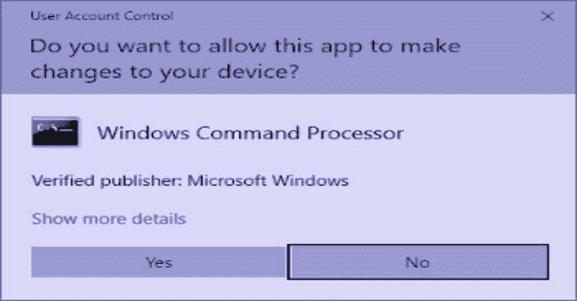

# UACME:击败 Windows 用户帐户控制

> 原文：<https://kalilinuxtutorials.com/uacme-defeating-windows/>

**UACMe** 是一个通过滥用内置的 windows autoElevate 后门来击败 windows 用户账户控制的。

**系统要求**

*   x86-32/x64 Windows 7/8/8.1/10(客户端，但有些方法也适用于服务器版本)。
*   需要将 UAC 设置为默认设置的管理员帐户。

**用途**

从命令行运行可执行文件:akagi32 [Key] [Param]或 akagi64 [Key] [Param]。有关更多信息，请参见下面的“运行示例”。

第一个参数是要使用的方法数量，第二个是要运行的可选命令(可执行文件名称，包括完整路径)。第二个参数可以为空-在这种情况下，程序将从 system32 文件夹执行提升的 cmd.exe。

**也读作——[异议:运行时移动探索](https://kalilinuxtutorials.com/objection-mobile-exploration/)**

密钥(使用 dbgview 或类似工具查看调试输出以了解更多信息):

1.  作者:利奥·戴维森
    *   类型:Dll 劫持
    *   方法:IFileOperation
    *   目标:\system32\sysprep\sysprep.exe
    *   构成部分:cryptbase.dll
    *   实现:ucmStandardAutoElevation
    *   作品来自:Windows 7 (7600)
    *   已在 Windows 8.1 (9600)中修复
        *   如何:sysprep.exe 强化了来自清单元素的加载
2.  作者:利奥·戴维森衍生
    *   类型:Dll 劫持
    *   方法:IFileOperation
    *   目标:\system32\sysprep\sysprep.exe
    *   构成部分:ShCore.dll
    *   实现:ucmStandardAutoElevation
    *   工作环境:Windows 8.1 (9600)
    *   已修复:Windows 10 TP (> 9600)
        *   如何:ShCore.dll 搬到 KnownDlls 的副作用
3.  作者:利奥·戴维森
    *   类型:Dll 劫持
    *   方法:IFileOperation
    *   目标:\system32\oobe\setupsqm.exe
    *   构成部分:WdsCore.dll
    *   实现:ucmStandardAutoElevation
    *   作品来自:Windows 7 (7600)
    *   已修复:Windows 10 TH2 (10558)
        *   如何:OOBE 重新设计的副作用
4.  作者:乔恩·埃里克森
    *   Type: AppCompat
    *   方法:RedirectEXE Shim
    *   目标:\system32\cliconfg.exe
    *   组件:-
    *   实现:ucmShimRedirectEXE
    *   作品来自:Windows 7 (7600)
    *   已修复:Windows 10 TP (> 9600)
        *   如何:Sdbinst.exe 自动提升已删除，适用于 rest Windows 版本的 KB3045645/KB3048097
5.  作者:WinNT/Simda
    *   类型:提升的 COM 接口
    *   方法:ISecurityEditor
    *   目标:HKLM 注册表项
    *   组件:-
    *   执行:ucmSimdaTurnOffUac
    *   作品来自:Windows 7 (7600)
    *   已修复:Windows 10 TH1 (10147)
        *   如何:ISecurityEditor 接口方法已更改
6.  作者:Win32/Carberp
    *   类型:Dll 劫持
    *   方法:WUSA
    *   目标:\ehome\mcx2prov.exe，\system32\migwiz\migwiz.exe
    *   构成部分:WdsCore.dll、CryptBase.dll、CryptSP.dll
    *   实现:ucmWusaMethod
    *   作品来自:Windows 7 (7600)
    *   已修复:Windows 10 TH1 (10147)
        *   如何:删除 WUSA/提取选项
7.  作者:Win32/Carberp 衍生物
    *   类型:Dll 劫持
    *   方法:WUSA
    *   目标:\system32\cliconfg.exe
    *   构成部分:ntwdblib.dll
    *   实现:ucmWusaMethod
    *   作品来自:Windows 7 (7600)
    *   已修复:Windows 10 TH1 (10147)
        *   如何:删除 WUSA/提取选项
8.  作者:Leo Davidson 由 Win32/Tilon 衍生
    *   类型:Dll 劫持
    *   方法:IFileOperation
    *   目标:\system32\sysprep\sysprep.exe
    *   构成部分:Actionqueue.dll
    *   实现:ucmStandardAutoElevation
    *   作品来自:Windows 7 (7600)
    *   已在 Windows 8.1 (9600)中修复
        *   如何:sysprep.exe 强化载货清单
9.  作者:利奥·戴维森，WinNT/Simda，Win32/Carberp 衍生物
    *   类型:Dll 劫持
    *   方法:IFileOperation，ISecurityEditor，WUSA
    *   目标:IFEO 注册表项，\system32\cliconfg.exe
    *   组件:攻击者定义的应用程序验证程序 Dll
    *   实现:ucmAvrfMethod
    *   作品来自:Windows 7 (7600)
    *   已修复:Windows 10 TH1 (10147)
        *   如何:移除 WUSA/提取选项，更改 ISecurityEditor 接口方法
10.  作者:WinNT/Pitou，Win32/Carberp 衍生物
    *   类型:Dll 劫持
    *   方法:WUSA ifelioperation
    *   目标:\ system32 \ {新}或{现有} \ {自动提升}。exe，例如 winsat.exe
    *   组件:攻击者定义的 dll，例如 PowProf.dll、DevObj.dll
    *   实现:ucmWinSATMethod
    *   作品来自:Windows 7 (7600)
    *   已修复:Windows 10 TH2 (10548)
        *   如何:AppInfo 提升应用程序路径控制强化
11.  作者:乔恩·埃里克森
    *   Type: AppCompat
    *   方法:填补内存补丁
    *   目标:\system32\iscsicli.exe
    *   组件:攻击者准备了外壳代码
    *   实现:ucmShimPatch
    *   作品来自:Windows 7 (7600)
    *   已在 Windows 8.1 (9600)中修复
        *   如何:Sdbinst.exe 自动提升已删除，适用于 rest Windows 版本的 KB3045645/KB3048097
12.  作者:利奥·戴维森衍生
    *   类型:Dll 劫持
    *   方法:IFileOperation
    *   目标:\system32\sysprep\sysprep.exe
    *   构成部分:dbgcore.dll
    *   实现:ucmStandardAutoElevation
    *   作品来自:Windows 10 TH1 (10240)
    *   已修复:Windows 10 TH2 (10565)
        *   如何:更新 sysprep.exe 清单
13.  作者:利奥·戴维森衍生
    *   类型:Dll 劫持
    *   方法:IFileOperation
    *   目标:\system32\mmc.exe EventVwr.msc
    *   构成部分:elsext.dll
    *   实现:ucmMMCMethod
    *   作品来自:Windows 7 (7600)
    *   已修复:Windows 10 RS1 (14316)
        *   如何:移除缺失的依赖项
14.  作者:利奥·戴维森，win nt/sire ff 衍生
    *   类型:Dll 劫持
    *   方法:IFileOperation
    *   目标:\system\credwiz.exe，\system32\wbem\oobe.exe
    *   构成部分:netutils.dll
    *   实现:ucmSirefefMethod
    *   作品来自:Windows 7 (7600)
    *   已修复:Windows 10 TH2 (10548)
        *   如何:AppInfo 提升应用程序路径控制强化
15.  作者:Leo Davidson，Win32/Addrop，Metasploit 衍生物
    *   类型:Dll 劫持
    *   方法:IFileOperation
    *   目标:\system32\cliconfg.exe
    *   构成部分:ntwdblib.dll
    *   实现:ucmGenericAutoelevation
    *   作品来自:Windows 7 (7600)
    *   已修复:Windows 10 RS1 (14316)
        *   如何:删除 Cliconfg.exe 自动提升
16.  作者:利奥·戴维森衍生
    *   类型:Dll 劫持
    *   方法:IFileOperation
    *   目标:\system32\GWX\GWXUXWorker.exe，\system32\inetsrv\inetmgr.exe
    *   构成部分:SLC.dll
    *   实现:ucmGWX
    *   作品来自:Windows 7 (7600)
    *   已修复:Windows 10 RS1 (14316)
        *   如何:AppInfo 提升应用程序路径控制和 inetmgr 可执行文件强化
17.  作者:利奥·戴维森衍生
    *   类型:Dll 劫持(导入转发)
    *   方法:IFileOperation
    *   目标:\system32\sysprep\sysprep.exe
    *   构成部分:unbcl.dll
    *   实现:ucmStandardAutoElevation2
    *   工作环境:Windows 8.1 (9600)
    *   已修复:Windows 10 RS1 (14371)
        *   如何:更新 sysprep.exe 清单
18.  作者:利奥·戴维森衍生
    *   类型:Dll 劫持(清单)
    *   方法:IFileOperation
    *   目标:\system32\taskhost.exe，\system32\tzsync.exe(任何不带清单的 ms exe)
    *   组件:攻击者已定义
    *   实施:ucmAutoElevateManifest
    *   作品来自:Windows 7 (7600)
    *   已修复:Windows 10 RS1 (14371)
        *   如何:查看清单分析逻辑
19.  作者:利奥·戴维森衍生
    *   类型:Dll 劫持
    *   方法:IFileOperation
    *   目标:\system32\inetsrv\inetmgr.exe
    *   构成部分:MsCoree.dll
    *   实现:ucmInetMgrMethod
    *   作品来自:Windows 7 (7600)
    *   已修复:Windows 10 RS1 (14376)
        *   如何:inetmgr.exe 可执行文件清单强化、缓解策略->ProcessImageLoadPolicy->首选系统 32 图像
20.  作者:利奥·戴维森衍生
    *   类型:Dll 劫持
    *   方法:IFileOperation
    *   目标:\system32\mmc.exe，Rsop.msc
    *   构成部分:WbemComn.dll
    *   实现:ucmMMCMethod
    *   作品来自:Windows 7 (7600)
    *   已修复:Windows 10 RS3 (16232)
        *   如何:Target 要求 wbemcomn.dll 由 MS 签名
21.  作者:利奥·戴维森衍生
    *   类型:Dll 劫持
    *   方法:IFileOperation，SxS DotLocal
    *   目标:\system32\sysprep\sysprep.exe
    *   构成部分:comctl32.dll
    *   实现:ucmSXSMethod
    *   作品来自:Windows 7 (7600)
    *   已修复:Windows 10 RS3 (16232)
        *   如何:缓解策略->ProcessImageLoadPolicy->首选系统 32 图像
22.  作者:利奥·戴维森衍生
    *   类型:Dll 劫持
    *   方法:IFileOperation，SxS DotLocal
    *   目标:\ system32 \ consent.exe
    *   构成部分:comctl32.dll
    *   实现:ucmSXSMethod
    *   作品来自:Windows 7 (7600)
    *   固定在:未固定
        *   如何:—
23.  作者:利奥·戴维森衍生
    *   类型:Dll 劫持
    *   方法:IFileOperation
    *   目标:\system32\pkgmgr.exe
    *   构成部分:DismCore.dll
    *   实现:ucmDismMethod
    *   作品来自:Windows 7 (7600)
    *   固定在:未固定
        *   如何:—
24.  作者:BreakingMalware
    *   类型:Shell API
    *   方法:环境变量扩展
    *   目标:\system32\CompMgmtLauncher.exe
    *   组件:攻击者已定义
    *   实现:ucmCometMethod
    *   作品来自:Windows 7 (7600)
    *   已修复:Windows 10 RS2 (15031)
        *   如何:删除 CompMgmtLauncher.exe 自动提升
25.  作者:谜 0x3
    *   类型:Shell API
    *   方法:注册表项操作
    *   目标:\system32\EventVwr.exe，\system32\CompMgmtLauncher.exe
    *   组件:攻击者已定义
    *   实现:ucmHijackShellCommandMethod
    *   作品来自:Windows 7 (7600)
    *   已修复:Windows 10 RS2 (15031)
        *   如何:EventVwr.exe 重新设计，CompMgmtLauncher.exe 自动提升删除
26.  作者:谜 0x3
    *   类型:竞争条件
    *   方法:文件覆盖
    *   目标:%temp%\GUID\dismhost.exe
    *   构成部分:LogProvider.dll
    *   实现:ucmDiskCleanupRaceCondition
    *   作品来自:Windows 10 TH1 (10240)
    *   始终通知兼容
    *   已修复:Windows 10 RS2 (15031)
        *   如何:更改文件安全权限
27.  作者:ExpLife
    *   类型:提升的 COM 接口
    *   方法:IARPUninstallStringLauncher
    *   目标:定义的攻击者
    *   组件:攻击者已定义
    *   实现:ucmUninstallLauncherMethod
    *   作品来自:Windows 7 (7600)
    *   已修复:Windows 10 RS3 (16199)
        *   如何:从 COMAutoApprovalList 中移除 UninstallStringLauncher 接口
28.  作者:Exploit/沙虫
    *   类型:白名单组件
    *   方法:InfDefaultInstall
    *   目标:定义的攻击者
    *   组件:攻击者已定义
    *   实现:ucmSandwormMethod
    *   作品来自:Windows 7 (7600)
    *   已在 Windows 8.1 (9600)中修复
        *   如何:将 InfDefaultInstall.exe 从 g _ lpautoapprovexelist(MS14-060)中删除
29.  作者:谜 0x3
    *   类型:Shell API
    *   方法:注册表项操作
    *   目标:\system32\sdclt.exe
    *   组件:攻击者已定义
    *   实现:ucmAppPathMethod
    *   作品来自:Windows 10 TH1 (10240)
    *   已修复:Windows 10 RS3 (16215)
        *   如何:Shell API 更新
30.  作者:利奥·戴维森衍生物，lhc645
    *   类型:Dll 劫持
    *   方法:WOW64 记录器
    *   目标:\ syswow64 \ {任何提升的 exe，例如 wusa.exe}
    *   构成部分:wow64log.dll
    *   实现:ucmWow64LoggerMethod
    *   作品来自:Windows 7 (7600)
    *   固定在:未固定
        *   如何:—
31.  作者:谜 0x3
    *   类型:Shell API
    *   方法:注册表项操作
    *   目标:\system32\sdclt.exe
    *   组件:攻击者已定义
    *   实现:ucmSdcltIsolatedCommandMethod
    *   作品来自:Windows 10 TH1 (10240)
    *   已修复:Windows 10 RS4 (17025)
        *   如何:Shell API / Windows 组件更新
32.  作者:Xi-陶
    *   类型:Dll 劫持
    *   方法:使用 uiAccess 应用程序进行 UIPI 旁路
    *   目标:\ Program Files \ Windows Media Player \ osk . exe \ system32 \ eventvwr . exe \ system32 \ MMC . exe
    *   构成部分:osksupport.dll duser.dll
    *   实现:ucmUiAccessMethod
    *   作品来自:Windows 7 (7600)
    *   固定在:未固定
        *   如何:—
33.  作者:winscripting.blog
    *   类型:Shell API
    *   方法:注册表项操作
    *   目标:\system32\fodhelper.exe，\system32\computerdefaults.exe
    *   组件:攻击者已定义
    *   实现:ucmmssettingsdelegateexecute method
    *   作品来自:Windows 10 TH1 (10240)
    *   固定在:未固定
        *   如何:—
34.  作者:詹姆斯·福肖
    *   类型:Shell API
    *   方法:环境变量扩展
    *   目标:\ system32 \ svchost . exe via \ system32 \ schtasks . exe
    *   组件:攻击者已定义
    *   实现:ucmDiskCleanupEnvironmentVariable
    *   工作环境:Windows 8.1 (9600)
    *   始终通知兼容
    *   固定在:未固定
        *   如何:—
35.  作者:中情局&詹姆斯·福肖
    *   类型:模拟
    *   方法:令牌操作
    *   目标:自动提升的应用程序
    *   组件:攻击者已定义
    *   实现:ucmTokenModification
    *   作品来自:Windows 7 (7600)
    *   AlwaysNotify 兼容，参见注释
    *   已修复:Windows 10 RS5 (17686)
        *   如何:添加 ntoskrnl . exe-> SeTokenCanImpersonate 附加访问令牌检查
36.  作者:托马斯·范霍特又名沙盒逃脱者
    *   类型:竞争条件
    *   方法:NTFS 重分析点和 Dll 劫持
    *   目标:wusa.exe
    *   构成部分:dcomcnfg.exe、mmc.exe、ole32.dll、MsCoree.dll
    *   实现:ucmJunctionMethod
    *   作品来自:Windows 7 (7600)
    *   固定在:未固定
        *   如何:—
37.  作者:埃内斯托·费尔南德斯，托马斯·范霍特
    *   类型:Dll 劫持
    *   方法:SxS DotLocal，NTFS 重分析点
    *   目标:\system32\dccw.exe
    *   构成部分:GdiPlus.dll
    *   实现:ucmSXSDccwMethod
    *   作品来自:Windows 7 (7600)
    *   固定在:未固定
        *   如何:—
38.  作者:克莱门特·鲁奥
    *   类型:白名单组件
    *   方法:APPINFO 命令行欺骗
    *   目标:\system32\mmc.exe
    *   组件:攻击者已定义
    *   实现:ucmHakrilMethod
    *   作品来自:Windows 7 (7600)
    *   固定在:未固定
        *   如何:—
39.  作者:斯特凡·坎萨克
    *   类型:Dll 劫持
    *   方法:。NET 代码分析器
    *   目标:\system32\mmc.exe
    *   组件:攻击者已定义
    *   实现:ucmCorProfilerMethod
    *   作品来自:Windows 7 (7600)
    *   固定在:未固定
        *   如何:—
40.  作者:鲁本·布宁
    *   类型:COM 处理程序劫持
    *   方法:注册表项操作
    *   目标:\system32\mmc.exe，\System32\recdisc.exe
    *   组件:攻击者已定义
    *   实现:ucmCOMHandlersMethod
    *   作品来自:Windows 7 (7600)
    *   已修复:Windows 10 19H1 (18362)
        *   如何:Windows 变化的副作用
41.  Author: Oddvar Moe
    *   类型:提升的 COM 接口
    *   方法:ICMLuaUtil
    *   目标:攻击者定义
    *   组件:攻击者已定义
    *   实现:ucmCMLuaUtilShellExecMethod
    *   作品来自:Windows 7 (7600)
    *   固定在:未固定
        *   如何:—
42.  作者:BreakingMalware 和 Enigma0x3
    *   类型:提升的 COM 接口
    *   方法:IFwCplLua
    *   目标:定义的攻击者
    *   组件:攻击者已定义
    *   实现:ucmFwCplLuaMethod
    *   作品来自:Windows 7 (7600)
    *   已修复:Windows 10 RS4 (17134)
        *   如何:Shell API 更新
43.  作者:奥德瓦尔·莫伊导数
    *   类型:提升的 COM 接口
    *   方法:IColorDataProxy，ICMLuaUtil
    *   目标:定义的攻击者
    *   组件:攻击者已定义
    *   实现:ucmDccwCOMMethod
    *   作品来自:Windows 7 (7600)
    *   固定在:未固定
        *   如何:—
44.  作者:字节码 77
    *   类型:Shell API
    *   方法:环境变量扩展
    *   目标:多个自动提升的流程
    *   组件:每个目标各不相同
    *   实现:ucmVolatileEnvMethod
    *   作品来自:Windows 7 (7600)
    *   已修复:Windows 10 RS3 (16299)
        *   如何:在进程创建期间忽略当前用户系统目录变量
45.  作者:字节码 77
    *   类型:Shell API
    *   方法:注册表项操作
    *   目标:\system32\slui.exe
    *   组件:攻击者已定义
    *   实现:ucmSluiHijackMethod
    *   工作环境:Windows 8.1 (9600)
    *   固定在:未固定
        *   如何:—
46.  作者:佚名
    *   类型:竞争条件
    *   方法:注册表项操作
    *   目标:\ system32 \ bitlockerwizardelev . exe
    *   组件:攻击者已定义
    *   实现:ucmBitlockerRCMethod
    *   作品来自:Windows 7 (7600)
    *   已修复:Windows 10 RS4 (>16299)
        *   如何:Shell API 更新
47.  作者:clavoillotte & 3gstudent
    *   类型:COM 处理程序劫持
    *   方法:注册表项操作
    *   目标:\system32\mmc.exe
    *   组件:攻击者已定义
    *   实现:ucmCOMHandlersMethod2
    *   作品来自:Windows 7 (7600)
    *   已修复:Windows 10 19H1 (18362)
        *   如何:Windows 变化的副作用
48.  作者:德罗克
    *   类型:提升的 COM 接口
    *   方法:ISPPLUAObject
    *   目标:定义的攻击者
    *   组件:攻击者已定义
    *   实现:ucmSPPLUAObjectMethod
    *   作品来自:Windows 7 (7600)
    *   已修复:Windows 10 RS5 (17763)
        *   如何:ISPPLUAObject 接口方法已更改
49.  作者:RinN
    *   类型:提升的 COM 接口
    *   方法:ICreateNewLink
    *   目标:\system32\TpmInit.exe
    *   构成部分:WbemComn.dll
    *   实现:ucmCreateNewLinkMethod
    *   作品来自:Windows 7 (7600)
    *   已修复:Windows 10 RS1 (14393)
        *   如何:副作用 consent.exe 汽车批准列表介绍
50.  作者:佚名
    *   类型:提升的 COM 接口
    *   方法:IDateTimeStateWrite，ISPPLUAObject
    *   目标:w32time 服务
    *   构成部分:w32time.dll
    *   实现:ucmDateTimeStateWriterMethod
    *   作品来自:Windows 7 (7600)
    *   已修复:Windows 10 RS5 (17763)
        *   如何:ISPPLUAObject 接口更改的副作用
51.  作者:字节码 77 衍生物
    *   类型:提升的 COM 接口
    *   方法:IAccessibilityCplAdmin
    *   目标:\system32\rstrui.exe
    *   组件:攻击者已定义
    *   实现:ucmAcCplAdminMethod
    *   作品来自:Windows 7 (7600)
    *   已修复:Windows 10 RS4 (17134)
        *   如何:Shell API 更新
52.  作者:大卫·威尔斯
    *   类型:白名单组件
    *   方法:AipNormalizePath 解析滥用
    *   目标:定义的攻击者
    *   组件:攻击者已定义
    *   实现:ucmDirectoryMockMethod
    *   作品来自:Windows 7 (7600)
    *   固定在:未固定
        *   如何:—
53.  作者:埃梅里克·纳西
    *   类型:Shell API
    *   方法:注册表项操作
    *   目标:\system32\sdclt.exe
    *   组件:攻击者已定义
    *   实现:ucmShellDelegateExecuteCommandMethod
    *   作品来自:Windows 10 (14393)
    *   固定在:未固定
        *   如何:—
54.  作者:egre55
    *   类型:Dll 劫持
    *   方法:Dll 路径搜索滥用
    *   目标:\ sys wow 64 \ system properties advanced . exe 和其他系统属性*。可执行程序的扩展名
    *   组件:\ AppData \ Local \ Microsoft \ windows apps \ srrstr . dll
    *   实现:ucmEgre55Method 方法
    *   作品来自:Windows 10 (14393)
    *   固定在:未固定
        *   如何:—
55.  作者:詹姆斯·福肖
    *   类型:GUI Hack
    *   方法:使用令牌修改的 UIPI 旁路
    *   目标:\system32\osk.exe，\system32\msconfig.exe
    *   组件:攻击者已定义
    *   实现:ucmTokenModUIAccessMethod
    *   作品来自:Windows 7 (7600)
    *   固定在:未固定
        *   如何:—
56.  作者:哈希姆·贾瓦德
    *   类型:Shell API
    *   方法:注册表项操作
    *   目标:\system32\WSReset.exe
    *   组件:攻击者已定义
    *   实现:ucmShellDelegateExecuteCommandMethod
    *   作品来自:Windows 10 (17134)
    *   固定在:未固定
        *   如何:—
57.  作者:Leo Davidson 由 Win32/Gapz 衍生
    *   类型:Dll 劫持
    *   方法:IFileOperation
    *   目标:\system32\sysprep\sysprep.exe
    *   构成部分:unattend.dll
    *   实现:ucmStandardAutoElevation
    *   作品来自:Windows 7 (7600)
    *   已在 Windows 8.1 (9600)中修复
        *   如何:sysprep.exe 强化了来自清单元素的加载

**注:**

*   方法(6)从 Windows 8 开始在 wow64 环境中不可用；
*   方法(11) (54)仅在 x86-32 版本中实现；
*   method _13) _19) _30) _38) _50)仅 x64 版本柠檬；
*   方法(14)需要进程注入，wow64 不支持，使用此工具的 x64 版本；
*   方法(26)仍然有效，但是它的主要优点是在 AlwaysNotify 级别上绕过了 UAC。从 15031 年起它就消失了；
*   方法(30)需要 x64，因为它滥用了 WOW64 子系统功能；
*   方法(35)总是通知兼容的，因为总是会有运行的自动提升的应用，或者用户无论如何都必须启动它们；
*   方法(38)在执行位于 github.com/hfiref0x/Beacon/blob/master/uac/exec.html;远程脚本时需要互联网连接
*   方法(55)并不真正可靠(像任何 GUI 黑客一样),只是为了好玩才加入的。

**运行实例:**

*   akagi32.exe 1 号
*   akagi64.exe 3
*   akagi 32 1c:\ windows \ system32 \ calc . exe
*   akagi 64 3c:\ windows \ system32 \ charmap . exe

**警告**

*   该工具仅显示恶意软件使用的流行的 UAC 绕过方法，并以不同的方式改进原始概念重新实现其中的一些方法。存在不同的、尚不为一般公众所知的方法，请注意这一点；
*   使用(5)方法将永久关闭 UAC(重新启动后)，请确保在测试环境中这样做，或者不要忘记在工具使用后重新启用 UAC；
*   如果您在真实机器上进行测试，使用(5)、(9)方法将永久损害目标密钥的安全性(UAC 设置密钥用于(5)，IFEO 用于(9))——完成此工具使用后，手动恢复密钥安全性；
*   此工具不是为反病毒测试设计的，也没有经过测试在攻击性反病毒环境中工作，如果您仍然计划将它与已安装的反病毒软件一起使用，那么您使用它需要自担风险；
*   一些 AV 可能会将此工具标记为 HackTool，MSE/WinDefender 不断将其标记为恶意软件，没有；
*   如果你在真实的计算机上运行这个程序，记得在使用后删除所有程序的剩余部分，更多关于文件的信息，请参见源代码；
*   大多数方法都是为 x64 创建的，不支持 x86-32。我看不出支持 32 位版本的 Windows 或 wow64 有什么意义，但是稍加调整，大多数都可以在 wow64 下运行。

**Windows 10 支持和测试政策**

*   不支持停产的 Windows 10 版本，因此未进行测试(在撰写本文时，停产的 Windows 10 版本为:TH1 (10240)、TH2(10586))；
*   不支持内部版本，因为内部版本中的方法可能是固定的。

**保护**

*   没有管理权限的帐户。

**恶意软件使用情况**

*   目前已知的 UACMe 被 Adware/Multiplug (9)、Win32/Dyre (3)、Win32/Empercrypt (10 & 13)、IcedID downloader (35 & 41)使用。我们对恶意使用该工具不承担任何责任。它是免费的、开源的，按原样提供给每个人。

**其他用途**

*   目前被“THOR APT”扫描仪(来自德国的手工图案匹配 fraudware)用作“签名”。我们对该工具在欺诈软件中的使用不承担任何责任；
*   名为“uacguard”的诈骗软件项目从他们的平台上引用了 UACMe。我们对该工具在诈骗软件中的使用不承担任何责任。资源库[https://github.com/hfiref0x/UACME](https://github.com/hfiref0x/UACME)及其内容是 UACMe 代码的唯一真实来源。我们与这个项目的外部链接无关，在任何地方提到以及修改(叉)；
*   2016 年 7 月，所谓的“安全公司”Cymmetria 发布了一份关于名为“Patchwork”的脚本小子恶意软件捆绑包的报告，并将其错误标记为 APT。他们声称正在使用“UACME 方法”，实际上这只是从 UACMe v1.9 轻微和不专业地修改注射器 dll，并在恶意软件自我实现的方式中使用 car ERP/Pitou 混合方法。对于第三方“安全公司”在可疑广告活动中使用 UACMe，我们不承担任何责任。

**建造**

*   UACMe 自带完整源代码，用 C 写的部分用 C#写；
*   为了从源代码构建，您需要 Microsoft Visual Studio 2013/2015 U2 和更高版本。

**指令**

*   首先为要生成的解决方案中的项目选择平台工具集(项目->属性->常规):
    *   用于 Visual Studio 2013 的 v120
    *   用于 Visual Studio 2015 的 v140
    *   用于 Visual Studio 2017 的 v141。
*   对于 v140 及以上版本，设置目标平台版本(项目->属性->常规):
    *   如果 v140 那么选择 8.1(注意必须安装 Windows 8.1 SDK
    *   如果是 v141，则选择 10.0.17134.0(注意，必须安装 Windows 10.0.17134 SDK)。
*   请注意，藤波模块是用。NET Framework 3.0(这是 it 工作的要求)，所以。如果要生成此模块，必须安装. NET Framework 3.0。
*   可以用 SDK 8.1/10.17134/10.17763 构建。

[**Download**](https://github.com/hfiref0x/UACME)