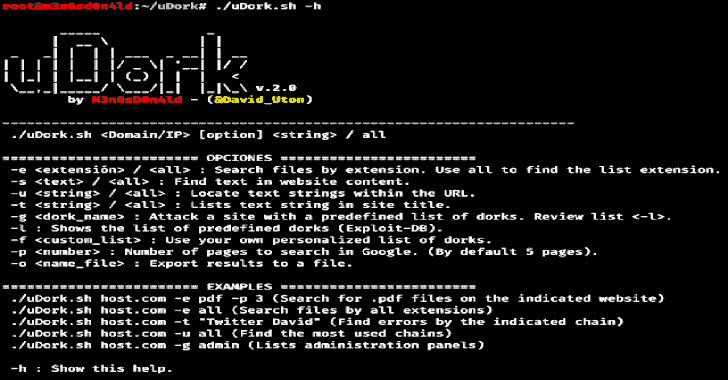
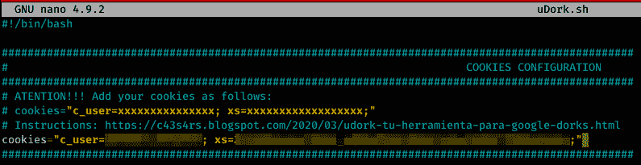
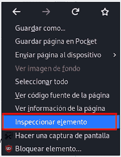
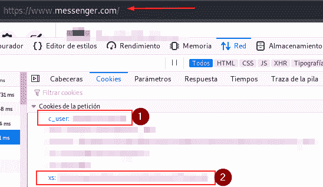
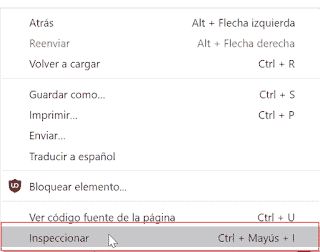
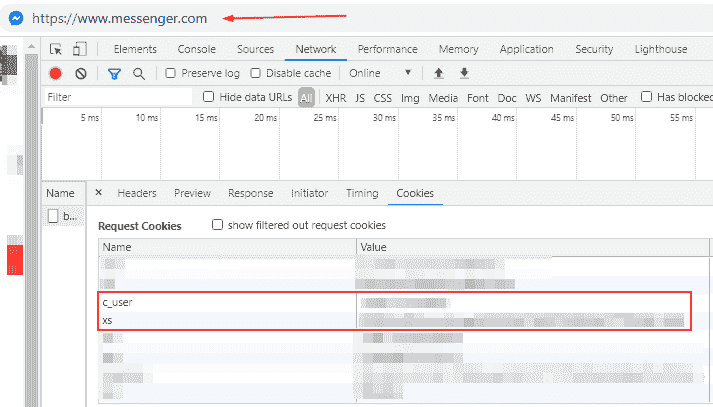
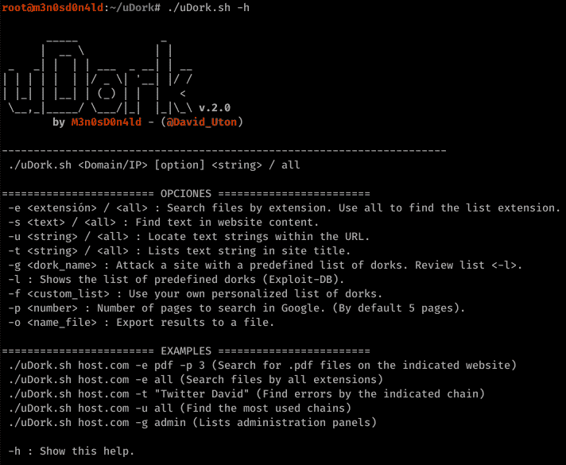
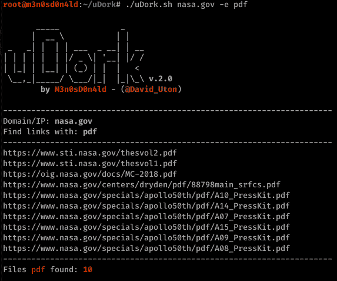
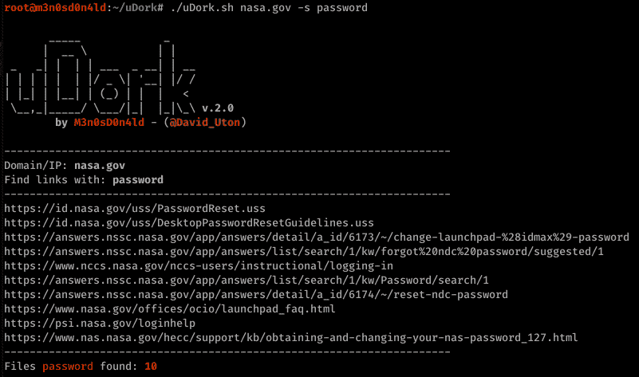

# uDork:使用高级谷歌搜索技术的工具

> 原文：<https://kalilinuxtutorials.com/udork/>

**uDork** 是一个用 Bash Scripting 编写的脚本，它使用先进的 Google 搜索技术来获取文件或目录中的[敏感信息](https://www.kitploit.com/search/label/Sensitive%20Information)，查找物联网设备，检测 web 应用程序的版本，等等。

它不攻击任何服务器，它只使用预定义的呆子和/或来自 exploit-db.com 的官方名单(谷歌黑客数据库:[https://www.exploit-db.com/google-hacking-database](https://www.exploit-db.com/google-hacking-database))。

**下载&安装**

$ git 克隆 https://github.com/m3n0sd0n4ld/uDork
$ CD uDork
$ chmod+x uDork . sh

**$。/uDork.sh -h**

**获取 Cookie 的步骤&配置 Cookie**

*   登录 facebook.com
*   现在，我们将访问[www.messenger.com](http://www.messenger.com)(它是脸书的消息应用程序)并点击“继续为…”按钮。

*   一旦我们进去了，我们所要做的就是得到两个使 uDork 工作所需的 cookies。

*   **用火狐:**
    *   右键单击“检查”。

于是:cookies = " c _ user = XXXXXXxs = XXXXXX"

*   使用谷歌浏览器
    *   右键单击“检查”。

于是:cookies = " c _ user = XXXXXXxs = XXXXXX"

**Docker 版本**

*   **确认**

推特:[@ interh4ck](https://twitter.com/interh4ck)GitHub:(【https://github.com/interhack86】T2)

$ git 克隆 https://github . com/m3 n 0 SD 0n 4 LD/udrk
$ CD udrk
$ docker build-t udrk。
$ dock run–RM-it-e c _ user = XXXXXX-e xs = XXXXXX udark-h

**使用**

*   菜单

*   **搜索 pdf 文件的示例**

*   **搜索默认扩展名列表的示例。**

*   **使用“密码”搜索路线的示例**

*   **呆瓜清单**

*   **使用呆瓜大规模的例子**

[**Download**](https://github.com/m3n0sd0n4ld/uDork)