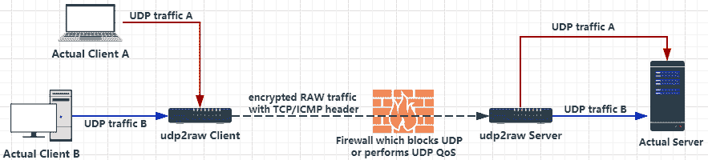
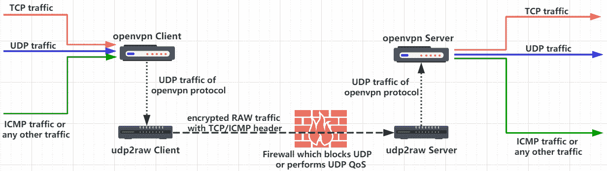
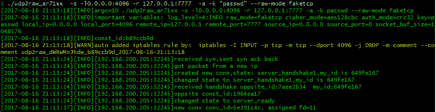
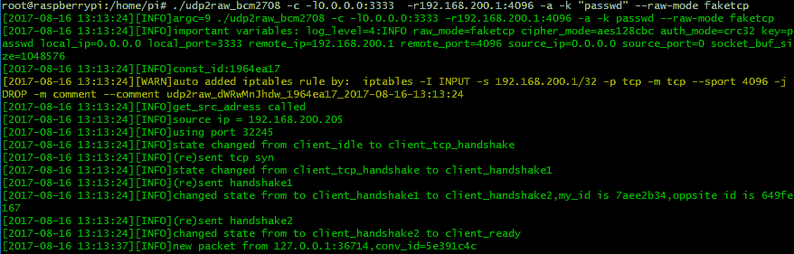
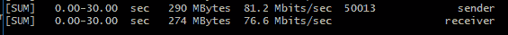
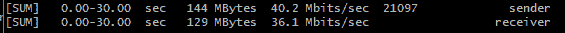

# UDP2Raw 隧道–将 UDP 流量转换为加密 UDP/FakeTCP/ICMP 的隧道

> 原文：<https://kalilinuxtutorials.com/udp2raw-tunnel/>

Udp2raw 隧道是通过使用原始套接字将 Udp 流量转换为加密的 FakeTCP/UDP/ICMP 流量的隧道，帮助您绕过 UDP 防火墙(或不稳定的 UDP 环境)。它可以防御重放攻击，并支持多路复用。它还充当连接稳定器。



单独使用时，udp2raw 仅通过隧道传输 udp 流量。不过，如果你使用 udp2raw +任何基于 udp 的 VPN 在一起，你可以隧道任何流量(包括 TCP/UDP/ICMP)，目前 OpenVPN/L2TP/ShadowVPN 和 tinyfecVPN 被确认支持。



**也看[SharpSploit——用 C#](https://kalilinuxtutorials.com/sharpsploit/) 写的. NET 后期开发库 **

## **Udp2raw 隧道特性**

### **发送/接收带有 ICMP/FakeTCP/UDP 报头的 UDP 数据包**

ICMP/FakeTCP 头帮助您绕过 UDP 阻止、UDP QOS 或某些 ISP 上不正确的 UDP NAT 行为。在 ICMP 报头模式下，udp2raw 隧道的工作方式类似于 ICMP 隧道。

也支持 UDP 头。在 UDP 头模式下，它的行为就像普通的 UDP 隧道一样，您可以利用其他功能(如加密、防重放或连接固定化)。

### **具有实时/无序交付的模拟 TCP**

在 FakeTCP 报头模式下，udp2raw 隧道在建立连接时模拟 3 次握手，在数据传输时模拟 seq 和 ack_seq。它还模拟了以下 TCP 选项:`MSS`、`sackOk`、`TS`、`TS_ack`、`wscale`。防火墙将 FakeTCP 视为 TCP 连接，但其本质上是 UDP:它支持实时/无序交付(就像普通 UDP 一样)，没有一致性控制或重新传输。所以在使用 OpenVPN 时不会有 TCP over TCP 的问题。

### **加密、防重放**

*   使用 AES-128-CBC 加密您的流量。
*   通过 HMAC-SHA1(或较弱的 MD5/CRC32)保护数据完整性。
*   使用防重放窗口防御重放攻击，类似于 IPSec 和 OpenVPN。

### **故障检测&稳定(连接恢复)**

心跳检测到连接失败。如果超时，客户端将自动更改端口号并重新连接。如果重新连接成功，将恢复以前的连接，并且所有现有的 UDP 会话将保持有效。

例如，如果您使用 udp2raw + OpenVPN，OpenVPN 在任何重新连接后都不会失去连接，**即使重新插入网线或更改 WiFi 接入点**。

### **其他特征**

*   **多路复用**一个客户端可以处理多个 UDP 连接，所有这些连接共享同一个原始连接。
*   **多个客户端**一台服务器可以有多个客户端。
*   **NAT 支持**这三种模式都可以在 NAT 环境下工作。
*   **OpenVZ 支持**在 BandwagonHost VPS 上测试。
*   **易建**无依赖。要交叉编译 udp2raw tunnel，您只需下载一个工具链，修改 makefile 以指向工具链，运行`**make cross**`即可。(注意:针对桌面、RaspberryPi、Android 和一些 Openwrt 路由器的预编译二进制文件已经包含在版本中)

### **关键词**

`**Bypass UDP QoS**`**`Bypass UDP Blocking``Bypass OpenVPN TCP over TCP problem``OpenVPN over ICMP``UDP to ICMP tunnel``UDP to TCP tunnel``UDP over TCP`**

## **入门**

### **运行中**

假设您的 UDP 被阻止或被 QOS，或只是支持不佳。假设您的服务器 ip 是 44.55.66.77，您有一个监听 udp 端口 7777 的服务。

```
# Run at server side:
./udp2raw_amd64 -s -l0.0.0.0:4096 -r 127.0.0.1:7777    -k "passwd" --raw-mode faketcp -a

# Run at client side
./udp2raw_amd64 -c -l0.0.0.0:3333  -r44.55.66.77:4096  -k "passwd" --raw-mode faketcp -a
```

(以上命令需要以 root 身份运行。为了获得更好的安全性，通过一些额外的步骤，您可以作为非根用户运行 udp2raw 隧道)

###### **服务器输出:**



###### **客户端输出:**



现在，客户端和服务器之间通过 TCP 端口 4096 建立了一个加密的原始隧道。连接到客户端的 UDP 端口 3333 相当于连接到服务器端的端口 7777。不会暴露任何 UDP 流量。

## **高级话题**

### **用法**

```
udp2raw tunnel
git version:6e1df4b39f    build date:Oct 24 2017 09:21:15
repository: https://github.com/wangyu-/udp2raw-tunnel

usage:
    run as client : ./this_program -c -l local_listen_ip:local_port -r server_address:server_port  [options]
    run as server : ./this_program -s -l server_listen_ip:server_port -r remote_address:remote_port  [options]

common options,these options must be same on both side:
    --raw-mode            <string>        avaliable values:faketcp(default),udp,icmp
    -k,--key              <string>        password to gen symetric key,default:"secret key"
    --cipher-mode         <string>        avaliable values:aes128cbc(default),xor,none
    --auth-mode           <string>        avaliable values:hmac_sha1,md5(default),crc32,simple,none
    -a,--auto-rule                        auto add (and delete) iptables rule
    -g,--gen-rule                         generate iptables rule then exit,so that you can copy and
                                          add it manually.overrides -a
    --disable-anti-replay                 disable anti-replay,not suggested
client options:
    --source-ip           <ip>            force source-ip for raw socket
    --source-port         <port>          force source-port for raw socket,tcp/udp only
                                          this option disables port changing while re-connecting
other options:
    --conf-file           <string>        read options from a configuration file instead of command line.
                                          check example.conf in repo for format
    --fifo                <string>        use a fifo(named pipe) for sending commands to the running program,
                                          check readme.md in repository for supported commands.
    --log-level           <number>        0:never    1:fatal   2:error   3:warn
                                          4:info (default)     5:debug   6:trace
    --log-position                        enable file name,function name,line number in log
    --disable-color                       disable log color
    --disable-bpf                         disable the kernel space filter,most time its not necessary
                                          unless you suspect there is a bug
    --sock-buf            <number>        buf size for socket,>=10 and <=10240,unit:kbyte,default:1024
    --force-sock-buf                      bypass system limitation while setting sock-buf
    --seq-mode            <number>        seq increase mode for faketcp:
                                          0:static header,do not increase seq and ack_seq
                                          1:increase seq for every packet,simply ack last seq
                                          2:increase seq randomly, about every 3 packets,simply ack last seq
                                          3:simulate an almost real seq/ack procedure(default)
                                          4:similiar to 3,but do not consider TCP Option Window_Scale,
                                          maybe useful when firewall doesnt support TCP Option
    --lower-level         <string>        send packets at OSI level 2, format:'if_name#dest_mac_adress'
                                          ie:'eth0#00:23:45:67:89:b9'.or try '--lower-level auto' to obtain
                                        the parameter automatically,specify it manually if 'auto' failed
    --gen-add                             generate iptables rule and add it permanently,then exit.overrides -g
    --keep-rule                           monitor iptables and auto re-add if necessary.implys -a
    --clear                               clear any iptables rules added by this program.overrides everything
    -h,--help                             print this help message
```

### **Iptables 规则，`-a`和`-g`**

这个程序通过原始套接字发送数据包。在 FakeTCP 模式下，Linux 内核 TCP 数据包处理必须被两边的 iptables 规则阻止，否则内核将自动为未识别的 TCP 数据包发送 RST，您将会遇到稳定性/性能问题。您可以使用`-a`选项让程序在启动/退出时自动添加/删除 iptables 规则。您还可以使用`-g`选项来生成 iptables 规则并手动添加它。

### **`--cipher-mode`和`--auth-mode`**

建议使用`aes128cbc` + `hmac_sha1`获得最大的安全性。如果你想在路由器上运行程序，你可以试试`xor` + `simple`，它可以在大多数时候骗过防火墙的包检查，但它不能保护你免受严重的攻击。无模式仅用于调试目的。不建议将密码模式或授权模式设置为无。

### **T2`--seq-mode`**

FakeTCP 模式的行为并不完全像真正的 TCP 连接。ISP 也许能够区分模拟的 tcp 流量和真实的 TCP 流量(尽管代价很高)。序列模式可以帮助您稍微改变序列增加行为。如果您遇到连接问题，请尝试更改该值。

### **T2`--lower-level`**

`--lower-level`允许您在 OSI 第 2 层(链路层)发送数据包，这样您就可以绕过任何本地 iptables 规则。如果您有一个与 udp2raw 隧道冲突的复杂 iptables 规则，并且您不能(或懒得)编辑 iptables 规则，`--lower-level`可能非常有用。尝试`--lower-level auto`自动检测参数，如果`auto`失败可以手动指定。

手动格式`if_name#dest_mac_adress`，即:`eth0#00:23:45:67:89:b9`。

### **T2`--keep-rule`**

监控 iptables，并在必要时自动重新添加 iptables 规则(用于阻止内核 tcp 处理)。当 iptables 规则可能被其他程序清除时特别有用(例如，如果您正在使用 openwrt，每次您更改并提交设置时，iptables 规则可能会被清除并重新构建)。

### **T2`--conf-file`**

您也可以从配置文件中加载选项，以防止`ps`命令泄露机密。

例如，将上述`server`示例的选项(在入门部分)重新写入配置文件:

**`server.conf`**

```
-s
# You can add comments like this
# Comments MUST occupy an entire line
# Or they will not work as expected
# Listen address
-l 0.0.0.0:4096
# Remote address
-r 127.0.0.1:7777
-a
-k passwd
--raw-mode faketcp
```

注意参数`-k`:在命令行模式下，密码两边的引号将被 shell 删除。在配置文件中，我们不删除引号。

然后使用以下命令启动服务器

```
./udp2raw_amd64 --conf-file server.conf
```

### **T2`--fifo`**

使用 fifo(命名管道)向正在运行的程序发送命令。比如`--fifo fifo.file`。

在客户端，您可以使用`echo reconnect >fifo.file`强制客户端重新连接。当前没有为服务器执行任何命令。

## **性能测试**

#### **测试方法:**

iperf3 TCP via OpenVPN + udp2raw(不使用 iperf3 UDP 模式是因为本期提到的一个 bug:[https://github.com/esnet/iperf/issues/296](https://github.com/esnet/iperf/issues/296)。相反，我们通过 OpenVPN 将 TCP 流量封装成 UDP 来测试性能。详见[申请](https://github.com/wangyu-/udp2raw-tunnel#application)。

#### **iperf3 命令:**

```
iperf3 -c 10.222.2.1 -P40 
iperf3 -c 10.222.2.1 -P40 -R
```

#### **环境**

*   **客户端**Vultr $ 2.5/月计划(单核 2.4GHz cpu，512MB RAM，日本东京)
*   **服务器**BandwagonHost 3.99 美元/年计划(单核 2.0GHz cpu，128MB RAM，美国洛杉矶)

### **测试 1**

raw _ mode:fake TCP cipher _ mode:xor auth _ mode:simple



(倒档速度相似，未上传)

### **测试 2**

raw _ mode:fake TCP cipher _ mode:AES 128 CBC auth _ mode:MD5



(倒档速度相似，未上传)

## **应用**

## **使用 udp2raw +openvpn 通过原始流量隧道传输任何流量**


1.  绕过 UDP 数据块/UDP QOS
2.  没有 TCP over TCP 问题(TCP over TCP 问题[http://sites.inka.de/bigred/devel/tcp-tcp.html](http://sites.inka.de/bigred/devel/tcp-tcp.html)，[https://community.openvpn.net/openvpn/ticket/2](https://community.openvpn.net/openvpn/ticket/2))
3.  OpenVpn over ICMP 也成为一种选择
4.  支持几乎所有基于 UDP 的 VPN

[](https://github.com/wangyu-/udp2raw-tunnel)