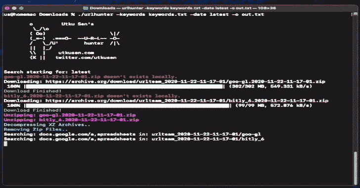

# Urlhunter:一个侦察工具，允许搜索通过 Shortener 服务暴露的 URL

> 原文：<https://kalilinuxtutorials.com/urlhunter/>

Urlhunter 是一个侦察工具，允许搜索通过 bit.ly 和 goo.gl 等短服务暴露的 URL。

**如何？**

一个名为 [URLTeam](https://archiveteam.org/index.php?title=URLTeam) (向他们致敬)的组织正在强力推行 URL shortener 服务，并每天发布匹配的结果。urlhunter 下载他们的[收藏](https://archive.org/details/UrlteamWebCrawls)并让你分析它们。

**安装**

*   **来自二进制**

您可以从 [releases](https://github.com/utkusen/urlhunter/releases/latest) 页面下载预构建的二进制文件并运行。例如:

【T2`tar xzvf urlhunter_0.1.0_Linux_amd64.tar.gz`
`./urlhunter --help`

*   **来源于**

1.  在您的系统上安装 Go
2.  运行:`**go get -u github.com/utkusen/urlhunter**`

**Windows 用户注意:** urlhunter 使用的是预装在 Linux 和 macOS 系统上的`XZ Utils`。对于 Windows 系统，你需要从[https://tukaani.org/xz/](https://tukaani.org/xz/)下载

**用途**

*   urlhunter 运行需要 3 个参数: **`-keywords`、`-date`和`-o`。**
*   例如:`**urlhunter -keywords keywords.txt -date 2020-11-20 -o out.txt**`

*   **-关键词**
    *   您需要指定包含在 URL 上搜索的关键字的 txt 文件。关键字必须逐行书写。您有三种不同的方式来指定关键字:
    *   **单个关键字:** urlhunter 将给定的关键字作为子串进行搜索。例如:
        *   `acme.com`关键字将同时匹配`https://acme.com/blabla`和`https://another.com/?referrer=acme.com`
    *   **多个关键词:** urlhunter 会用一个`AND`逻辑搜索给定的关键词。这意味着，URL 必须包含所有提供的关键字。关键字必须用`,`字符分隔。例如:
        *   `acme.com,admin`会配`https://acme.com/secret/adminpanel`但是 ***不会*** 配`https://acme.com/somethingelse`
    *   **正则表达式值:** urlhunter 将搜索给定的正则表达式值。在关键字文件中，包含正则表达式公式的行必须以`regex`字符串开头。格式为:`regex REGEXFORMULA`。例如:
        *   `regex 1\d{10}`会配`https://example.com/index.php?id=12938454312`但是 ***不会*** 配`https://example.com/index.php?id=abc223`

*   **-日期**
    *   urlhunter 下载给定日期的存档文件。您有三种不同的方法来指定日期:
    *   **最新:** urlhunter 将下载最新的存档。`-date latest`
    *   **单一日期:** urlhunter 将下载给定日期的存档。日期格式为年-月-日。
        *   例如:`-date 2020-11-20`
    *   **日期范围:** urlhunter 将下载在给定的开始和结束日期之间的所有档案。
        *   例如:`-date 2020-11-10:2020-11-20`

*   **-o**
    *   您可以用`-o`参数指定输出文件。例如`-o out.txt`

**演示视频**

