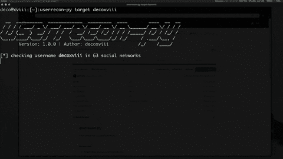

# UserRecon-PY:在社交网络中查找用户名

> 原文：<https://kalilinuxtutorials.com/userrecon-py-username-social-networks/>

Userrecon-PY 是一款用于在社交网络中查找用户名的工具。

**安装**

1.  安装依赖项(Debian/Ubuntu):

sudo 安装 python3 python3-pip

*   用`pip3`安装:

**sudo -H pip3 安装 git+https://github . com/deco XVIII/user recon-py . git user recon-py–help**

**也可阅读-[H2 buster:一个基于 HTTP/2](https://kalilinuxtutorials.com/h2buster/)** 的线程化递归网页目录暴力扫描器

**建筑来源**

克隆此存储库，并:

**git 克隆 https://github.com/decoxviii/userrecon-py.git；CD user recon-py sudo-H pip 3 install-r requirements . txt
python 3 setup . py build
sudo python 3 setup . py install**

**更新**

要将此工具更新到最新版本，请运行:

**sudo -H pip3 安装 git+https://github . com/deco XVIII/user recon-py . git–升级 user recon-py–版本**

**用法**

通过运行`**userrecon-py --help**`开始打印可用的动作。然后，您可以执行以下测试:

**user recon-py target deco XVIII-o test1**

[**Download**](https://github.com/decoxviii/userrecon-py)

**贷项:取消选择**