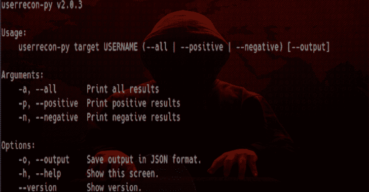

# Userrecon-py:各种网站的用户名识别

> 原文：<https://kalilinuxtutorials.com/userrecon-py/>

**Userrecon-py** 用于各种网站的用户名识别。用于各种网站的用户名识别。

**安装**

**同** `**pip3**`

**# Linux
sudo -H pip3 安装 git+https://github . com/deco XVIII/user recon-py . git–升级
user recon-py–帮助**

**从源代码构建**

**# Linux
git 克隆 https://github.com/decoxviii/userrecon-py.git；CD user recon-py
sudo-H pip 3 install-r requirements . txt
python 3 setup . py build
sudo python 3 setup . py install**

**也可理解为-[lock door 框架:一个具有网络安全资源的渗透测试框架](https://kalilinuxtutorials.com/lockdoor-framework-penetration-testing-framework-cyber-security/)**

**用法**

通过运行`**userrecon-py --help**`开始打印可用的动作。然后，您可以执行以下测试:

**#打印所有结果。
user recon-py target deco XVIII–all-o test

#打印阳性结果。
user recon-py target deco XVIII–阳性 o 试验

#打印阴性结果。
user recon-py target deco XVIII–阴性 o 试验**

[**Download**](https://github.com/decoxviii/userrecon-py)