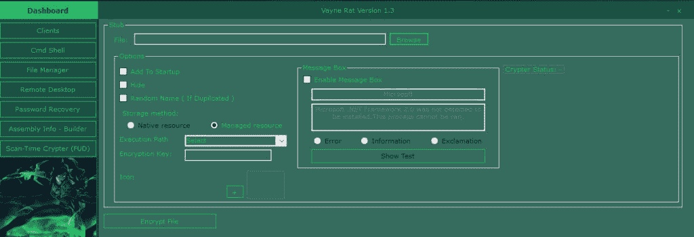
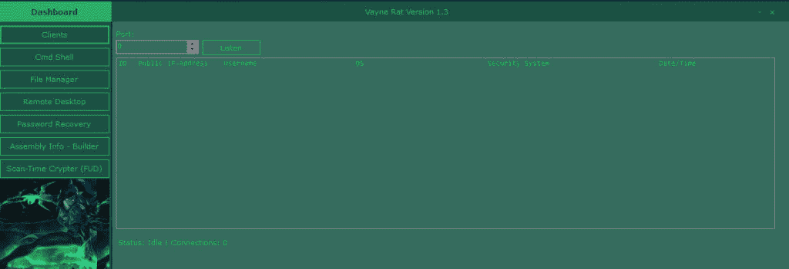

# 薇恩-RaT 免费和开源远程管理

> 原文：<https://kalilinuxtutorials.com/vayne-rat-free-tool/>

薇恩鼠是用 C#编写的免费开源远程管理工具。

Android 的出现是因为高移动性软件包，我们已经看到自动黑客应用程序作为非根设备的良好增长。

对于我们的读者，我们已经阅读了 2018 年 automaton 最有效的黑客应用程序列表，这些应用程序可能由技术爱好者、护理 IT 安全管理员助理或护理道德黑客助理雇用。

## **特征——薇恩鼠**

*   多线程
*   CMD 外壳
*   文件管理器(下载和上传)
*   远程桌面
*   密码恢复
*   装配生成器
*   扫描时间编码器(FUD)

## **要求**

*   存根编码。NET 2.0
*   Mono.Cecil.dll
*   掩饰者 Lib.dll
*   Bunifu_UI_v1.52.dll

**又读 [胡克:安卓应用的自动化动态分析](http://kalilinuxtutorials.com/hooker/)**

## **支持的操作系统(32 位和 64 位)**

*   Windows XP SP3
*   Windows Server 2003
*   Windows Vista
*   Windows Server 2008
*   Windows 7
*   Windows Server 2012
*   Windows Server 2016
*   Windows 8/8.1
*   Windows 10

## **在**上测试

Windows 10，8.1，XP SP3，Server 2012 R2，2016

## **截图**

## **演员表:**

单声道。塞西尔（男子名）

[https://github.com/jbevain/cecil](https://github.com/jbevain/cecil)