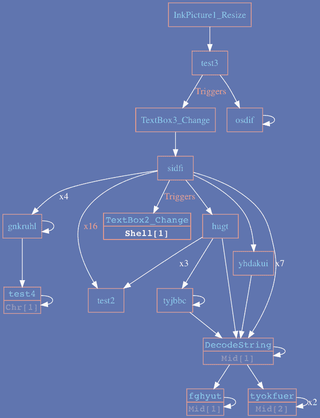
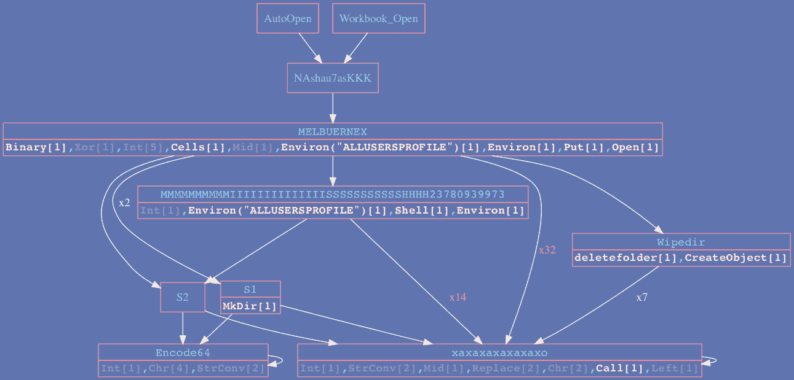

# vba2 graph–从 Vba 代码生成调用图，以便更容易地分析恶意文档

> 原文：<https://kalilinuxtutorials.com/vba2graph-analysis-malicious-documents/>

Vba2Graph 是安全研究人员的工具，他们浪费时间分析恶意的 Office 宏。生成 VBA 调用图，突出显示潜在的恶意关键字。

允许快速分析恶意宏，并容易理解执行流程。

## **vba2 图形特征**

*   关键词突出显示
*   VBA 物业支持
*   声明支持的外部函数
*   带有“_Change”执行触发器的复杂宏
*   花哨的配色方案！

#### **优点**

*   相当快
*   在野外观察到的大多数恶意宏上运行良好

#### **缺点**

*   静态(无法识别动态解析的调用)

**也可阅读[BabySploit——用 Python 写的初学者测试工具包/框架](https://kalilinuxtutorials.com/babysploit-beginner-pentesting-toolkit/)**

## **安装**

### **安装**油嘴工具 **:**

```
https://github.com/decalage2/oletools/wiki/Install
```

### **安装 Python 需求**

```
pip2 install -r requirements.txt
```

### **安装 Graphviz**

#### **窗户**

安装 Graphviz msi:

```
https://graphviz.gitlab.io/_pages/Download/Download_windows.html
```

将“dot.exe”添加到 PATH env 变量中，或者:

```
set PATH=%PATH%;C:\Program Files (x86)\Graphviz2.38\bin
```

#### **Mac**

```
brew install graphviz
```

#### **Ubuntu**

```
sudo apt-get install graphviz
```

#### **拱门**

```
sudo pacman -S graphviz
```

### **用途**

```
usage: vba2graph.py [-h] [-o OUTPUT] [-c {0,1,2,3}] (-i INPUT | -f FILE)

optional arguments:
  -h, --help            show this help message and exit
  -o OUTPUT, --output OUTPUT
                        output folder (default: "output")
  -c {0,1,2,3}, --colors {0,1,2,3}
                        color scheme number [0, 1, 2, 3] (default: 0 - B&W)
  -i INPUT, --input INPUT
                        olevba generated file or .bas file
  -f FILE, --file FILE  Office file with macros 
```

### **使用示例(所有平台)**

仅支持 Python 2:

```
# Generate call graph directly from an Office file with macros [tnx @doomedraven]
python2 vba2graph.py -f malicious.doc -c 2    

# Generate vba code using olevba then pipe it to vba2graph
olevba malicious.doc | python2 vba2graph.py -c 1

# Generate call graph from VBA code
python2 vba2graph.py -i vba_code.bas -o output_folder 
```

### **输出**

您将在输出文件夹中获得 4 个文件夹:

*   **png:** 您正在寻找的实际图形图像
*   **svg:** 相同的图形图像，只是在矢量图形中
*   **点:**用于创建图形图像的点文件
*   脚本识别的 VBA 函数代码(用于调试)

## **例题**

示例 1:

trick bot downloader–利用对象调整大小事件作为初始触发器，随后是 TextBox_Change 触发器。



示例 2:



[ ](https://github.com/MalwareCantFly/Vba2Graph) **信用:**[**@ MalwareCantFly**](https://twitter.com/MalwareCantFly)

***你可以在 [Linkedin](https://www.linkedin.com/company/gbhackers/) 、 [Twitter](https://twitter.com/GbhackerOn) 、[脸书](https://www.facebook.com/gbhackersadmin)上关注我们的日常网络安全更新，你也可以在线参加[最佳网络安全课程](https://ethicalhackersacademy.com/)以保持自我更新。***